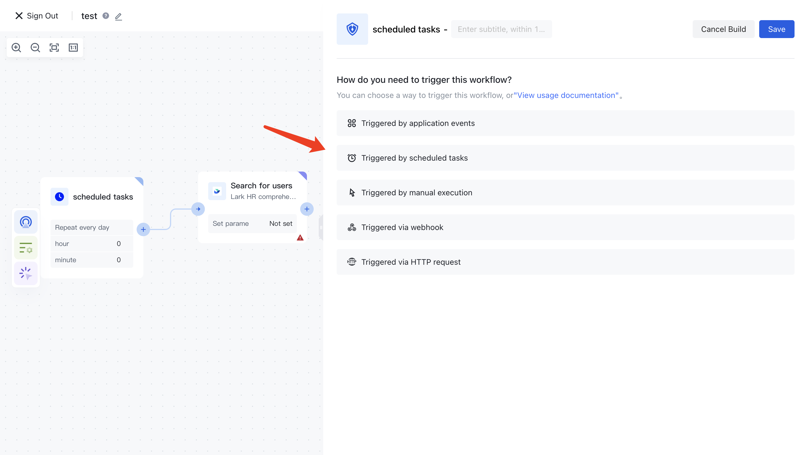

# Timed execution of workflow

If you need to trigger the workflow according to a certain time cycle, you need to set the trigger to <strong> scheduled task </strong>:

Timed tasks are divided into the following modes:

1. Repeat monthly
2. Repeat every week
3. Repeat daily
4. Cron expression

## Repeat every day

Set daily trigger time:

## Repeat every month

Set the monthly trigger date and time:

## Repeat every week

Set the day of the week to trigger and the specific time:

## Cron expression

This is the most flexible way, you can use [Third party websites](https://cron.qqe2.com/) Generate cron expressions. Here are some common cron expressions:

> Note: Authentication identity automation allows cron expressions to have a minimum time interval of two hours.

- 0 0 23 * * ?   Execute once a day at 23:00
- 0 0 1 * * ?   Execute once a day at 1am:
- 0 0 1 1 * ?   Execute once a month at 1am on the 1st of each month
- 0 0 23 L * ?   Execute once a month at 23:00 on the last day of the month
- 0 0 1 ? *  L   Implemented once a week at 1am on Sundays
- 0 0 0,13,18,21 * * ?  Execute once every day at 0:00, 13:00, 18:00, and 21:00
- 0 15 10 ? *  Trigger on the third Friday of each month at 10:15 am
- 0 15 10 ? *  MON-FRI     Triggered at 10:15 am from Monday to Friday
- 0 10,44 14 ?  3 WED triggered every Wednesday in March at 2:10 pm and 2:44 pm
