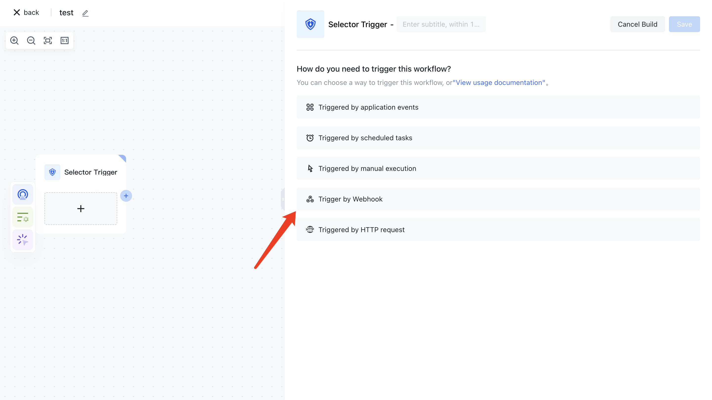
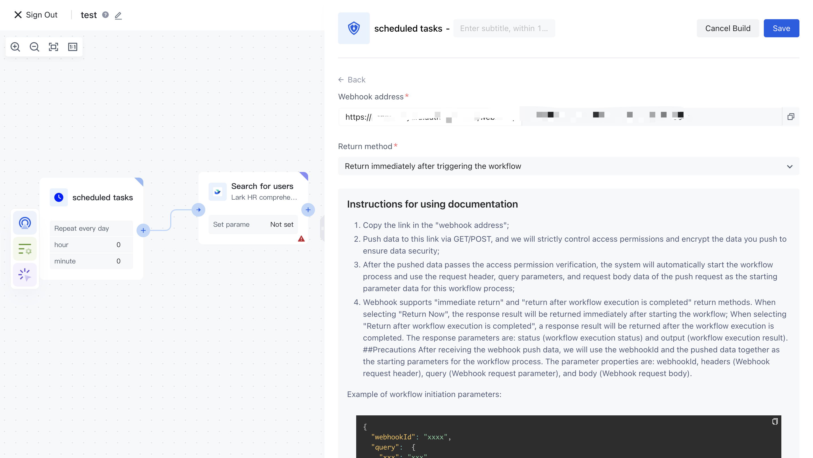

# Trigger Workflow through Webhook

## Overview

Webhooks provide a seamless way to trigger workflows asynchronously in Authing. Unlike API-based workflow triggers, the webhook method is particularly useful for scenarios where execution does not depend on an immediate response. This enables event-driven automation while keeping your system operations decoupled from the workflow's execution results.

For example, when a specific action occurs within your application—such as a user profile update or an event log entry—you can send a request to the workflow's webhook endpoint, triggering a corresponding process without waiting for its completion.

## Use Cases

- Event-Driven Automation: Automate workflows based on specific events, such as user sign-ups, password changes, or system alerts.
- Decoupled Execution: Execute long-running tasks asynchronously without affecting the primary application’s performance.
- System Integrations: Connect external services or applications that support webhook-based notifications to trigger identity-related workflows in Authing.
- Audit & Logging: Automatically log certain actions, such as login attempts or role modifications, by triggering workflows to store or process these events.

## How to Trigger a Workflow via Webhook

### Step 1: Configure the Webhook Trigger

1. Navigate to the Authing Console.
2. Select the workflow you want to trigger.
3. In the Trigger Method section, choose 'Trigger By Webhook'.

4. A unique webhook URL will be generated for this workflow.
5. Copy the webhook URL for later use from the <strong> Webhook address</strong> section.


### Step 2: Sending an HTTP Request to the Webhook

To trigger the workflow, send an HTTP request to the copied webhook URL. You can use POST requests to pass relevant data.

```javaScript
POST https://<your-webhook-url>
Content-Type: application/json

{
  "event": "user.created",
  "userId": "12345",
  "metadata": {
    "role": "admin",
    "source": "app"
  }
}
```

### Step 3: Processing Incoming Parameters

The webhook-triggered workflow can access various request parameters:

* Request Body – JSON or form data sent in the request.
* Query Parameters – URL parameters included in the request.
* Request Headers – Metadata such as authentication tokens or content type.

Within the workflow, these parameters can be used as inputs to determine actions and execute logic dynamically. For details, please refer to [Calling workflow through API interface](/en/workflow/execute-workflow/trigger-workflow-via-http-request.html).


## Best Practices

When working with webhook triggers, you may have some additional considerations for higher security and reliability.

- Security: Authenticate webhook requests using signatures, tokens, or IP whitelisting to prevent unauthorized triggers.
- Retry Mechanism: Implement a retry strategy in case of temporary failures or network issues.
- Logging & Monitoring: Log webhook requests and workflow executions for better debugging and audit tracking. Tools like [Beeceptor](https://beeceptor.com/) can help you inspect, debug, and monitor outgoing webhook requests during testing and development.
- Minimal Payload: Keep the request payload lightweight, sending only necessary data to optimize performance.
