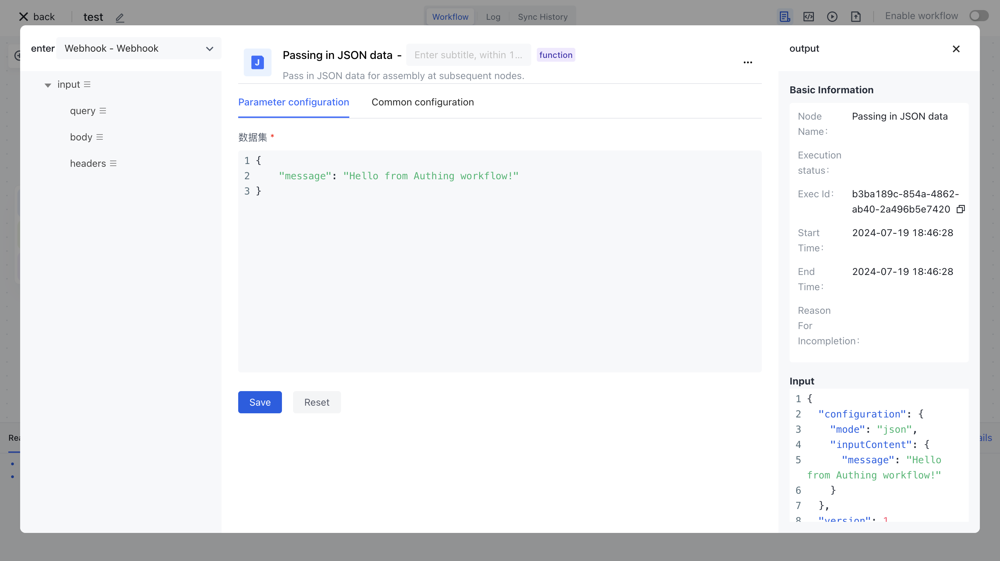

# Call Workflow via an API interface

Just like you would normally request an API interface, Authing workflow can expose a public service API address, and after calling it, you can get the workflow execution result via an HTTP response.

When selecting a trigger, select Trigger by HTTP Request:


You can copy the request address in the <strong> </strong><strong> API </strong><strong> address </strong> item, and you can also configure the HTTP request invocation method:

1. Request mode: HTTP request modes of GET, POST, PUT, DELETE, HEAD, and PATCH are supported
2. Authentication mode: Supports non-authentication, Basic authentication, and request header authentication
3. No authentication: In this case, no authentication mode is set, and any third party that gets this API address can call this interface.
4. Basic authentication: Through HTTP Basic authentication, you need to configure the user name and password, the client call method see below.
5. Request header authentication: It is necessary to configure the key and key values of the request header, such as passing an x-api-key request header when requiring customers to request, and the content is the key configured for you
6. Return method:
7. Immediate return: The client returns the request immediately after triggering workflow execution. The client can obtain the workflow execution instance ID and asynchronously obtain the execution result.
8. Return after workflow execution: Blocking wait until workflow execution is completed and then return, similar to our usual call API interface, you can synchronize to get workflow execution results. <strong> Where the execution result of workflow is the output value of your last node </strong>.
9. HTTP status code: Specifies the status code that controls the HTTP request response. The default value is 200.


## Quick example

We use the default configuration here: we use a GET request without any authentication, and wait for workflow to complete and return. Add a JSON node to workflow to return test data:

```typescript
{
    "message": "Hello from Authing workflow!"
}
```


Next we copy the API address, access it in a browser, and see that the workflow execution result is returned directly:


## HTTP Basic authentication mode

Based on the previous example, we set the authentication mode to <strong> Basic authentication </strong>, and set the BASIC authentication user name and password to test and test.


Convenient to test, here we use [http://web.chacuo.net/safebasicauth](http://web.chacuo.net/safebasicauth) this web site to generate Basic request header value:


Then use a development tool such as Postman or curl to request this interface:

> You need to replace the API address and Authorization values in the following example with your own.

```typescript
curl --location --request POST 'https://console.authing.cn/public/service/xxxxxx-xxxx-xxxxx-xxxxxx' \
--header 'Authorization: Basic xxxxxxxxx'
```

After execution, you can also get the correct result:

```typescript
{
  "code": 200,
  "message": "SUCCESS",
  "data": {
    "output": {
      "data": {
        "message": "Hello from Authing workflow!"
      }
    },
    "status": "COMPLETED"
  }
}
```

## HTTP Header authentication mode

We then set the authentication mode to "<strong> request header authentication </strong>", set the request header to 'x-api-key', and set the key to 'my-secret-api-key' :


Using a Postman or curl request, you can see the workflow execution result:


## Gets the parameters passed in the HTTP request

In the node where workflow runs, you can get the parameters passed by the HTTP request, including:

- Request body: Obtain it through ${workflow.input.body}
- Query parameters: Obtain them by running ${workflow.input.query}
- Request header: Obtain this parameter through ${workflow.input.headers}

Here we modify the contents of the JSON node to be:

```typescript
{
    "body": "${workflow.input.body}",
    "headers": "${workflow.input.headers}",
    "query": "${workflow.input.query}"
}
```



Using Postman or curl again, notice that we set the request header, request body, and query parameters:

```typescript
curl --location --request POST 'https://console.authing.cn/public/service/c1447ab0-091b-472e-8f03-a2fde394c25c?param1=value1&param2=value2' \
--header 'x-api-key: my-secret-api-key' \
--header 'Content-Type: application/json' \
--data-raw '{
    "key1": "value1",
    "key2": "value2"
}'
```

By returning the result we can see that we end up with this information in the node:

```typescript
{
    "code": 200,
    "message": "SUCCESS",
    "data": {
        "output": {
            "data": {
                "headers": {
                    "x-request-id": "2a0baec567eda9d215278c704f1445eb",
                    "content-length": "33",
                    "x-forwarded-proto": "https",
                    "postman-token": "59148df2-c25c-4d39-a953-257638e3a974",
                    "x-forwarded-port": "443",
                    "accept": "*/*",
                    "x-real-ip": "111.196.161.238",
                    "x-forwarded-scheme": "https",
                    "x-forwarded-host": "console.authing.cn",
                    "sw8": "1-MTFkMTQyZWMwZWRkNGYzY2IwN2IzN2JiNDhlZjVkMTI=-NzQ2MzM2OWY5ZWI5NDkwNTkwNjgzYzFjYTMzY2Y2OTc=-3-YXV0aGluZy1zZXJ2ZXI=-YXV0aGluZy1zZXJ2ZXItY2Q5OWQ4OTc4LXhxam5y-L2FwaS92MS93b3JrZmxvdy93ZWJob29rL2FwaS9jMTQ0N2FiMC0wOTFiLTQ3MmUtOGYwMy1hMmZkZTM5NGMyNWM=-YXV0aGluZy1mbG93LWVuZ2luZS5hdXRoaW5nLnN2Yy5jbHVzdGVyLmxvY2FsOjgwODA=",
                    "x-api-key": "my-secret-api-key",
                    "host": "authing-flow-engine.authing.svc.cluster.local:8080",
                    "content-type": "application/json",
                    "connection": "close",
                    "x-scheme": "https",
                    "accept-encoding": "gzip, deflate, br",
                    "user-agent": "PostmanRuntime/7.29.2"
                },
                "query": {
                    "param1": "value1",
                    "param2": "value2"
                },
                "body": {
                    "key1": "value1",
                    "key2": "value2"
                }
            }
        },
        "status": "COMPLETED"
    }
}
```
