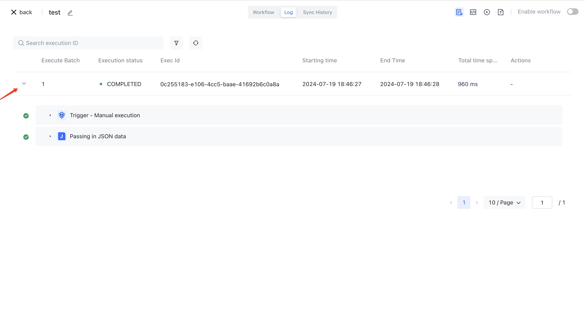

# Viewing Workflow Execution Records

You can see all the execution records of the workflow history in the "Run Log" menu of the workflow details:

Expand each execution record to see the running status and time consumption of each node:

Further expanding each specific node, you can see the input and output data of this node, as well as the operation logs of the node:

