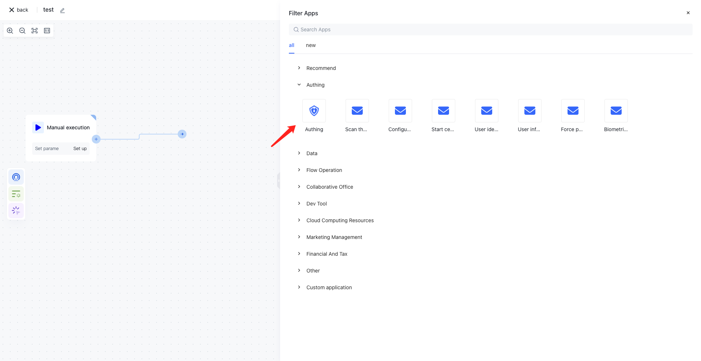

# Operate internal resources of Authoring

Authing identity automation integrates [all open APIs of Authing](https://api-explorer.authing.cn/)For example, interfaces such as managing users, managing organizational structures, managing groups, managing roles, managing applications, etc., this means that you can automate the management of all resources within Authing. The implementation includes but is not limited to the following functions:

1. Automatically disable users who have not logged in for a period of time.
2. Label users based on email suffix and age.
3. Automatically label and add default groups to users after creation.
4. ...




## Select Action

You should be able to notice that all actions under the Authoring application node correspond one-to-one with the interfaces of the Authoring V3 API. It is recommended that you first use the [Authing API Explorer ](https://api-explorer.authing.cn/)Quickly understand the use of the Authoring API.


You can see the corresponding usage documentation for each action in the details of the Authing application, and the corresponding interface address in the Authing API Explorer will be included in the document description.


## Quick example

Next, we will demonstrate a specific usage scenario: pull the Authoring user list and label the user based on their email suffix.

Here we need to use two interfaces under the Authing application:

- [Pull user list](https://api-explorer.authing.cn/?tag=tag/%E7%AE%A1%E7%90%86%E7%94%A8%E6%88%B7/API%20%E5%88%97%E8%A1%A8/operation/UsersManagementController_listUsers)
- [Batch modification of user information](https://api-explorer.authing.cn/?tag=tag/%E7%AE%A1%E7%90%86%E7%94%A8%E6%88%B7/API%20%E5%88%97%E8%A1%A8/operation/UsersManagementController_updateUserBatch)

At the same time, it is necessary to convert the return result of the user list pulling interface into the format of the batch modification user information interface, and calculate the email suffix for each user, so a data conversion node is also needed.

### Create user extension fields to store labels

Firstly, we need to add a user extension field in the Settings Field Management page of the console. Here, we set a string type extension field - email_domain.


### Write a node to pull the Authoring user list

Create an Authoring node to retrieve/search user lists, and configure them separately:

-AdvancedFilter: Advanced search criteria, where we set the condition that the email is not empty:

```typescript
[
  {
    "field": "email",
    "operator": "NOT_NULL"
  }
]
```

- Options: optional. Here, we set the pagination condition to the first page and pull 50 entries. You may ask, what if I need to pull all users? We have provided you with a loop node. Please refer to the documentation for details:[Recurrent execution](/en/workflow/process-control-nodes/recurrent-execution.html)

```typescript
{
  "pagination": {
    "page": 1,
    "limit": 50
  }
}
```


After writing, you can click on execute to see the effect.

### Add a data conversion node for calculating user email suffixes

You can view batch modification of user information in the Authoring API Explorer


We have configured two conversion rules here:

1. Field mapping rule userId ->usrerId
2. Expression rule: Convert `$item.email.split("@")[1]` to a customData. email_domain field (a nested structure)


Click on execute, let's take a look at the results:


### Write batch modification of user information nodes

In the previous step, we have already converted the data into the format required for batch modification of user information nodes. Now, we only need to assemble the data:


Finally, click execute and you can see that the user's extension fields have been updated correctly:


