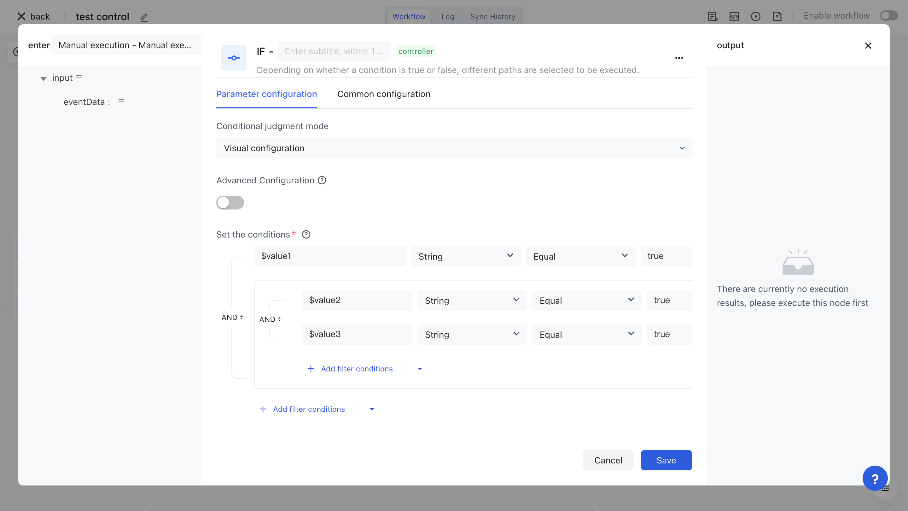

# IF

Imagine a scenario like this: when a user logs in, we listen to the user's login event and determine whether the logged in IP is an external IP. If so, we send a reminder email to the current user; When using templates for upstream synchronization scenarios, if the comparison results of users in this synchronization show that a large number of users need to be deleted, we need to send an alert email to the administrator. To achieve such dynamic logical judgments, an IF node is required.

The IF node of Identity Automation allows you to configure very flexible visual judgment rules, and execute a certain segment of logic when specific conditions are met; Otherwise, execute another piece of logic (or ignore it).

# The judgment expressions supported by IF nodes

The IF node for authentication automation is a simplified SWITCH node that only contains two branches: True and False. Like the SWITCH node, it also supports the following very flexible judgment expressions, and you can choose the appropriate mode according to your specific scenario.


## Visualization configuration

By using this mode, very flexible AND and OR logic can be configured, while supporting conditional groups. First, add variables to the <strong> Set Run Variables </strong> section, where values can be used to assemble data from any previous node; The set variable can be referenced in the expression module of <strong> Set Condition </strong> (with a $symbol added before the variable).

The meaning of the rule as shown in the following figure is: when the value of $value1 is true or when $value2 and value 3 are both true, the condition is met.



## Custom Code Mode

By using this mode, any logic can be written, and the custom code shown in the following figure is equivalent to the visualization configuration above:

```typescript
return !!value1 || (!!value2 && !!value3);
```


