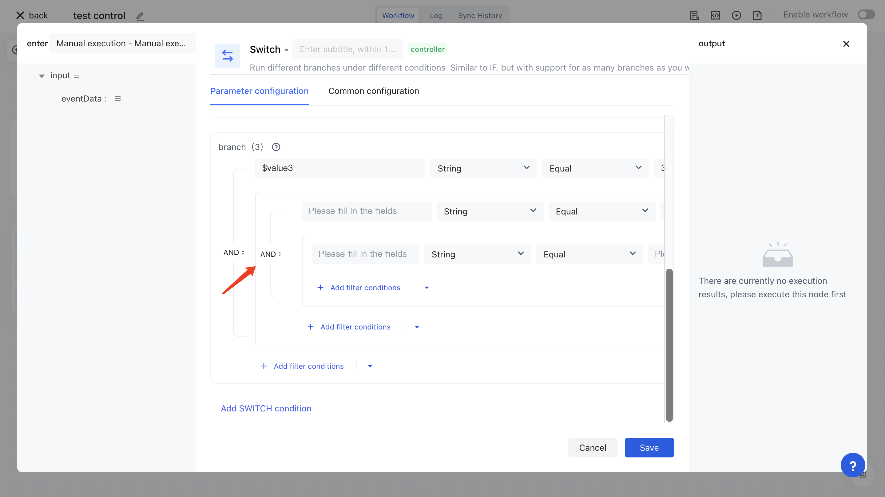

# SWITCH

Imagine a scenario where a user is pulled from the Authoring user directory and their account is automatically disabled when they have not logged in in in the past 6 months; Automatically archive accounts when not logged in in the past year; Otherwise, no action will be taken. Alternatively, when the user's account level is regular, VIP, or super VIP, different emails can be sent separately. To achieve the scenario of which branch to take when certain conditions are met, a SWITCH node is required.

The SWITCH node for identity automation allows you to configure very flexible visual judgment rules. When condition A is met, branch A is executed; When condition B is met, execute branch B; Otherwise, other branches will be taken by default.

# The judgment expressions supported by the SWITCH node

The Authorization Identity Automation Switch supports several very flexible judgment expressions, and you can choose the appropriate mode according to your specific scenario.

## Visualization configuration

By using this mode, very flexible AND and OR logic can be configured, while supporting conditional groups. First, add variables to the <strong> Set Run Variables </strong> section, where values can be used to assemble data from any previous node; The set variable can be referenced in the expression module of <strong> Set Condition </strong> (with a $symbol added before the variable).

At the <strong> Settings </strong> <strong> Condition </strong><strong> Branch Group </strong>, you can set the conditions that each branch meets, and the name of each group corresponds to the name of the SWITCH branch.

The conditions for each branch can support nested filtering conditions, as shown in the following figure, indicating that when $value1 is true or $value2 and $value3 are all true, the "branch" is taken.

##
