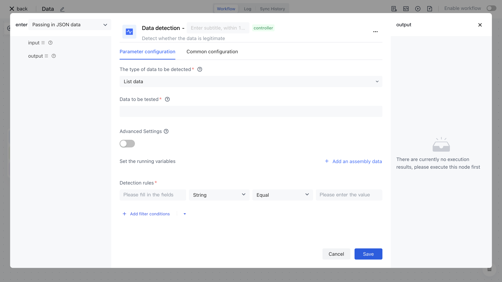
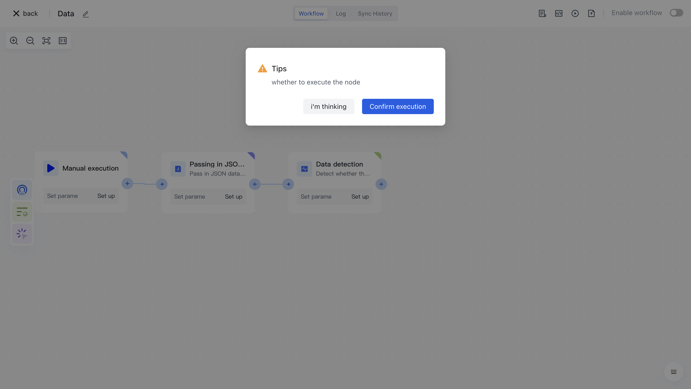
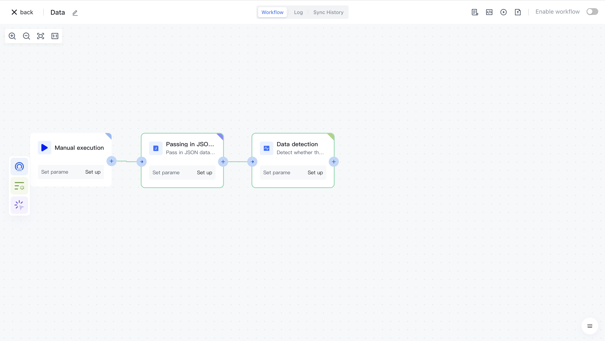

# Data detection

# Node Introduction

The "Data Detection" node is mainly used to detect whether the data meets certain conditions, and to determine whether the workflow process will continue to be executed later.

The nodes mainly include the following configurations:

-The types of data to be tested include "List Data" and "Tree Structure Data". If you need to check the values of each element in an object or array, please choose the "List Data" mode; If you need to check a tree structure, such as whether the parent node of the child node exists or whether the node ID is duplicate, please choose the "Tree Structure" mode.
-The data to be tested, the raw data to be tested, can be inputted by oneself or assembled through data assembly to assemble the data source before the current node. If this data is an array, then each item in the array will be checked.

- Advanced Settings: After enabling "Advanced Settings", multiple "Run Variables" can be set or assembled, each of which contains a variable name and value. The parameters set here can be referenced in the "Detection Rules" below. For example, if you have a scenario where you want to check whether the department ID corresponding to the department in user data exists, you can set a parameter called `allDepartmentIds`, and then you can use `$allDepartmentIds` in the 'detection rules' to reference it.

- Detection rules can be configured with a set of data detection rules, each of which includes "field", "field type", "operator", and "field value". Multiple detection rules support and/or relationship switching.

- Field, the name of the field corresponding to the filtering condition.
- Field type, filter condition field type, currently supports: string, number, Boolean, time, date, object, array, and enumeration value.
- Operators, each field type corresponds to a different operator.
- The field value corresponds to the detection rule field, and different "field types" support different field values.

# Quick Start

## Add node

On the Add Node page, enter the "Data Detection" keyword for application filtering.

Or find the "Data Detection" application node in the "Process Operations" category.

Clicking on a node will automatically add it to the workflow.

## Node configuration

Click on the node in the workflow canvas or click the "Edit" button below to enter the node's configuration page.

Configure the various configuration items of the node as follows:

- Select "List Data" for the type of data to be tested;
- Select the "Data" attribute under "Output" in the "Incoming JSON Data" section on the left for assembly with detection data;

- Open "Advanced Settings" and set the value corresponding to "Run Variable" `rightName` as `myname_01`;
- Configure two "detection rules" as follows: `id = "myid_01" ` and ` name = $rightName`.

## Test Run

Click the "Execute the previous link of this node" button on the node to execute it.

After reconfirmation, all previous processes of this node will be executed.

After clicking the "Confirm Execution" button, you will see the message prompt "Node in Progress".

Click on the "Run Log" column, then click on the expand button on the left side of the latest "Execution Batch" and "Data Detection" nodes to view the node execution results.

