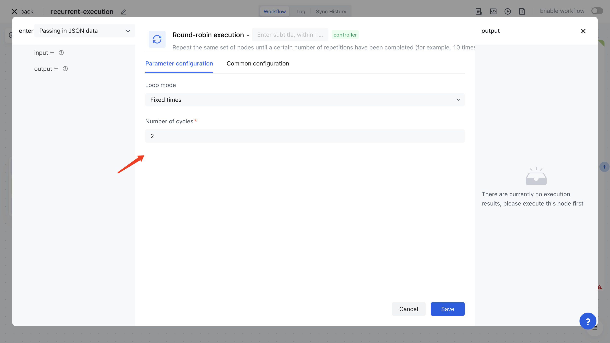
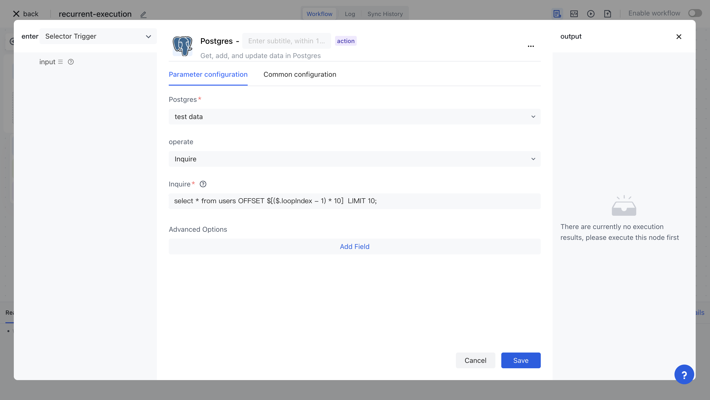
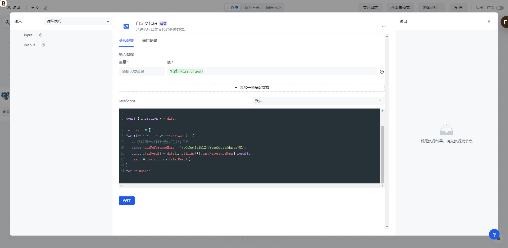

# Recurrent execution

Imagine a scenario where you need to pull a large amount of data from a third-party interface, and a single request cannot return all of it, requiring pagination; Alternatively, it is necessary to send account passwords to a group of users separately. In these scenarios, loops are used.

Loop nodes can allow you to repeat an operation and stop it when certain specific conditions are met, which is very useful in some scenarios, such as:

1. Send emails to a group of email addresses;
2. When pulling third-party data, the data volume is relatively large and pagination queries are needed;
3. When querying database data by pagination;
When processing a batch of data individually or in batches;

# Create a loop node

You can find the <strong> Loop Execution </strong>node in the application list of Authing identity automation:


In the Authing identity automation platform, any process can be nested within the loop node, as shown below:


# Several supported loop modes

The Authoring loop node supports the following loop modes:

1. Fixed execution mode: Configure a fixed number of executions and terminate the loop after running the fixed execution. Suitable for scenarios where you know in advance how many times you need to loop.


1. Expression pattern: By writing dynamic expressions, dynamically determine the number of times a loop is executed. Suitable for scenarios that require dynamic calculation of loop counts, such as loop pulling database data, loop pagination pulling third-party data. For details, please refer to Example 3 and Example 4 in the following text.


1. Loop list mode: Dynamically pass in an array, and determine the number of loops based on the length of the passed array. You can obtain the value of the current element in the loop node. For details, please refer to

# Get loop context

Within the loop node, it is often necessary to obtain the following contextual information:

- The index of the current number of loops is $[$. loopIndex], starting from 1. You can also write expressions like the following
  - $[$. loopIndex+1]: Current loop coordinates+1
  - $[$. loopIndex * 10]: Current loop coordinates * 10
  - $[($. loopIndex -1) * 10]: (Current loop coordinate -1) * 10
- The value of the current loop element can be obtained through ${getLoopItem. output. result}. For details, please refer to Example 2: Loop sending emails to users.

# Common scenario examples

## Example 1: Execute a fixed number of times

In this example, we created an HTTP Request node in the loop execution node and set the fixed number of loops to 2:




Click execute and you can see that it has been executed twice in total:


## Example 2: Loop sending emails to users

In this example, we first use the "Get User List" method of the Authing application to pull the user list:


Next, add a loop execution node, set the loop mode to "loop list", and assemble the list data as the output result of the previous node:


Next, add an "Authoring Mail Service" node to the loop body, where the recipient is set to ${getLoopItem. output. result. email}, which is the email value of the current element:


Click execute: You can see that an email has been sent for each user.

## Example 3: Paging and pulling database data

Here we take pulling user data from the Postgres database by pagination as an example. When we page and pull database data in a program, it is generally divided into the following steps:

1. Use count to calculate the total number;
2. Starting from a starting coordinate (offset), specify the pull quantity (limit) for each batch, and increase the offset by the limit each time until the offset exceeds the total number;
3. Accumulate the results of all query batches to obtain the final result.

The same process applies to loop nodes that use Authoring identity automation: first, we add a Postgres node and write an SQL to query the total number of users:

```typescript
select count(*) from users;
```


By executing this node, you can see the actual execution results. Next, we will create a "loop execution" node: select "loop mode" as "expression", and add a runtime variable<strong> totalCount </strong>to the runtime variable, with the value assembled as the output result of the previous node. In this example, we found a total of 46 users:


Then set the loop expression to:

```typescript
if ($[$.loopIndex] < $.totalCount / 10 ) { true; } else { false; }
```

Among them, the built-in variable $[$. loopIndex] represents the number of times the current loop is executed (<strong> starts with 1 </strong>), and you can refer to the variable set in "Set Run Variable" in the expression through the $. variable name. In this example, we set the condition for loop execution to be that the index of the loop iteration ($[$. loopIndex]) is less than $. totalCount/10, which means pulling 10 users per page (if you need to pull 50 users per batch, change $. totalCount/10 to $. totalCount/50).

After dynamically setting the total number of loops, we need to set the correct offset and limit for each query. Add a Postgres node to the loop execution node and query the SQL as follows:

```typescript
select * from users OFFSET $[($.loopIndex - 1) * 10]  LIMIT 10;
```

Here, we have set a dynamic parameter for OFFSET: `$[($.loopIndex -1) * 10]`, which is (the current iteration coordinate -1) multiplied by 10. When $.loopIndex is 1, the OFF SET value is 0, which is the first page; When $.loopIndex is 2, the OFF SET value is 10, which is the second page. The value of LIMITED is 10, which is consistent with the $.totalCount/10 we wrote when setting up the loop expression in the previous step.



After clicking save, you can see that the Postgres node in the loop has been executed several times:


The output of the loop's direct node is in the following format:


The iteration in the output result represents the total number of iterations. In this example, there were 5 iterations, and the results of each iteration are shown in keys 1-5. Since a loop node may contain multiple nodes, the output of each node in each iteration uses the taskReferenceName of that node as the key. For example, in this example, the taskReferenceName of the Postgres node in the loop execution node is t40e5c41d1b12449dae532defdabae761, and its output is in the result field, which is an array.


After clarifying the output structure of the loop execution node, we will now use the "custom code" node to obtain the final data. Firstly, assemble the output result of the "loop execution" node in the input data:



代码如下：

1. Line 6: Obtain the total number of loop executions;
2. Line 9: Use the for loop to traverse the execution of each iteration and obtain the output of the Postgres node (in this example, the taskReferenceName of the Postgres node is t40e5c41d1b12449dae532defdabae761);
3. Line 13: Add the result of each execution to the final users array that needs to be returned;
4. Line 15: Return the final result

```typescript
// If you define a variable data in the above data, you can refer to this data here through data.
// This JS sandbox environment supports Node.js version 14 and supports the async/await syntax.
// If this code has a return value, you need to use return to return the corresponding return value.

// Total number of loop executions
const { iteration } = data;

let users = [];
for (let i = 1; i <= iteration; i++ ) {
  // Obtain the execution results of each iteration of the loop
  const taskReferenceName = "t40e5c41d1b12449dae532defdabae761";
  const iterResult = data[i.toString()][taskReferenceName].result;
  users = users.concat(iterResult);
}
return users;
```

Finally, by clicking execute, we can see the output result of the custom code node:


You can see that the final result is 46 users, which is consistent with the total number of users we obtained earlier.


