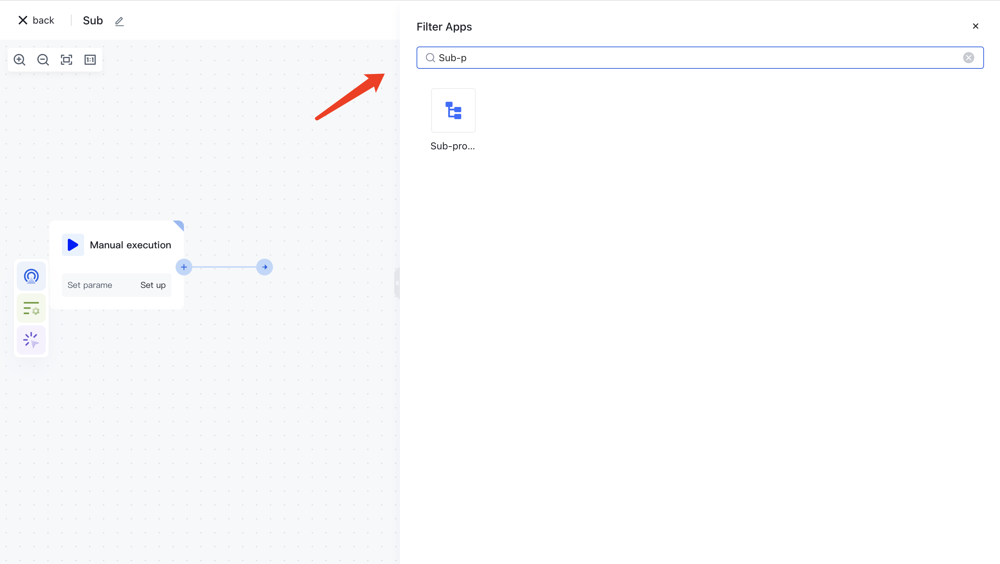

# Subprocess

Imagine a scenario where the workflow you need to write is a very complex process that may involve many large steps, such as pulling data, filtering data, detecting data, and writing data. Just like when we write a program, we don't want to put all the logic in one large function body, so when we write a workflow, we don't want to put all the nodes in one big process. With the help of sub processes, you can break down a large process into many smaller processes, each of which can be run and debugged independently, and combined into one large process.

A subprocess node allows you to trigger another workflow during the current workflow execution process. When configuring a subprocess node, you can select any mainstream or subordinate flow in the current user pool other than the current workflow, and you can also configure the initiation parameters of the subprocess.

# Create sub processes

You can find the "sub process" node in the "process operation" category, or directly search for the "sub process" keyword in the application search box.

# Configure sub processes

Configuration items:

> Sub workflow: Select a workflow other than the current workflow as the sub workflow< Startup parameters (optional): Enter a JSON format data

After adding the "sub process" node, it is necessary to select a sub workflow and configure the startup parameters of the sub process (optional)

After saving the "sub process" configuration, when executing the workflow, the sub workflow will be automatically triggered and the "start parameter" (optional) will be used as the input parameter for the sub process.
