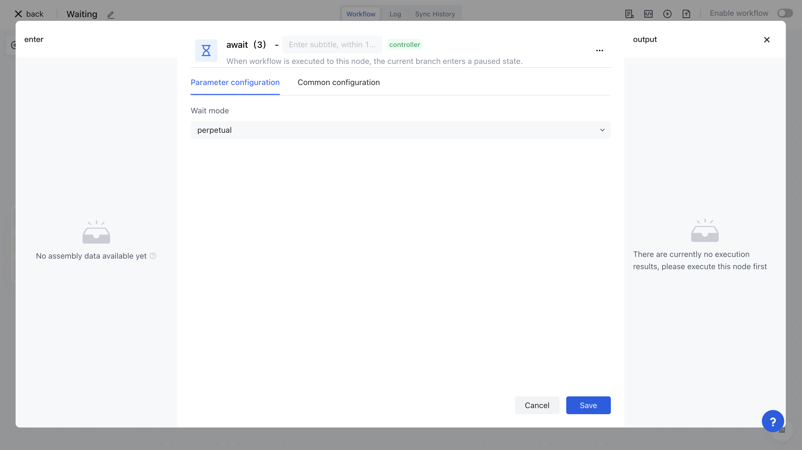
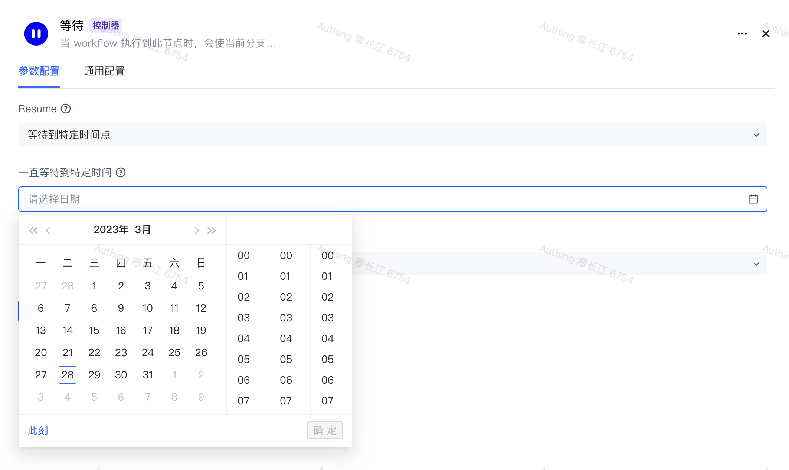

# Waiting

Imagine a scenario like this: when performing upstream synchronization, if the user's comparison calculation results show that a large amount of data needs to be deleted, you need to permanently pause the entire flow for this scenario, wait for the administrator to manually confirm before resuming; Alternatively, after executing a node, you may wish to wait for a certain amount of time before continuing with the execution. You can use waiting nodes to implement the above scenarios.

# Several waiting modes supported

The waiting node for authentication automation supports the following modes to support various usage scenarios.

## Permanent waiting

In this mode, when waiting for a node to execute, the node will be permanently paused, and the process will only continue until the administrator manually resumes it.

## Waiting for a fixed period of time (please stay tuned)

Supports seconds, minutes, hours, and days as units, and resumes the process execution when the waiting time reaches a certain amount of time.

## Waiting until a specific point in time (please stay tuned)

Manually select a fixed time point, and when the time reaches this point, the process resumes execution.

