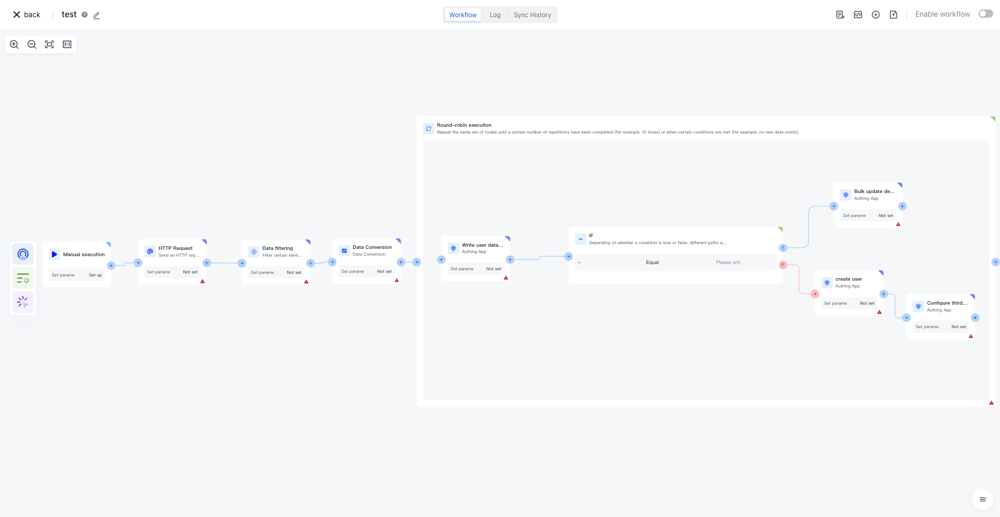
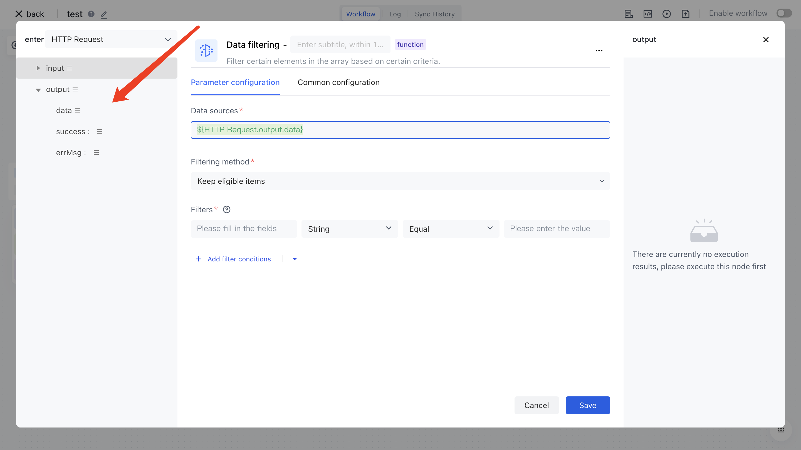
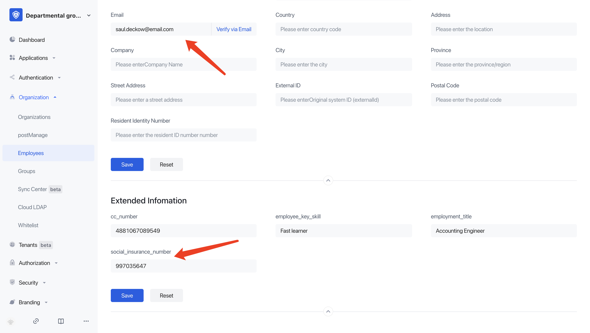
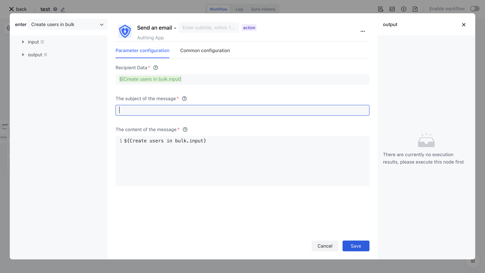

# Write the first workflow

How will this document create a workflow from scratch and import a mock user data source into Authing. The final created flowchart is as follows:



It will involve the following core nodes:

- HTTP: Sending HTTP requests
- Data conversion: Convert the user field format of this user data source to Authing standard format
- Data filtering: Filter out users who meet certain filtering criteria based on their fields
- Loop: Loop processing batch data
- IF: Check if the user exists. If it exists, update it; otherwise, create it
- Authoring node: based on V3 API encapsulation, including V3 API[ https://api-explorer.authing.cn/ ](https://api-explorer.authing.cn/) Manage all functions on the management side.
- Email: This demo will demonstrate sending emails to users after they have been created.

# Step 1: Write HTTP node to pull data

Here we use [https://random-data-api.com/](https://random-data-api.com/) The free service mock data provided will be used [https://random-data-api.com/api/v2/users?size=100](https://random-data-api.com/api/v2/users?size=100) This interface generates random data.

Search for "HTTP" from the application list and select "HTTP Request this application":


Fill in the address at the URL of the configuration item:[https://random-data-api.com/api/v2/users?size=100](https://random-data-api.com/api/v2/users?size=100)Click save.


Click on the "Execute Previous Links for This Node" button on the HTTP node:


After the execution is completed, click the Run Log button in the upper middle to see the results and logs returned by this interface.

# Step 2: Write data filtering nodes to filter users

Add a "Data Filtering" node and check the output result of the previous "HTTP Request" node in the data source. Here, we select the <strong> result </strong>data item and click on it to see that the data source field automatically inputs <strong> ${HTTP Request. output. result} </strong> , which is the data we obtained from the "HTTP Request" node.



Next, let's write the filtering rules. Here we will set a relatively simple filtering condition: gender is female. If you want to learn more about the detailed usage of data filtering nodes, please refer to the documentation for using data filtering nodes.


Next, click the "Execute" button on the data filtering node. After the execution is completed, you can see the output result of this node:


It can be seen that only users with a gender of Female have been retained.

## 

# Step 3: Write a data conversion node to convert users to Authing standard format

Before writing this node, we first create a few custom fields in the Authing user pool, and later we will store certain fields from this user data source in our custom fields:


Next, add a "data filtering" node, similar to the previous step, where the data source needs to assemble the data from the previous "data filtering" node as input to this node.

When configuring the conversion rules here, we set the "target field" in the "conversion scenario constraint" to "Authoring", so that we can see all the current fields of Authoring, including extended fields, when performing field conversions.


Next, we will start writing conversion rules. Here we introduce four most commonly created conversion rules:

1. Field mapping: Map one key of the original data to one key of the new data, keeping the value unchanged.
2. Fixed value: Set a fixed value for a key in new data.
3. Expression: Custom expressions can be written for the values of raw data to achieve scenarios such as:
4. Take deeply nested data, such as $item. address. country
5. Take the part before email @ as the username
6. Use the last four digits of the social security account as the initial password
7. Conversion of enumeration values: For example, in this example, gender may contain values such as Female and Male, but in Clothing, the legal values are F, M, and U.

In this scenario, we have written the following conversion rules, with a focus on explaining the following rules:

- Convert the ID of a numeric type to a string type, using the <strong> JS syntax's toString() </strong> method:

```typescript
$item.id.toString()
```

- Set password: Check if social_insurance number exists. If it does, take the last 6 digits as the password; If it does not exist, set the default password to 123456.

```typescript
$item.social_insurance_number ? $item.social_insurance_number.slice($item.social_insurance_number.length - 6, $item.social_insurance_number.length) : "123456"
```

# Step 4: Write a loop node to process data in a loop

Add a loop node, set the loop mode to "Loop List", and assemble the output result of "Data Conversion Node" in "Select List Data to Loop".


In this mode, the "loop execution" node will traverse the incoming list and use each element traversed to execute the process in the loop body. You can use <strong> ${getLoopItem. output. result. xxxx} </strong> to obtain the value of the current element, for example, when the current element contains the following data:

```typescript
{
    "lastName": "Boyer",
    "birthdate": "1992-12-21",
    "gender": "F",
    "externalId": "3082",
    "photo": "https://robohash.org/autvoluptatibuspraesentium.png?size=300x300&set=set1",
    "firstName": "Kelle",
    "password": "434120",
    "employee_key_skill": "Problem solving",
    "phone": "+359 1-591-677-0166 x929",
    "employment_title": "Central Marketing Facilitator",
    "social_insurance_number": "764341202",
    "cc_number": "5564-5675-4676-3918",
    "email": "kelle.boyer@email.com"
}
```

The value of the current element's email can be obtained through <strong> ${getLoopItem. output. result. email} </strong>. Please refer to the detailed documentation of the "Loop Execution" node for details.

# Step 5: Write the content of the loop body

## Write the "Determine User Existence" interface for the Authoring node to determine whether the current user exists

Select the action "Check if the user exists" in the "Authoring" application:


Here we pass in the<strong> externalId </strong> field of the current element and check if the current user exists by using the <strong> externalId </strong> field.


Click execute again, and in the running log, it can be seen that the detection result shows that the expected user does not exist.


## Write an IF node and use the execution result of the previous node as the IF condition

The next logic we hope to implement is: when a user exists, follow the update logic; When it does not exist, follow the creation logic. So we need to use the execution result of the previous node as the judgment condition for the IF node. For detailed documentation on IF nodes, please refer to [IF] (/workflow/process control nodes/IF. HTML).

The configuration of this node is as follows: First, we define a variable called exists, which takes the result of the previous node's "check if the user exists" execution <strong> ${check if the user exists. output. data. exists} </strong>. Then, we set the value of exists (referenced by <strong> $exists </strong>, which is a Boolean type) to " <strong> Yes </strong>" in the condition:


We add two branches after the IF node:

- True branch: updating user information
- False branch: creating users


Our expected result is that when this condition is met, the "True" branch will be taken, otherwise the "No" branch will be taken.

Click on execute and check the running log. It can be seen that the "Create User" branch has been taken, which is in line with our expectations as all users do not yet exist.

> At present, we have not configured the "Create User" and "Update User Data" nodes, so the node reports an error, which is a normal situation.

## Write node configurations for "Create User" and "Update User Information"

I won't go into too much detail here. It should be mentioned that when creating a user, setting custom fields for the user can be done by writing nested JSON expressions like the following:


At the same time, the list passed in at the loop node is third-party user data, not Authing users, so when updating user information, it is not possible to obtain Authing's user ID. Fortunately, our V3 update user profile API supports passing in an optional field - <strong> userIdType </strong>. We can update users based on the <strong> externalId </strong>field:


Finally, let's take a look at the effect and see that the user has been successfully imported:


We select one of the users and try to log in with the last 6 digits of their social insurance number in their custom field as the password:



You can see that the login was successful:


1. Write a node for sending emails

I believe that upon seeing this, there is no need for further explanation:



# View the final flowchart

Finally, let's review the process we have created: First, we pull data through the <strong> HTTP </strong> node, filter out the actual data we want through the <strong> data filtering </strong> node, then convert user information into the standard format of Authing through the <strong> data conversion </strong>node, and finally pass the converted list into the <strong> loop </strong> node. In the loop body, for each piece of data, we first call the <strong> method in the Authing node to determine whether the user exists </strong>, and then add the<strong> IF </strong>node to determine whether the user exists. The results are used as the basis for judgment, and the process of creating users or updating user information is executed separately.


# ponder a problem

Please consider the following questions:

1. The Mock user data phone number format in this demo has been verified by the Authing API as illegal. Do you have any ideas to convert it to our legal format


1. If the V3 API of Clothing cannot support updating user information through the externalId field as the primary key, and the user ID of Clothing must be passed in, do you have any other ideas to accomplish this?
2. If the user's data source is very large and an HTTP request cannot be completed, a paginated query is required. Do you have any ideas.
