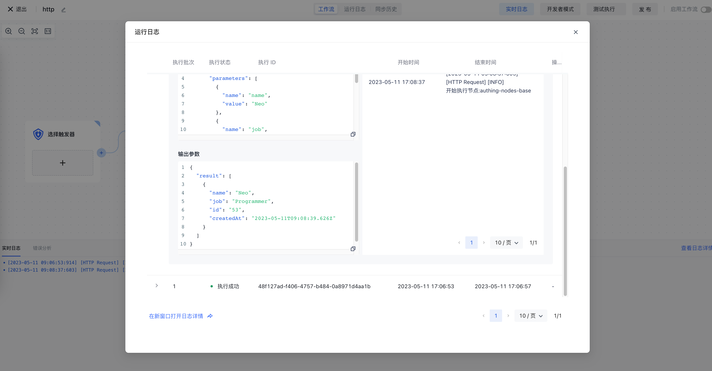
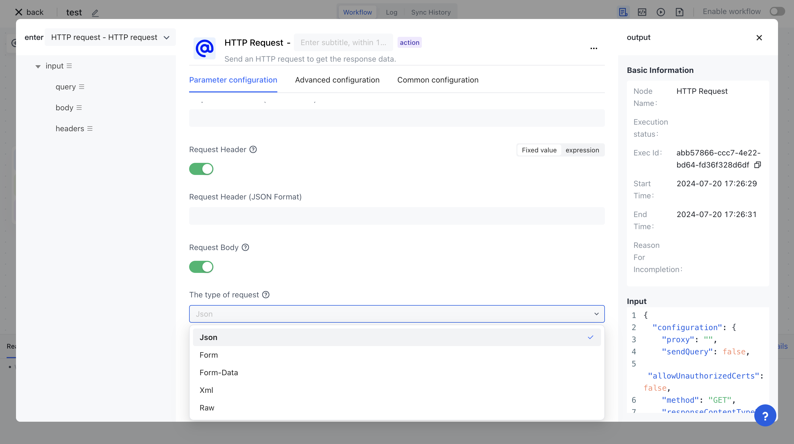

# HTTP Request

The HTTP Request node is one of the most common nodes in Authing identity automation. It allows you to make HTTP requests using REST APIs to query data from any application or service.

##Basic concepts

Before using this node, you need to first understand some basic HTTP terms and concepts.

### Request Method

Select the HTTP method used for the request:

- DELETE
- GET
- HEAD
- OPTIONS
- PATCH
- POST
- PUT

### URL

The API endpoint for the requirement request.

### Identity verification method

#### Predefined credentials

You can use the built-in credentials in Authioning identity automation, such as the pre integrated Slack API authentication method in Authioning identity automation. You need to manually process the actions of exchanging tokens and adding request headers.

#### General voucher

Choose a universal credential type to set up authentication using one of the following methods:

-Basic authentication method
-Digest authentication method
-Request header authentication method
- OAuth1
- OAuth2

###Query parameters, request header, and request body

You can choose to send additional information on request. The data you need to send depends on the API you interact with and the type of request you make.

-Send query parameters: Send Query Parameters in HTTP request
-Send request headers: Send request headers in HTTP requests
-Send request body: Send request body in HTTP request

### Other options

-Batch processing: Control how to batch large responses.
-Ignoring SSL issues: Ignoring SSL certificate issues
-Redirection: Choose whether to follow the redirection. Disabled by default.
-Response: Provide settings regarding the expected API response.
-Proxy: If you need to specify an HTTP proxy, please use this option.
-Time out: Set the timeout time for the request.

## Basic examples

Let's demonstrate a basic example of using an HTTP Request node to request https://reqres.in/ Data.

Create a new workflow and add an HTTP request node, enter it in the URL field https://reqres.in/api/users . All subsequent examples will call this endpoint:

### Get user list

Ensure that the method is set to GET. Click execute and you can see that you have received the data:

<!-- ### Add user

1. Select POST from the method dropdown list,
2. Open the request body button
3. Click to add parameters
4. Enter 'name' in the<strong> Name </strong>field.
5. Enter 'Neo' in the value field.
6. Click to add parameters
7. Enter 'job' in the<strong> Name </strong>field.
8. Enter 'Programmer' in the<strong> Value </strong>field.

 -->

<!-- After clicking save, execute:

  -->

## More examples

### Get binary files from URL

1. Enter the URL of the file in the URL field. For example, you can input [https://www.authing.com/favicon.ico](https://www.authing.com/favicon.ico) To obtain the logo of Clothing.
2. Select Add Options>Response.
3. Set the response format to a file.

### Send binary files to API endpoints

Connect the HTTP request node to the node that previously obtained the binary file. For example, this could be an HTTP request node, a binary file read node, a Google Drive node, and so on.

Select POST from the method drop-down list. Check the API documentation of your API to ensure that you have selected the correct HTTP request method.

Enter the URL to send the binary file to in the URL field.

Enable sending body text.

In the main content type, select binary data.

In the input data field name, enter the field name that contains binary data.

Select the execution node to run the node.

For a complete example, please refer to this workflow template.

### Obtain HTTP status code after execution

Select Add Options>Response.

Enable the inclusion of response headers and states.

When you execute a node, the output will include a header, status code, and status message.

### Send XML data

Enable sending body text.

In the main content type, select Original.

In the content type, enter application/XML.

Enter XML data in the body field.

