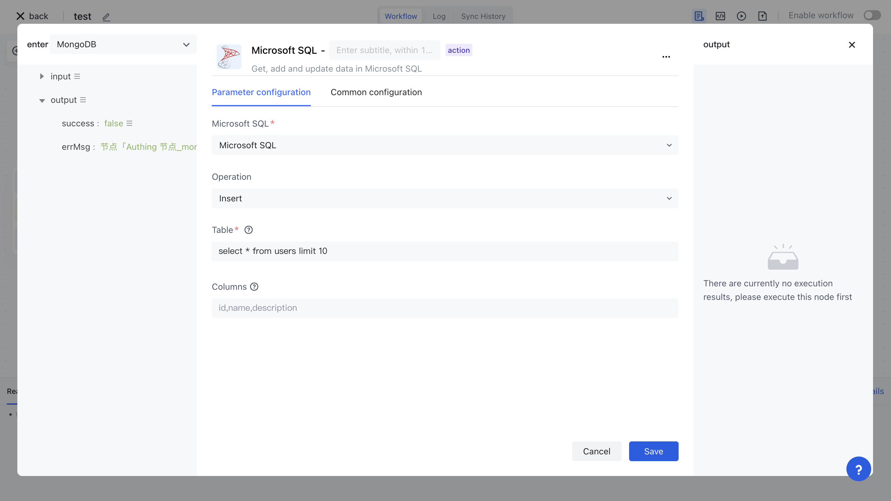

# Microsoft SQL

Microsoft SQL applications allow you to operate Microsoft SQL databases in Authing identity automation, including executing queries, inserting data, updating data, and more.

## Preparation work

If you have not yet created a Microsoft SQL database, please create it first.
2. Automatically configure your Microsoft SQL database key in Authoring identity.

## Supported operations

1. Execute query
2. Insert data
3. Update data
4. Delete data

