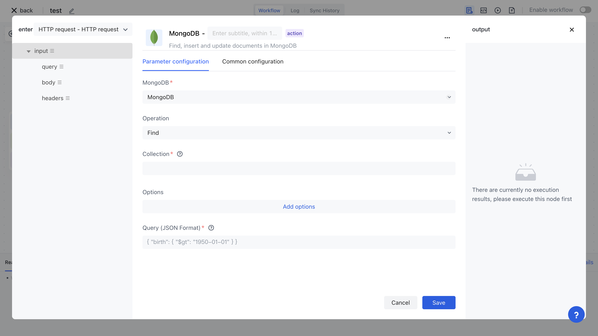
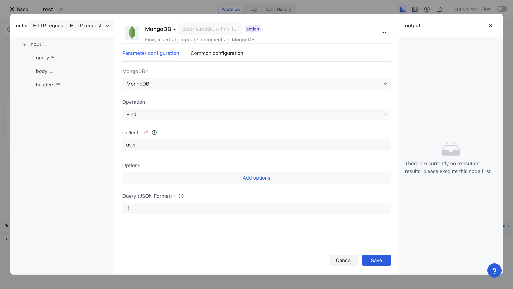
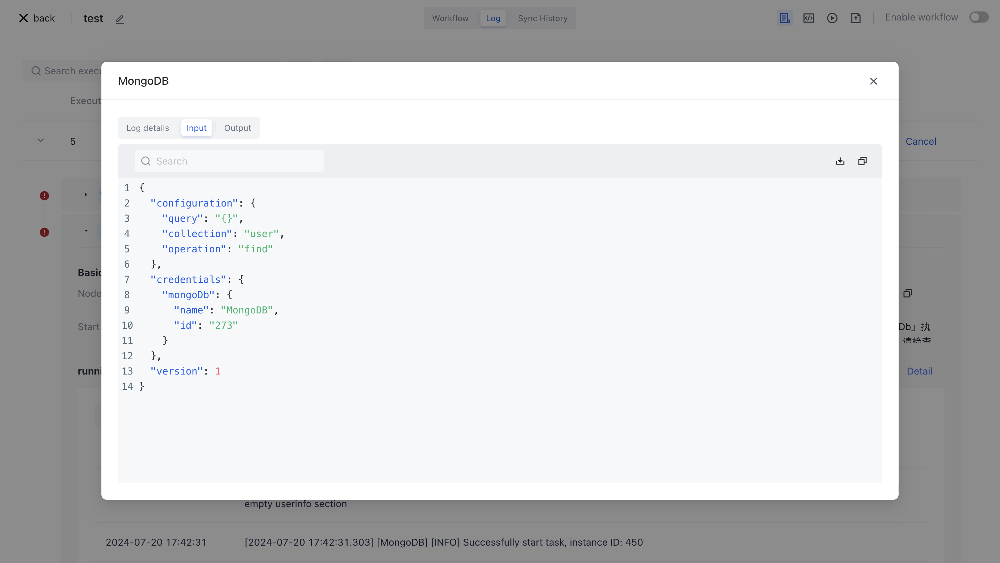

# MongoDB

The MongoDB application allows you to operate the MongoDB database in Authing identity automation, including executing queries, inserting data, updating data, and more.



## Preparation work

1. If you have not yet created the MongoDB database, please create it first.
2. Automatically configure your MongoDB database key in Authing identity.

## Supported operations

1. Aggregate aggregation
2. Delete
3. Find Query
4. Find And Replace
5. Find And Update
6. Insert
7. Update

##Basic examples


Firstly, in your MongoDB database, create a test table. Here, we create a Collection of `users` with three fields:`_id`、`name`、`email`, and insert several test data:

```typescript
db.createCollection("users")

db.users.insertOne(
   { name: "Bob", email: "bob@example.com"}
)
db.users.insertOne(
    { name: "Lucy", email: "lucy@example.com"}
 )
```

Set the operation of MongoDB node to Find, Collection to Find, and Query statement to `{}`：



Execution node:


