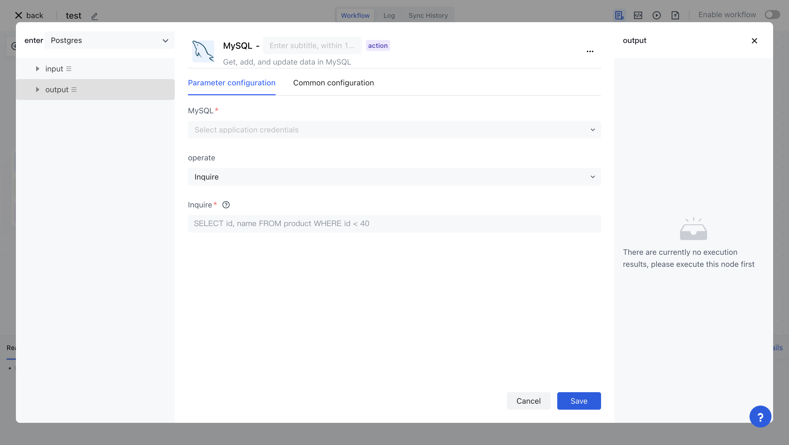
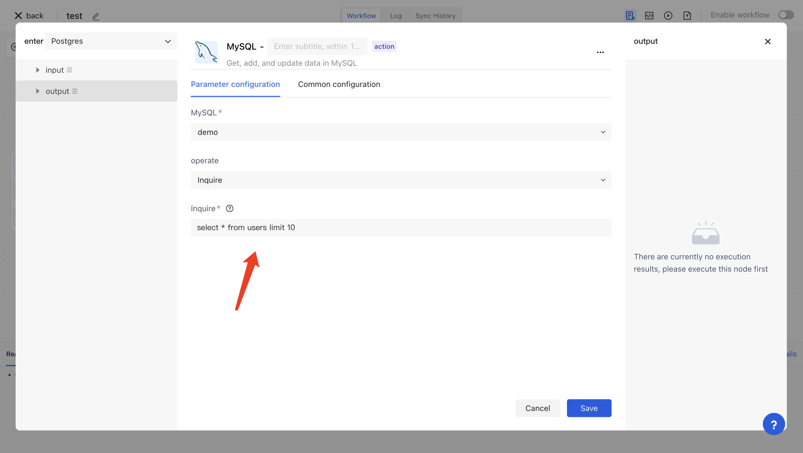
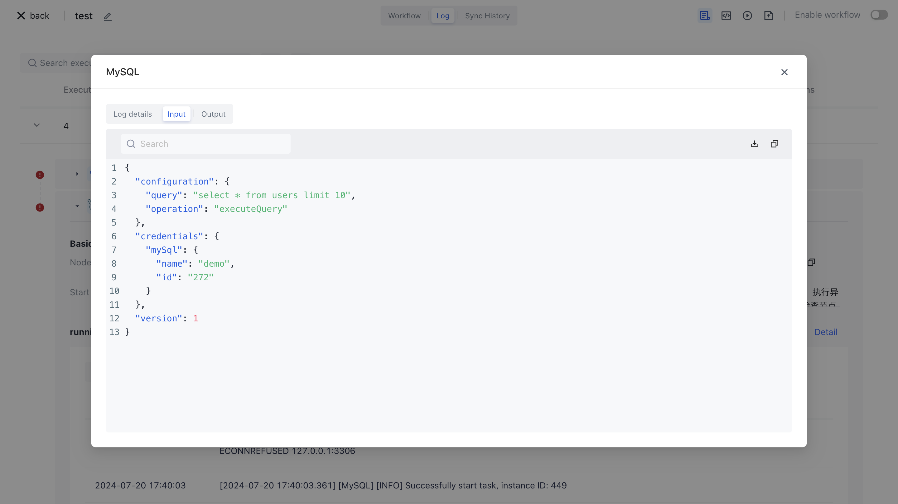

# MySQL

MySQL applications allow you to operate MySQL databases in Authing identity automation, including executing queries, inserting data, updating data, and more.



## Preparation work

If you have not yet created a MySQL database, please create it first.
2. Automatically configure your MySQL database key in Authoring identity.

## Supported operations

1. Execute query
2. Insert data
3. Update data

## Basic examples

Firstly, in your MySQL database, create a test table. Here, we create a `users` user table with three fields:` id `,` name `, and `email `, and insert several test data:

```typescript
CREATE TABLE `users` (
  `id` bigint NOT NULL AUTO_INCREMENT COMMENT 'Primary key',
  `name` varchar(64) NOT NULL DEFAULT '' COMMENT 'name',
  `email` varchar(128) CHARACTER SET utf8mb4 COLLATE utf8mb4_0900_ai_ci NOT NULL DEFAULT '' COMMENT 'mailbox',
  PRIMARY KEY (`id`)
) ENGINE=InnoDB AUTO_INCREMENT=72 DEFAULT CHARSET=utf8mb4 COLLATE=utf8mb4_0900_ai_ci COMMENT='User Table';

INSERT INTO `users` (`id`, `name`, `email`) VALUES
(1, 'Bob', 'bob@example.com'), 
(2, 'Lucy', 'lucy@example.com');
```

Set the operation of MySQL nodes to execute queries and write in query statements `select * from users limit 10`：



Execution node:


