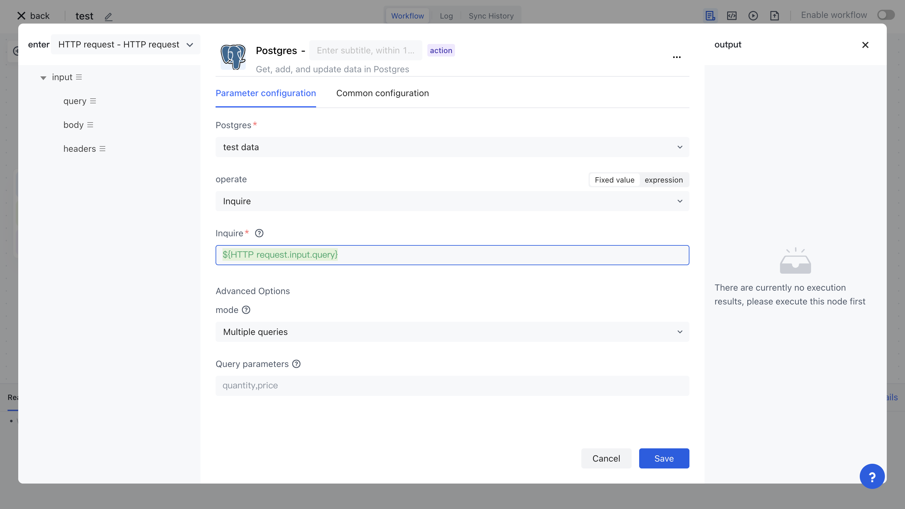

# PostgreSQL

The Postgres application allows you to operate the Postgres database in Authing identity automation, including executing queries, inserting data, updating data, and more.



## Preparation work

If you have not yet created a PostgreSQL database, please create it first.
2. Automatically configure your Postgres database key in Authoring identity.

## Supported operations

1. Execute query
2. Insert data
3. Update data

## Basic examples

Firstly, in your Postgres database, create a test table. Here, we create a 'users' user table with three fields:' id ',' name ', and' email ', and insert several test data:

```typescript
CREATE SEQUENCE IF NOT EXISTS users_id_seq;

-- Table Definition
CREATE TABLE "public"."users" (
    "id" int4 NOT NULL DEFAULT nextval('users_id_seq'::regclass),
    "name" varchar(64) NOT NULL,
    "email" varchar(64) NOT NULL,
    PRIMARY KEY ("id")
);

INSERT INTO "public"."users" ("id", "name", "email") VALUES
(1, 'Bob', 'bob@example.com'), 
(2, 'Lucy', 'lucy@example.com');
```

Set the Postgres node to execute queries and write in query statements `select * from users limit 10 `：


Execution node:


