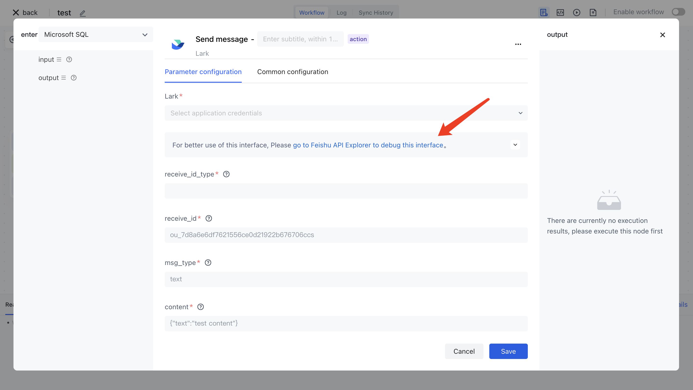

# Feishu

The Feishu application allows you to directly operate the Feishu API in Authing identity automation, including sending Feishu messages, creating approval processes, and inserting data into Feishu multi-dimensional tables.

## Preparation work

1. Register a Feishu account.
2. Create a Feishu enterprise self built application on the Feishu development platform (note: please set necessary permissions for this application, otherwise it will not be able to call Feishu's relevant APIs).
3. Automatically configure your Feishu enterprise self built application key in Authing identity.

## Supported operations

The Feishu application supports all the APIs of Feishu, including sending Feishu messages, creating approval processes, inserting data into Feishu multi-dimensional tables, creating tasks, and more. Please refer to for details [Feishu API Explorer](https://open.feishu.cn/api-explorer).

## View Feishu API documentation

In each action of the Feishu application, there is a corresponding Feishu API Explorer link for this interface. You can debug this interface in Feishu API Explorer to understand its basic usage.

