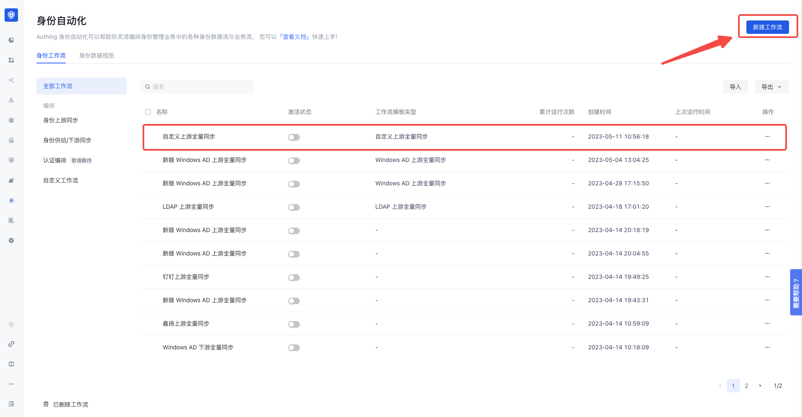
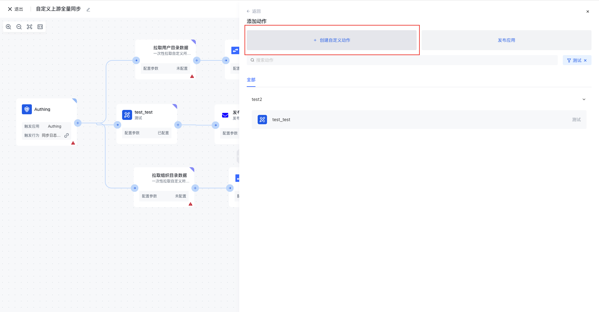
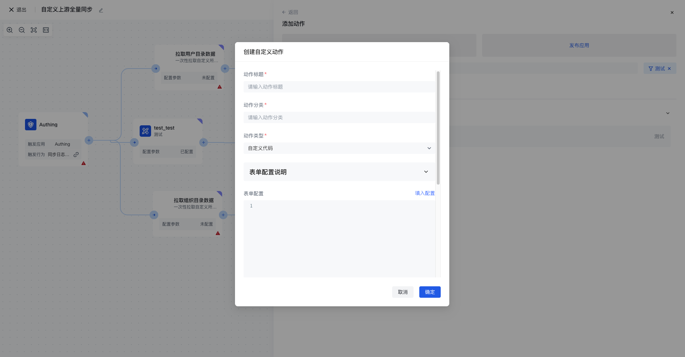
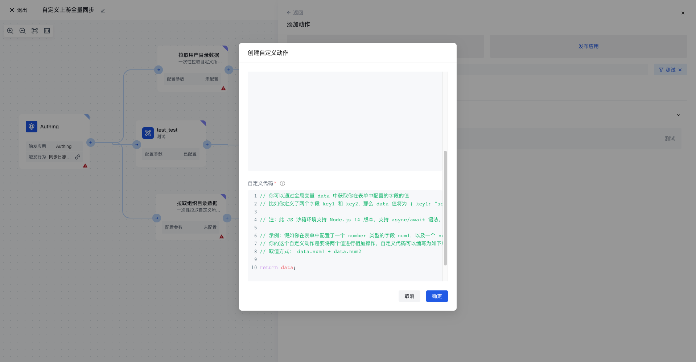
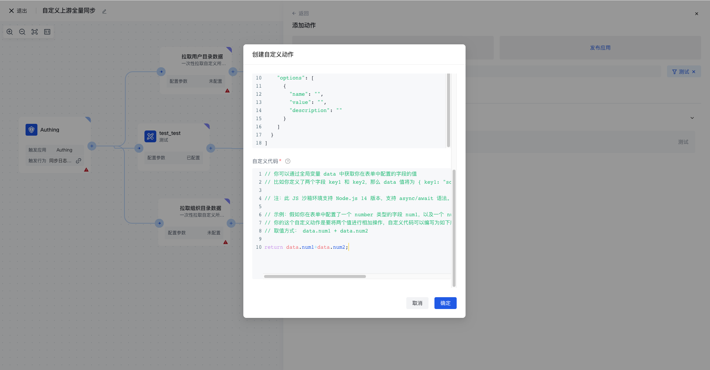
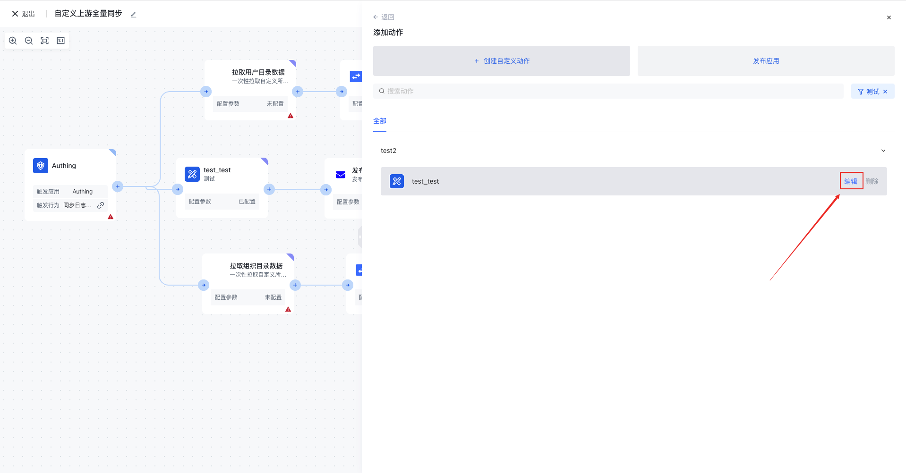
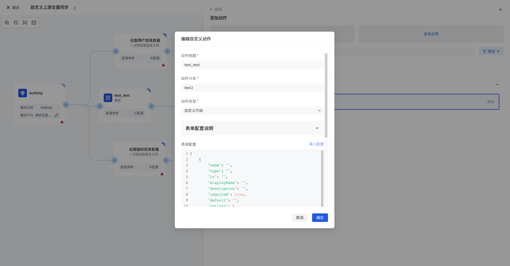
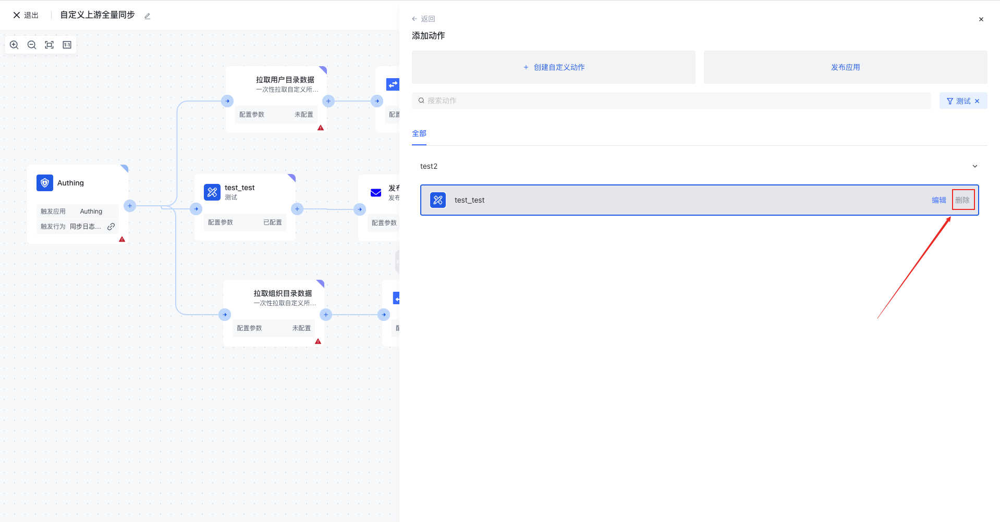

# Create custom actions

To create a custom action, users need to follow these steps:

1. Under identity automation, select an existing workflow or create a new workflow.

1. After creating Custom Application, tap to enter the Custom application, and tap Create Custom Action.

1. In creating a custom application, there are Action Title, Action Category, Action Type (user-defined code and HTTP request), and form configuration.

3. The following is a custom code implementation example - two numbers add example

1. Customize action editing
2. Select the custom action you want to edit and click Edit

1. In the Edit Custom action pop-up window, modify the properties to be edited, and click OK to save the modification.

1. Delete a user-defined action
2. Select the custom action you want to delete and click Delete.

