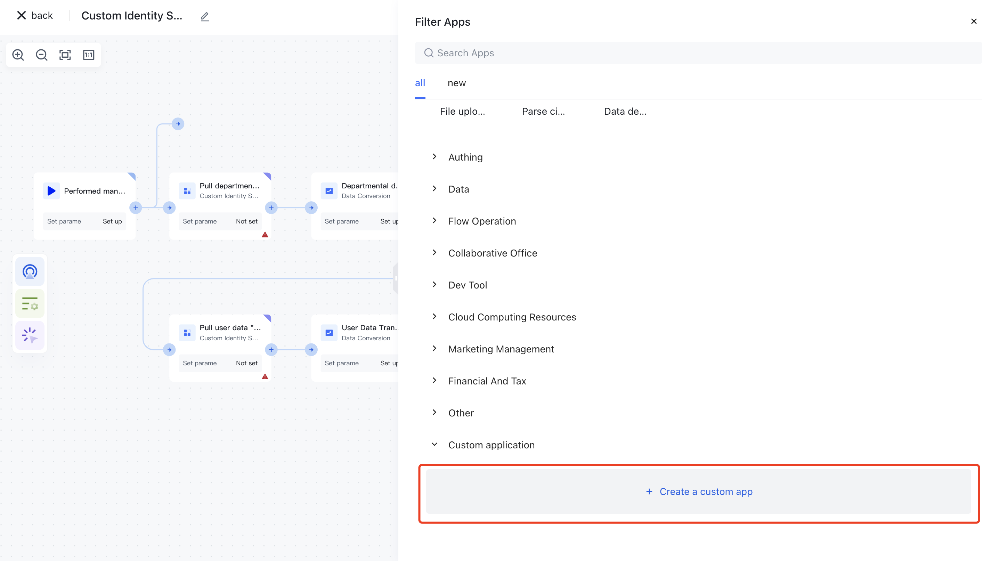
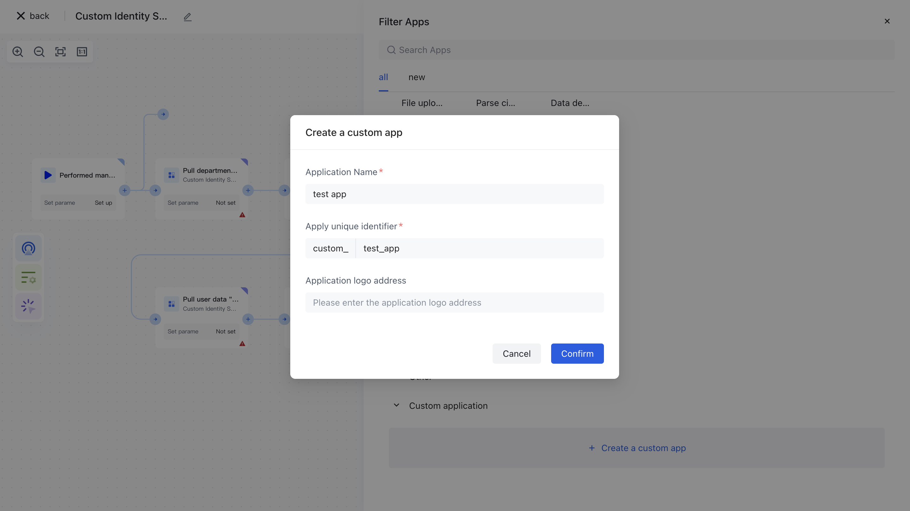

# Create a custom app

To create a custom app, users need to follow these steps:

The custom application function is implemented based on workflow, which is equivalent to the user customizing the nodes in the work to complete the expected goal.

1. Select an existing workflow or create a new one.

1. Click Add Node. In the sidebar, click Create Custom Application.

1. In the Create a Custom Application window, enter the custom application Name, Application Code, and Application Logod (optional).

<!-- 1. After the application is successfully created, you can find the newly created custom application in the right sidebar. -->

<!--  -->
