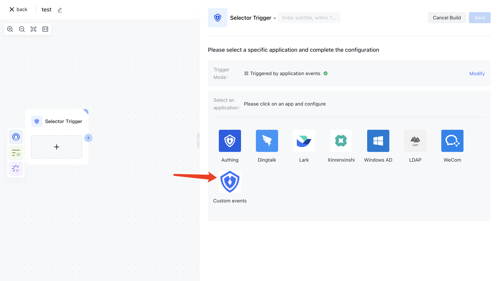

# Custom application Overview

## Introduction

User-defined applications allow users to combine common user-defined code snippets or a series of HTTP requests to form a workflow node set that is available only to users. Users can flexibly manage the action node classification and form property configuration of user-defined applications to improve the efficiency of workflow configuration.

In addition, a user-defined application supports the "publish application" operation. After being approved by the system administrator, the application can be used by other users. At the same time, users can still continue to use or update their own custom apps, but it will not affect the published apps. If the user wants to synchronize the subsequent updates to the published app, they can also submit the "Publish App" application again, and after approval, the app published in the public category will also be updated.

## Use scenario

Custom applications can be used in the following scenarios:

Integration with external systems: Custom applications can extract data from one system and push it to another, or automatically update records in multiple systems based on certain events, ensuring that data is accurate and up-to-date across all systems.
Custom workflows: Custom applications can guide users through specific processes or enforce certain rules or validations to ensure data quality, thus ensuring that processes are followed consistently and data is accurate and complete.
- Use a variety of tools and technologies: When creating custom applications, you can use a variety of tools and technologies to automate, integrate, and customize workflows, such as scripting with Nodejs, integrating with other systems using apis, writing custom form validation logic in JavaScript, and more.
- More powerful automation based on HTTP requests: Using HTTP requests, you can achieve more advanced automation functions.

Custom applications allow for more powerful automation based on HTTP requests. With HTTP requests, you can extract data from one system and push it to another, or automatically update records in multiple systems based on certain events.

If you need more information on how to use these apis, you can check out the corresponding documentation. If you need help writing code, please provide more context and specific questions, and I'll try to help you.