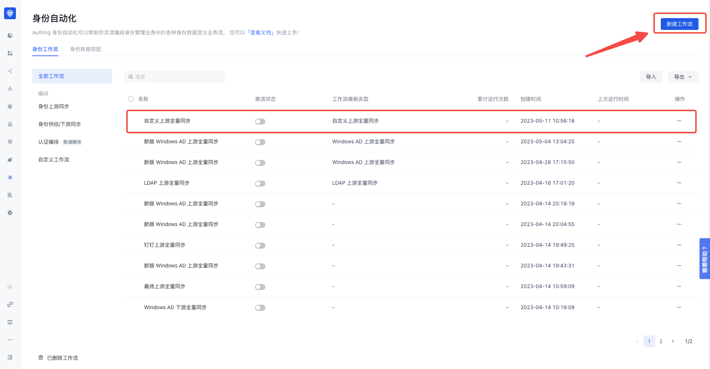
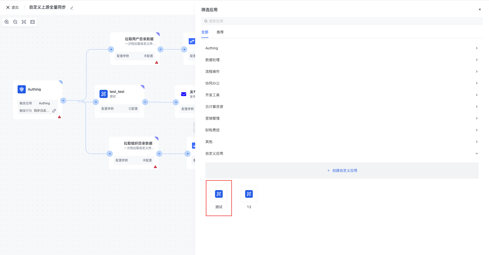
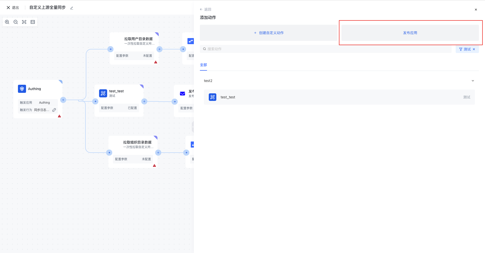
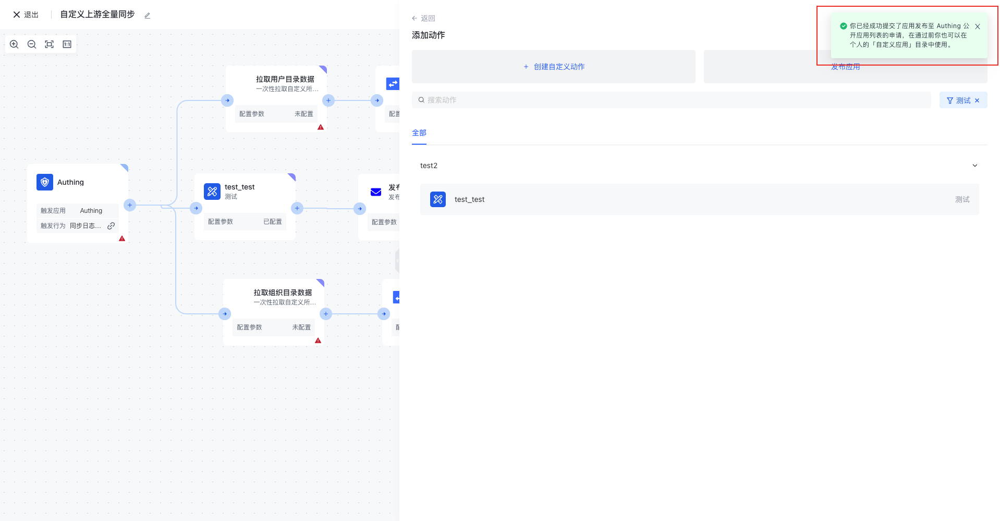

# Publish custom apps

To publish a custom application, users need to follow these steps:

1. Select an existing workflow or create a new one.

1. In the right sidebar, select the app you want to publish

1. Then click "Publish App" in the right sidebar.

1. After you click to confirm the release of the application, you will be prompted to publish the application to the Authing public application list for approval.

1. The relevant information about the application release will be submitted to the relevant background personnel for review. After the review, the application will become a public application node and be made available to all users.
