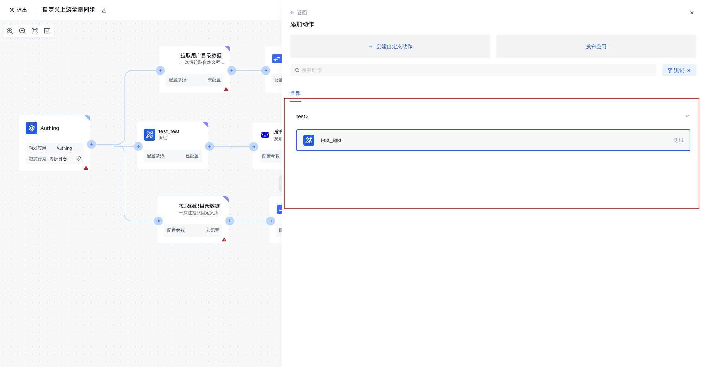
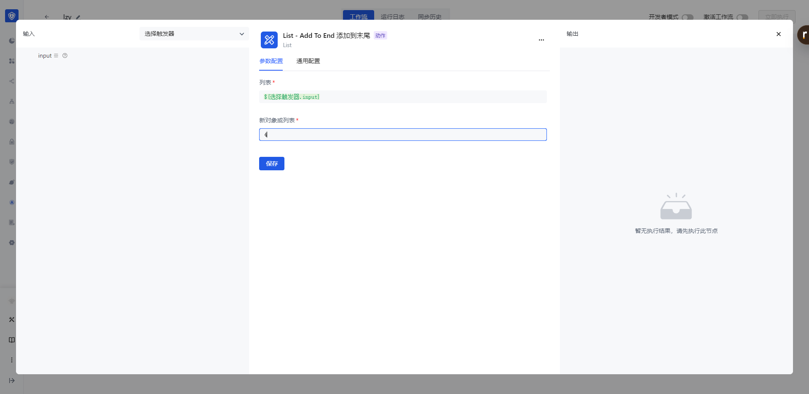
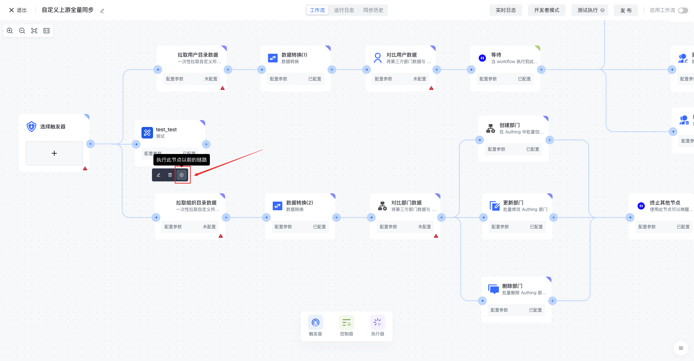
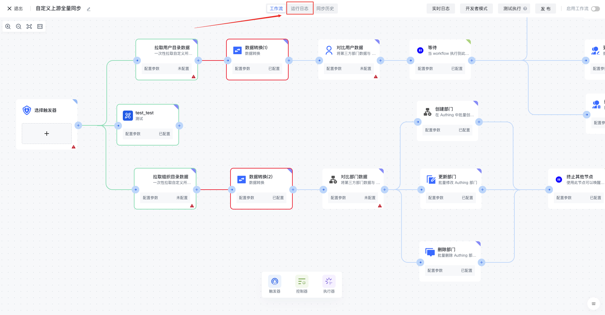
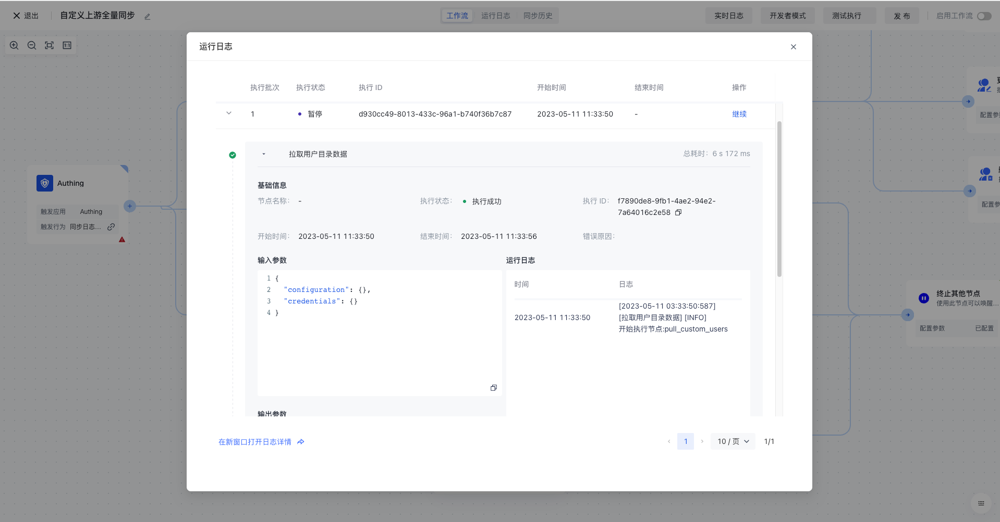

# Use custom apps

To use a custom app, users need to follow these steps:

1. After Custom Action is added successfully, it appears in the operations under Custom Application.

1. Select the Custom Action, create a node, and set parameters. You can pass the action down from the upstream or customize a fixed value.

1. You can click the Execute button of this node to test.

1. After clicking Execute, you can click Run Log in the upper middle of the workflow canvas, and view the running information and status of related nodes in Run Log.

