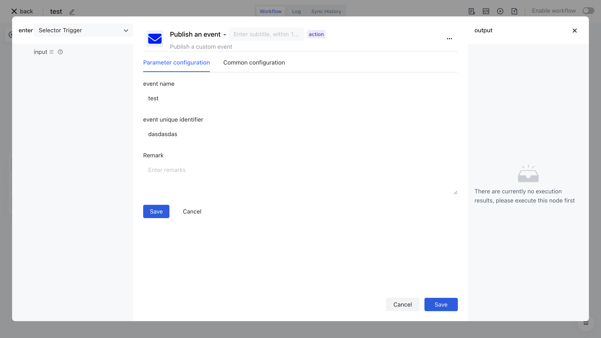

# Post custom events

1. Select an existing workflow or create a new one.

1. Click Add node, enter the publishing event in the shortcut text box, and then find the publishing event node.

1. Click the Publish event node, click Add user-defined event, configure information about the user-defined event, and click Save.

1. Then select the custom event you just created and save it.

1. When the workflow is running, the configured custom event will be published when it is executed to the application node regardless of the trigger mode.
