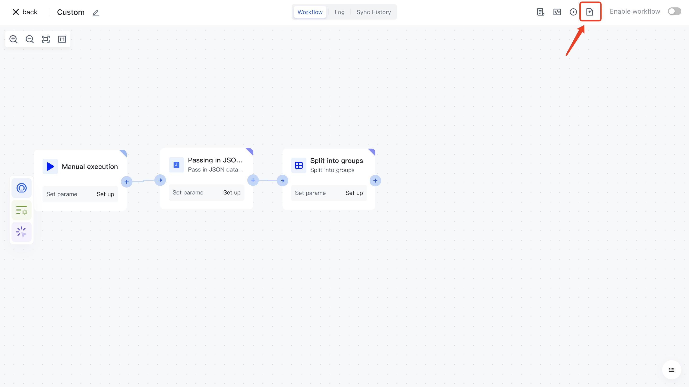

# Publish custom templates

1. Contact the administrator to obtain the permission to publish workflow templates (in terms of user pool ids).
2. In Identity Automation, select the workflow that you want to publish as a workflow template.

1. When the template publishing right is enabled for the user pool, the Publish button is displayed in the upper right corner of the workflow Canvas page.

1. Click the Publish template button and fill in the information related to the publish workflow template

- Currently only publishing to custom workflow templates is supported
- When choosing whether to publish to a public template:

- `No`: Posts to the My Templates category in the current user pool. (<strong> Other user pools cannot </strong>< /strong> view or use the </strong> template </strong>)
- `Yes`: This workflow template is published to the common Custom Workflow template category. (After <strong> publishes </strong><strong> template </strong><strong> need administrator </strong><strong> </strong><strong> review </strong><strong>, </strong><strong> will be displayed in </strong><strong> <strong> My template </strong><strong> <strong> before the </strong><strong> audit is not passed. , </strong><strong> Review </strong><strong> will be published to the public </strong><strong> </strong> Custom workflow </strong>< /strong> "template category </strong>)

