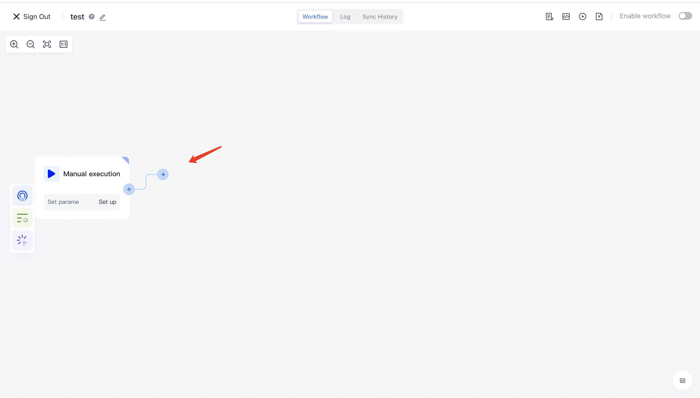
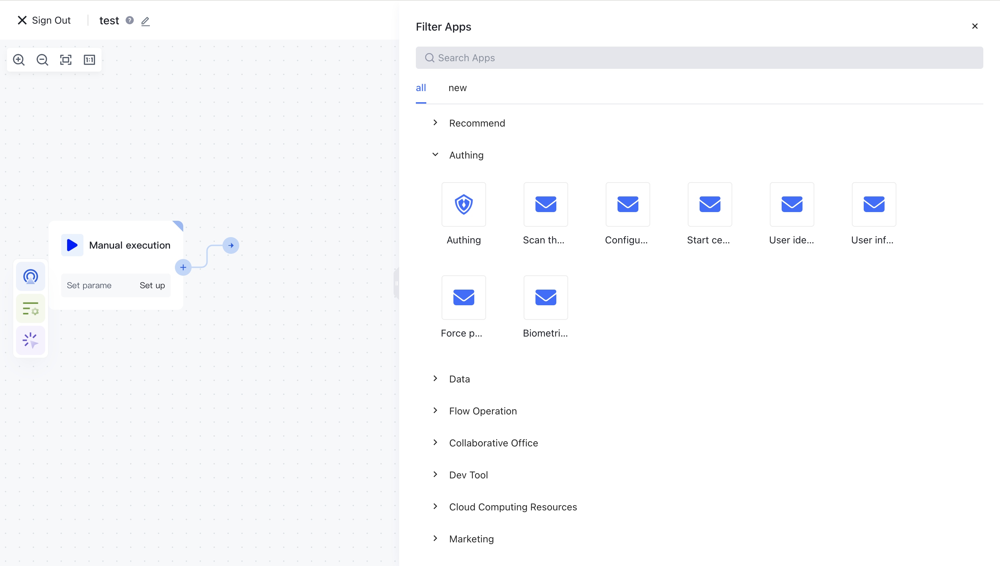
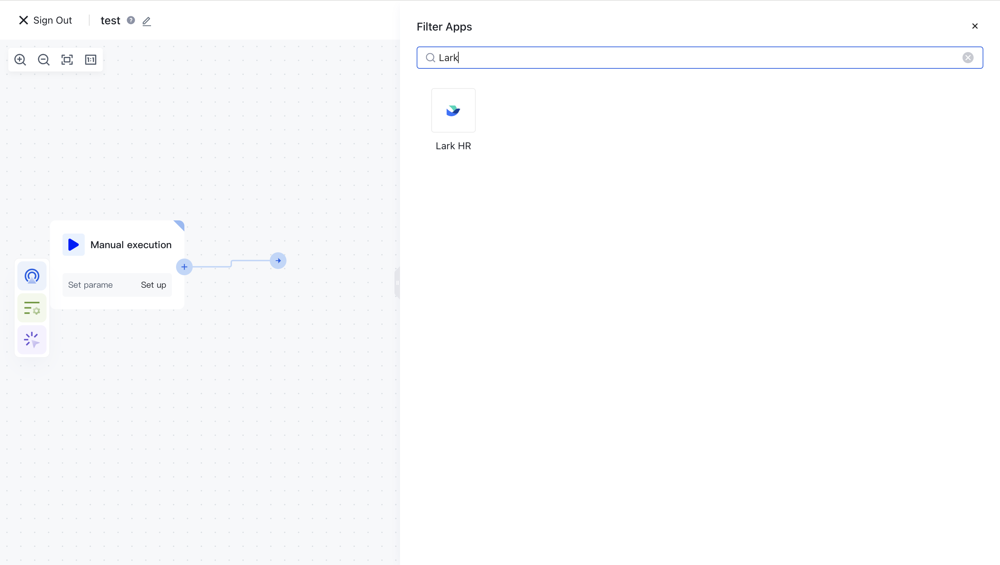
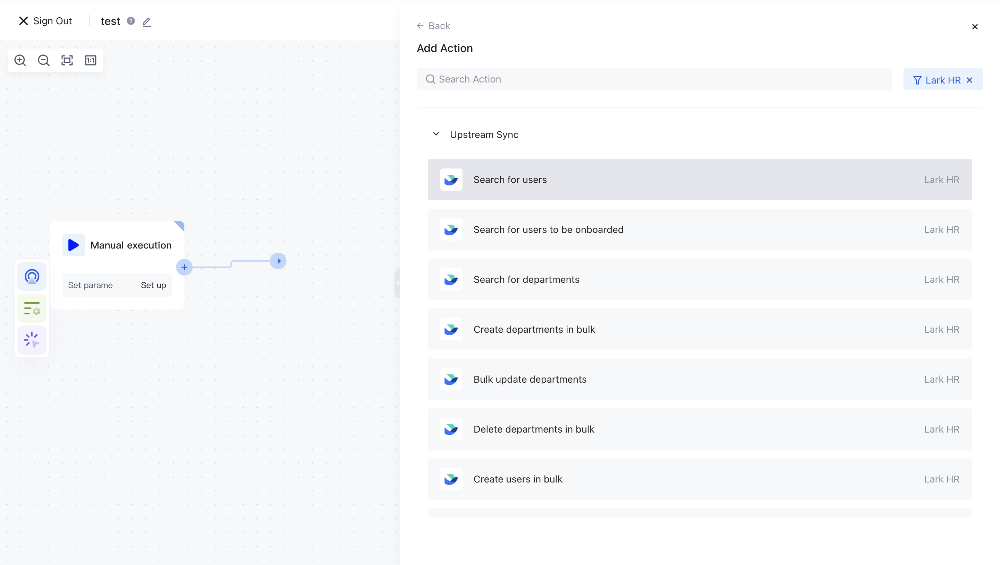
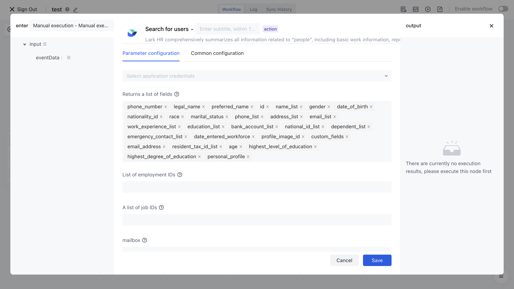
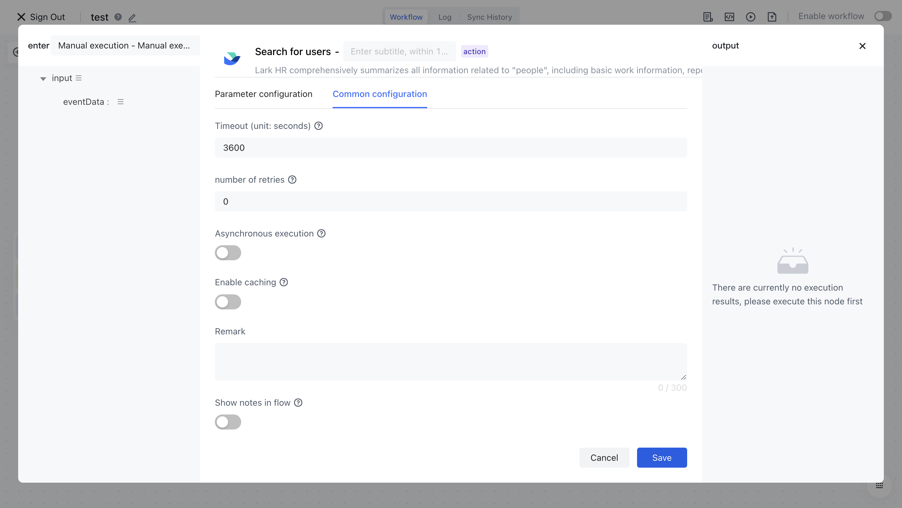
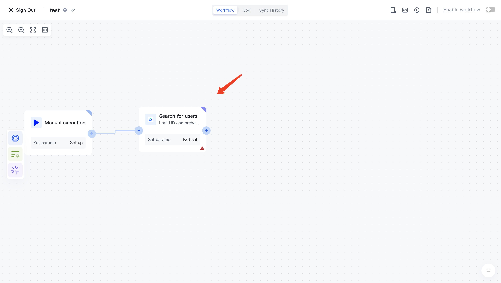

# Add node

On the right side of any node, there is a dot button. Hover the mouse over this dot and you can drag a line to add a new node:

In the pop-up application selection box, you can see all the applications integrated with Authing:

You can search for the application you need in the search box:

Choose the operation you need to complete, such as Feishu's "Send Message":

Next, you need to fill in the necessary configuration items, such as account, parameters, etc.:

Many times, certain parameters of the current node may depend on the results of previous nodes. In Authing identity sub automation, this is called<strong>Data</strong><strong>Assembly</strong>. For details, please refer to the document: [Assembly Data](/en/workflow/write-workflow/dynamically-assemble-data-for-nodes.html) 。

# Introduction to General Configuration Items

In the configuration items of each node, there is a general configuration menu where you can configure some common parameters, such as timeout time, retry count, etc.

The following is an explanation of each common configuration item:

- Time out: Specify the runtime timeout for this node, which defaults to 1 hour.
- Retries: When a node performs an exception, the default number of retries is 0, with a maximum of 5.
- Asynchronous execution: After being enabled, this node will execute asynchronously and will not block the execution of other nodes. If an exception occurs at this node, it will not cause the entire process to fail. Suitable for scenarios such as sending notifications and uploading files.
- Enable cache: After enabling it, within the effective cache time, the node will directly cache the value as the output result, which is suitable for obtaining third-party Access Tokens and other scenarios with a maximum number of requests within a certain period of time.

- Cache time: cache effective time, in seconds
- Note: Add note information to nodes

- Display note information in the workflow: Once enabled, you can see this note information on the workflow canvas.

