# Add process control node

The following will introduce the creation methods of process control nodes such as loops, IF, SWITCH, function calls, waits, and concurrent requests. For detailed instructions on the use of each process control node, please refer to the "Process Control Node" section.

## Add Branch

Branch Run: You create one or more workflow branches that can be executed simultaneously, providing operational efficiency.

After dragging a line from a node, we can continue to drag any branch from that node

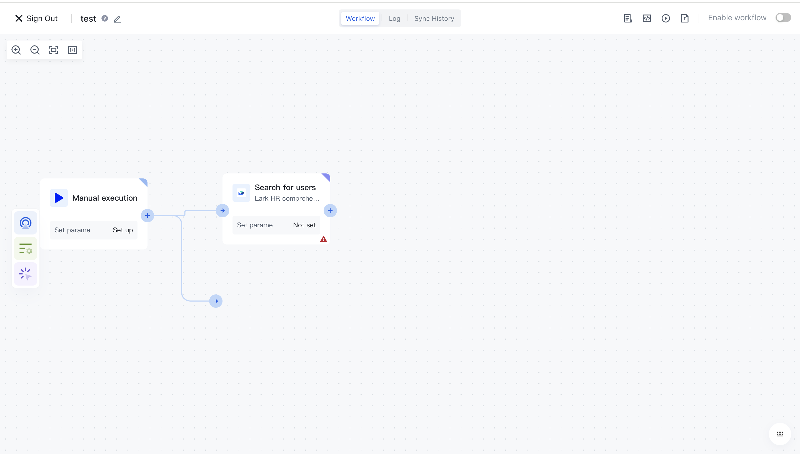

After dragging out the connection, an application selection box will pop up, allowing you to select any application you want to add:

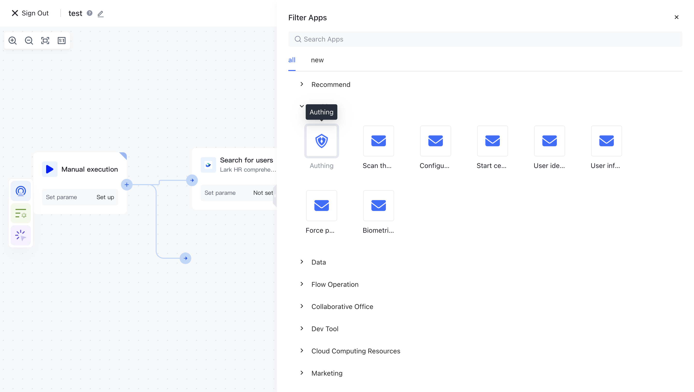

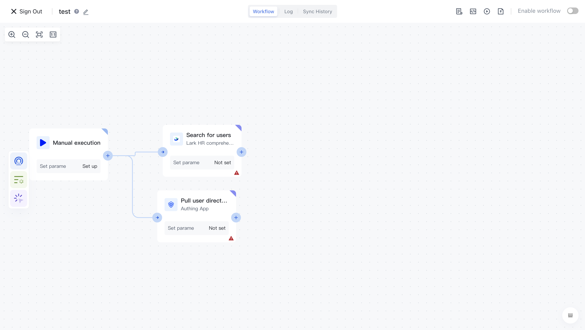

In this way, we created two parallel branches that will be executed in parallel during the workflow runtime. Only when both branches are completed will they continue to be executed further; If another branch fails to run, the entire workflow will terminate in a failed state.

How to merge the two branches in the future? You can add a new node in the future and connect the two branches to this node.

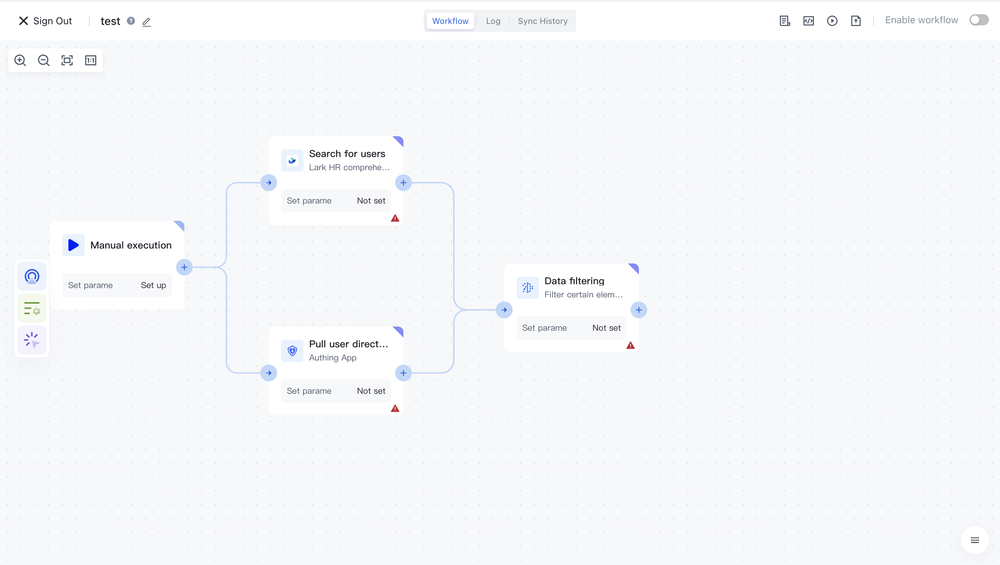

## Add IF node

You can see the IF nodes in the controller classification:

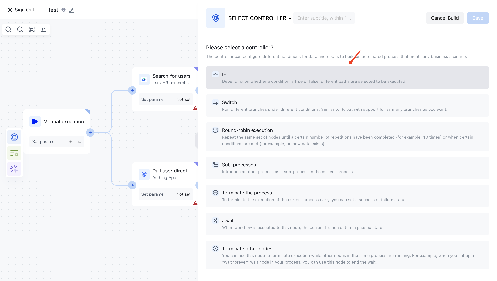

## Add a SWITCH node

You can see the SWITCH node in the controller classification:

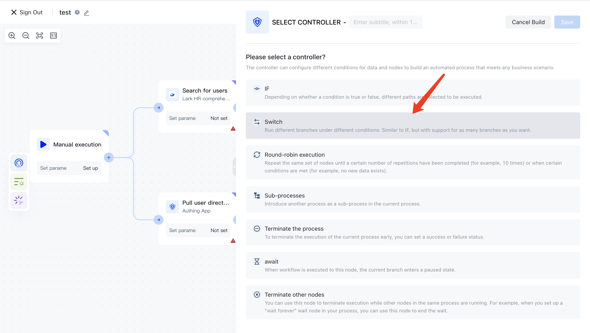

## Add loop node

Loop nodes allow you to repeat an operation.

You can see the loop nodes in the controller classification:

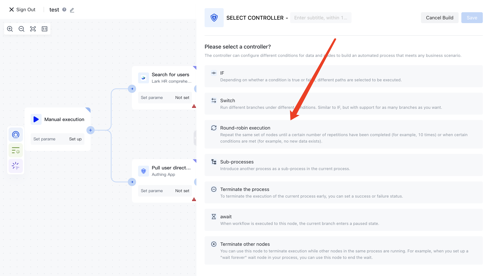

After adding, you can add any process within the loop execution node:

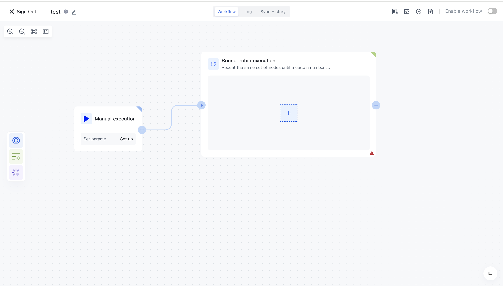

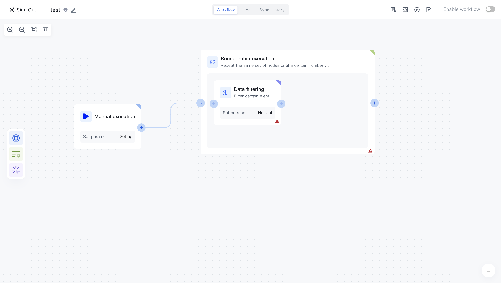

## Add waiting node

You can see the waiting nodes in the controller classification:

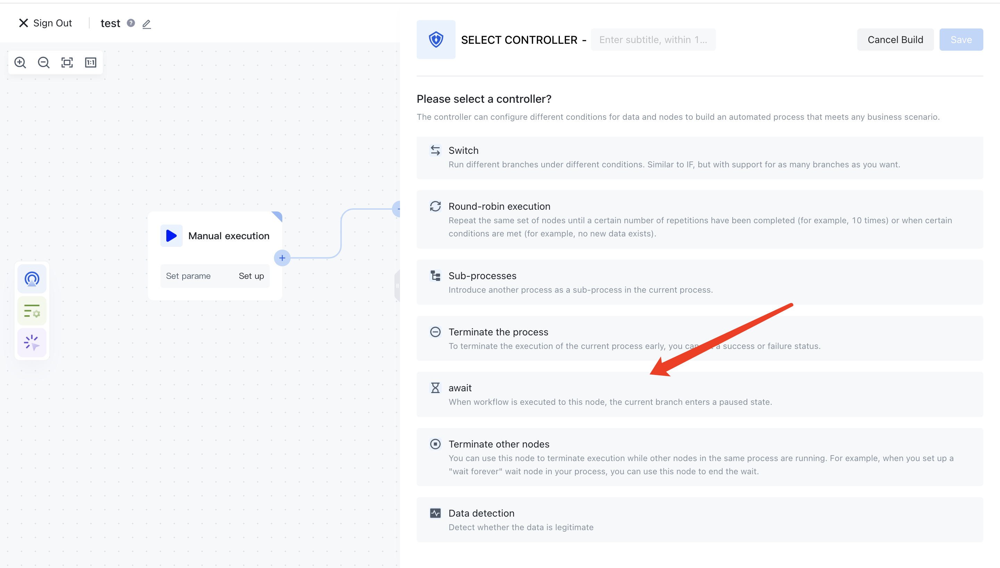

## Add sub process

You can see sub process nodes in the controller classification:

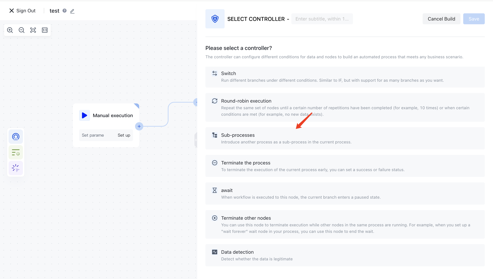

## Add termination process node

You can see the termination process node in the controller classification:

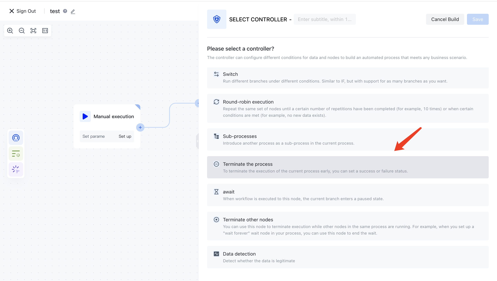
