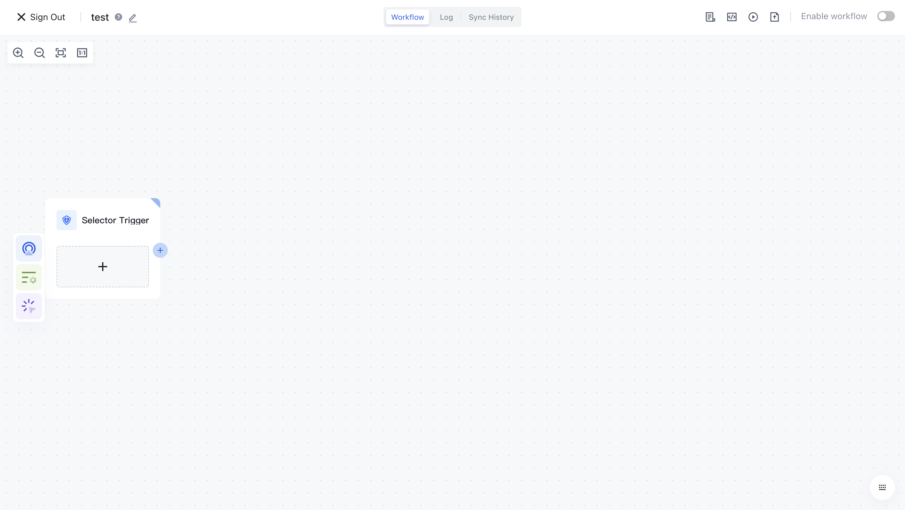

# Configure triggers

When you create a new workflow, a blank trigger will appear on the canvas, and you need to decide the specific starting method of your workflow:

Click the plus sign in the middle of the trigger node, and a selection box will pop up for you to choose the triggering method:

Different triggering methods require different configurations, and the specific configuration and usage of each trigger can be found in the following text. Here we can choose the simplest triggering method: manual execution.
