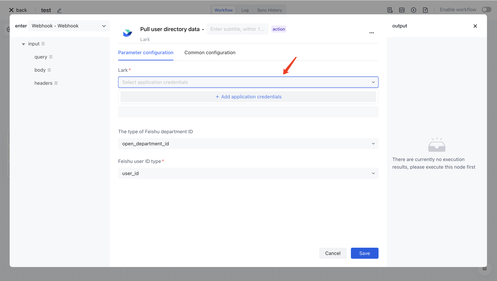
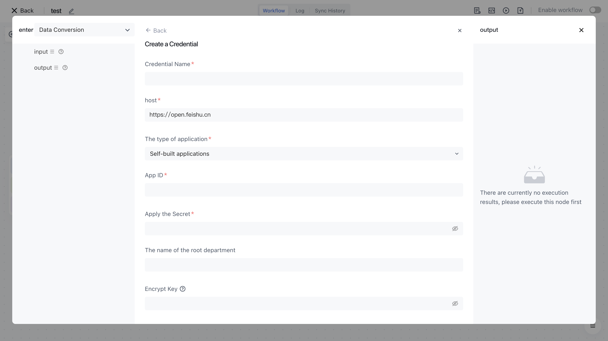

# Configure account connection

When using third-party application nodes in Authing identity automation, you need to configure the account of the third-party application. You can create, delete, or modify the configured account in the drop-down selection box of this account:

After the configuration is completed, you can click the<strong>Test Connection</strong>button. If the detection is successful, it indicates that the configuration is correct:

