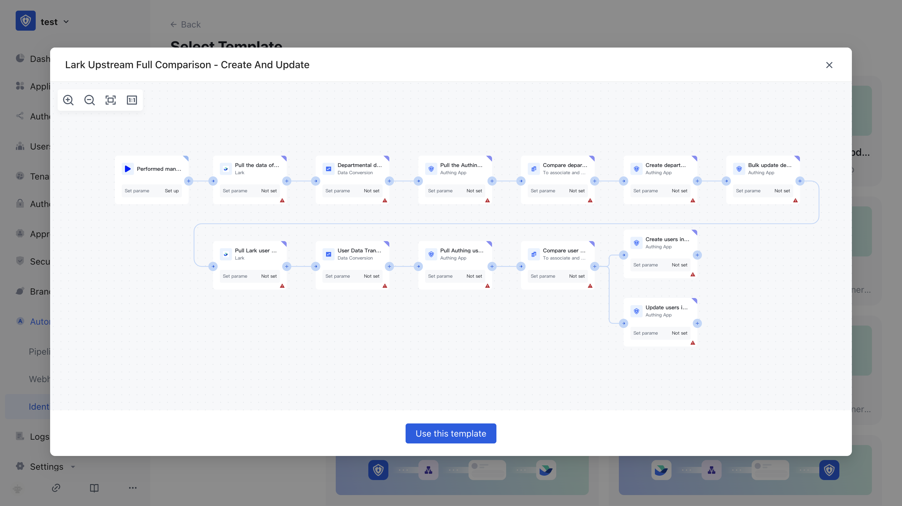

# Create Workflow

There are two ways to create a workflow:

1. Create workflow from scratch
2. Select workflow templates from the Authoring template market

## Create a new workflow from scratch

Enter the name and description of the workflow to:

## Creating a workflow using templates

In the template market for Authoring identity automation, choose the template you want to create:

