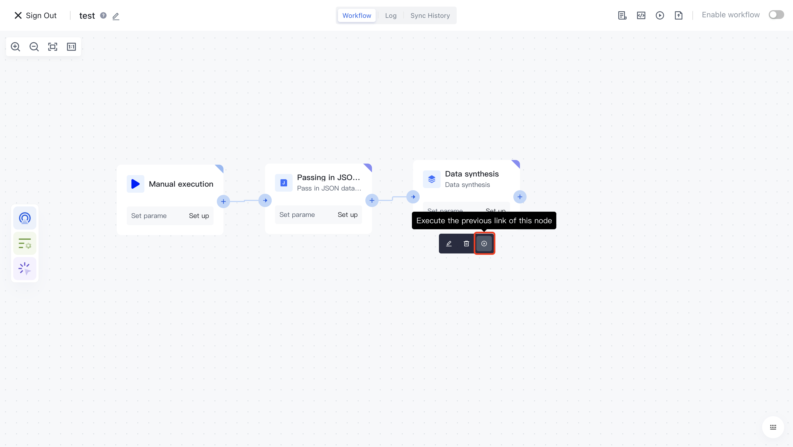

#Debugging Workflow

After completing the process writing, you may need to debug the workflow before it is officially released. At this point, you can turn on " <strong> Real time logs </strong> " and " <strong> Developer mode </strong> " in the upper right corner: you can see the execution status and output logs of each node:

1) The introduction of real-time logs is as follows:

2) The developer mode is introduced as follows:

3) You can click the "Execute" button on any node to execute a specific node separately:

