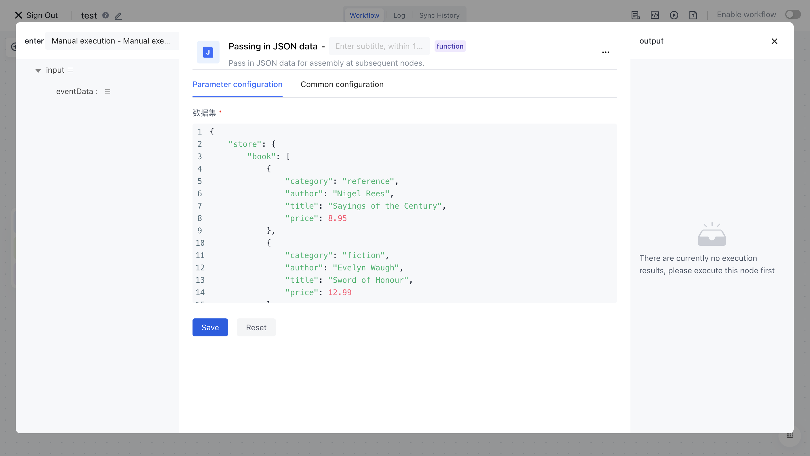

# Dynamically assemble data for nodes

This document introduces the expressions used in data assembly, and these out of the box expressions are often very useful when performing some simple processing on data.

> The Authoring process orchestration engine uses open-source [jsonpath](https://github.com/json-path/JsonPath) As a parsing engine for assembly data, if you are very familiar with this library, you can directly query its documentation.

# Create a sample workflow

>If you have just started working on identity automation with Authing, it is recommended to read [Write First Workflow] (/workflow/Quick Start/Boolean/Write First Workflow. hl).

Here we use a Mock data:

```typescript
{
    "store": {
        "book": [
            {
                "category": "reference",
                "author": "Nigel Rees",
                "title": "Sayings of the Century",
                "price": 8.95
            },
            {
                "category": "fiction",
                "author": "Evelyn Waugh",
                "title": "Sword of Honour",
                "price": 12.99
            },
            {
                "category": "fiction",
                "author": "Herman Melville",
                "title": "Moby Dick",
                "isbn": "0-553-21311-3",
                "price": 8.99
            },
            {
                "category": "fiction",
                "author": "J. R. R. Tolkien",
                "title": "The Lord of the Rings",
                "isbn": "0-395-19395-8",
                "price": 22.99
            }
        ],
        "bicycle": {
            "color": "red",
            "price": 19.95
        }
    },
    "expensive": 10
}
```

Here we create a simple workflow: use <strong> JSON </strong> nodes to pull data, and then use <strong> data synthesis</strong>nodes to test the use of data assembly:

1) Pull an incoming JSON data node and edit this node


2) Use JSON nodes to pull data, then fill in the parameter configuration with the JSON data above, and click save



3) First, click on the confirm execution button in the test execution, and let the workflow execute first


4) Next, we can see the execution results of the HTTP node in the data synthesis node and assemble its data.


By executing the workflow, you can see the output of the data synthesis node, which is the assembly result we tested. For example, in the simplest scenario, it is a direct reference to the value. The following will introduce other more advanced data assembly expressions.

# Common parsing expressions

| expression                                                                       | Example                                                                                                                                                                                                                                                                                                                                            | meaning                                                            |
| ---------------------------------------------------------------------------- | ----------------------------------------------------------------------------------------------------------------------------------------------------------------------------------------------------------------------------------------------------------------------------------------------------------------------------------------------- | --------------------------------------------------------------- |
| ${A certain node.output.xxx}                                                       | ${Incoming JSON data.output.data}                                                                                                                                                                                                                                                                                                                   | The most common way is to directly apply values                                          |
| ${A certain node.output.a[*].b}                                                    | ${Incoming JSON data.output.data[*].author}                                                                                                                                                                                                                                                                                                         | Extract the b field of all elements in list a and convert it into an array                      |
| ${A certain node.output.a..b}                                                      | ${Incoming JSON data.output.data..author}                                                                                                                                                                                                                                                                                                           | Extract the b field of all elements under object a and convert it into an array                      |
| ${A certain node.output.a[index]}                                                  | - ${Incoming JSON data.output.data.store.book[0]} (First element) <br/>- ${Incoming JSON data.output.data.store.book[1]} (Second element) <br/>- ${Incoming JSON data.output.data.store.book[-1]} (First to last element)<br/>- ${Incoming JSON data.output.data.store.book[-2]} (Second to last element)                                                                          | Get an element of an index in an array (index starts from 0)                         |
| ${A certain node.output.a[index1,index2,index3]}<br/><br/>Be careful not to have spaces between commas! | - ${Incoming JSON data.output.data.store.book[0,3,5]} (First, Fourth, and Sixth Elements)                                                                                                                                                                                                                                                                    | Batch retrieve elements of certain indices in an array (indices starting from 0)                     |
| ${A certain node.output.a[fromIndex:toIndex]}<br/><br/>Please note that there should be no spaces between ":"!   | - ${Incoming JSON data.output.data.store.book[0:3]} (From the first to the third element, excluding the last index) <br/>- ${Incoming JSON data.output.data.store.book[:3]} (From the first to the third element, excluding the last index)<br/>- ${Incoming JSON data.output.data.store.book[2:]} (From the third element to the last element) <br/>- ${Incoming JSON data.output.data.store.book[-2:]} (Last two elements) | Get all elements of the array from the beginning index to the introduction index, excluding the value of toIndex index index |
| ${A certain node.output.a[?(@.b.c)]}                                               | - ${Incoming JSON data.output.data.store.book[?(@.isbn)]}                                                                                                                                                                                                                                                                                           | Filter elements that exist in a certain field (nested support) in array data                    |
| ${A certain node.output.a[?(@.b.c<=10)]}                                           | - ${Incoming JSON data.output.data.store.book[?(@.price<10)]} 所有 price 小于 10 的书<br/>- ${Incoming JSON data.output.data.store.book[?(@.price<=10)]} All elements with price less than or equal to 10<br/>- ${Incoming JSON data.output.data.store.book[?(@.price>=10)]} All elements with price greater than or equal to 10                                                                   | Filter data in an array based on certain conditions                                    |
| ${A certain node.output.a[?(@.b.c<=$['c']['d'])]}                                    | - ${Incoming JSON data.output.data.store.book[?(@.price<$['expensive'])]} All prices are less than                                                                                                                                                                                                                                                             |                                                                 |
