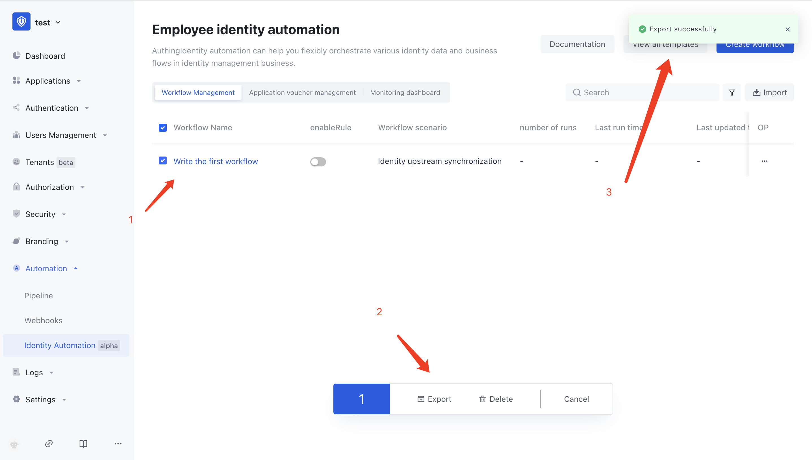
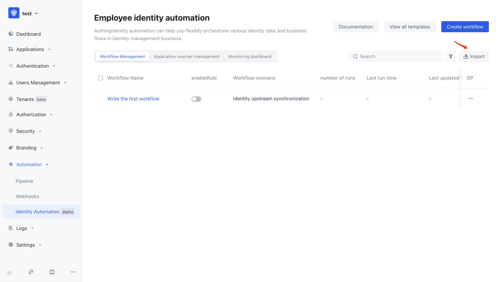

# Import and Export Workflow

You can export the workflow you have created in bulk:

1. Check the workflow that needs to be exported
2. Click the export button below
3. Obtain the exported file

Afterwards, you can import all of it into another Authing user pool, or even privatize the deployed Authing service. Simply click the import button in the other user pool and upload your previously exported zip file:

