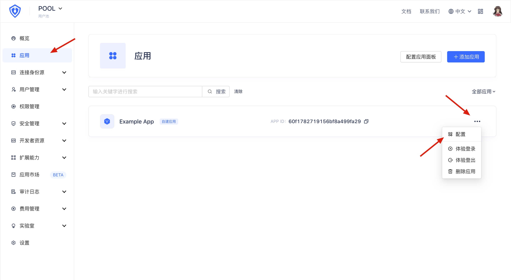
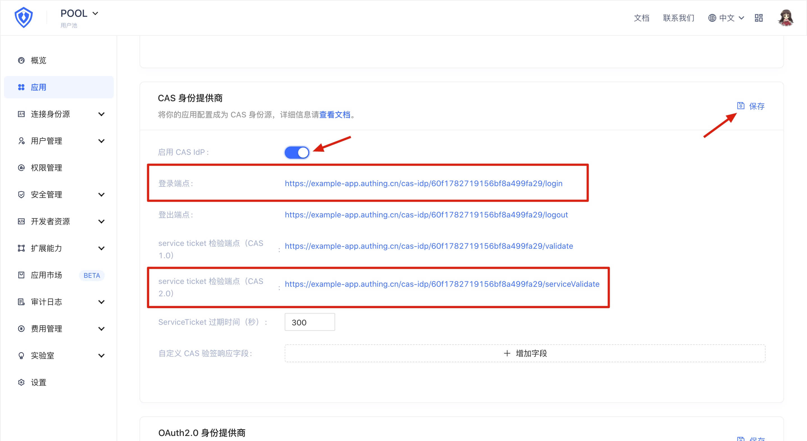
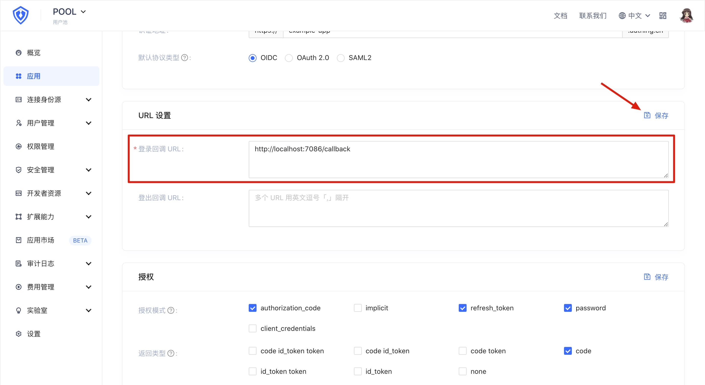

<IntegrationDetailCard title="启用并配置 CAS 身份源">

为了使用 CAS 2.0 协议进行认证，首先需要在 {{$localeConfig.brandName}} 控制台中启用 CAS 身份源功能，并配置回调地址。

首先打开 {{$localeConfig.brandName}} 控制台，进入用户池配置页面。打开应用面板，找到你想连接的应用，进入应用配置页面：

在「应用配置」选项卡中找到「CAS 身份提供商」面板，打开「启用 CAS IdP」开关，并单击右上角的「保存」按钮。记录下「登录端点」和「service ticket 检验端点（CAS 2.0）」两项的内容，之后的配置中会用到。

此外，还需要找到「应用配置」选项卡下的「URL 设置」面板，在「登录回调 URL」框配置一个你自己的回调地址，用来接受 {{$localeConfig.brandName}} 发来的 Ticket 参数。如果你不知道这是什么，可以继续往下看，之后再回来配置这一项。

配置完成后，不要忘记单击「保存」按钮保存你的配置。

</IntegrationDetailCard>