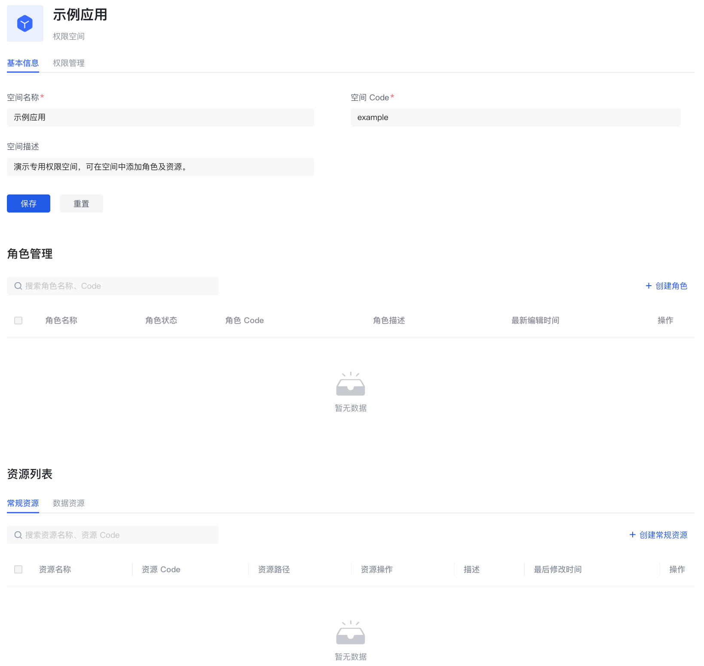

# 权限空间

权限空间可以理解为权限的命名空间，你可以在权限空间中创建角色、资源、管理权限，不同权限空间中的角色和资源相互独立，即使同名也不会冲突。

## 权限空间的主要功能

- 你可以在权限空间下创建与定义不同类型的资源
- 你可以在权限空间下创建与定义角色
- 你可以在权限空间内将资源授权给角色，再将角色授权给不同的用户与组织机构，实现基于 RBAC 模型的权限管理；你也可以在权限空间内将资源授权给用户等其他类型的主体，并设置基于条件的授权策略，实现基于 ABAC 模型的权限管理。
- 你可以在权限空间内查看与管理空间中资源权限详情

## 权限空间与应用的关系

当你每创建一个应用时，Authing 都会为你创建一个对应的权限空间，名称等同于应用名，对应的空间 Code 等同于应用 ID，且不可修改。

当你的某些业务系统无需对接 Authing 认证，只需要权限能力时，你也可以创建独立的与应用没有对应关系的权限空间，专门用来管理业务系统内的权限。

## 创建权限空间

你可以在权限列表页面，点击创建权限空间，进入创建页面：

在创建权限空间时，必填空间名称与空间 code，选填空间描述，填写说明如下：

| 字段名称  | 说明                                               |
| --------- | -------------------------------------------------- |
| 空间名称  | 建议使用业务系统的名称即可，例如“办公平台”         |
| 空间 Code | 权限空间的唯一标识，建议使用语义化的描述，例如“OA” |
| 空间描述  | 选填                                               |

## 管理权限空间

在权限空间的基本信息页面你主要可以：

- 管理权限空间下的角色
  - 创建权限空间下的角色
  - 查看权限空间下的角色详情
  - 编辑权限空间下的角色
  - 删除权限空间下的角色

- 管理权限空间下的资源
  - 创建权限空间下的资源
  - 查看权限空间下的资源详情
  - 编辑权限空间下的资源
  - 删除权限空间下的资源

## 权限空间权限管理

在权限空间的权限管理页面你主要可以

- 管理权限空间下的常规资源授权
  - 创建授权
  - 查看与修改授权
  - 删除授权
- 管理权限空间下的数据资源授权
  - 创建数据策略
  - 查看与修改数据策略
  - 删除数据策略

