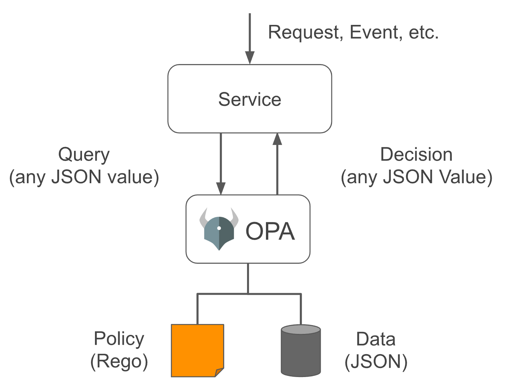
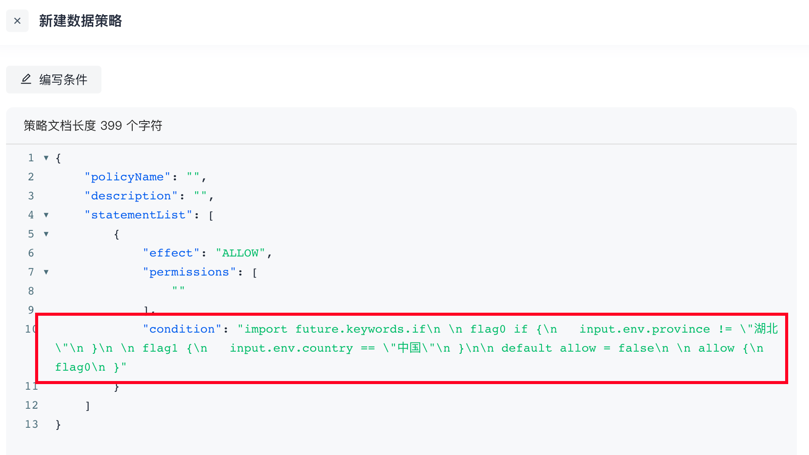
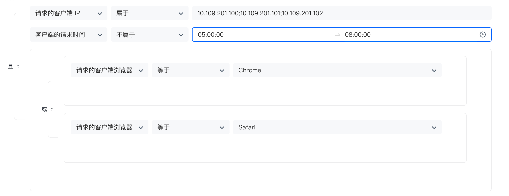
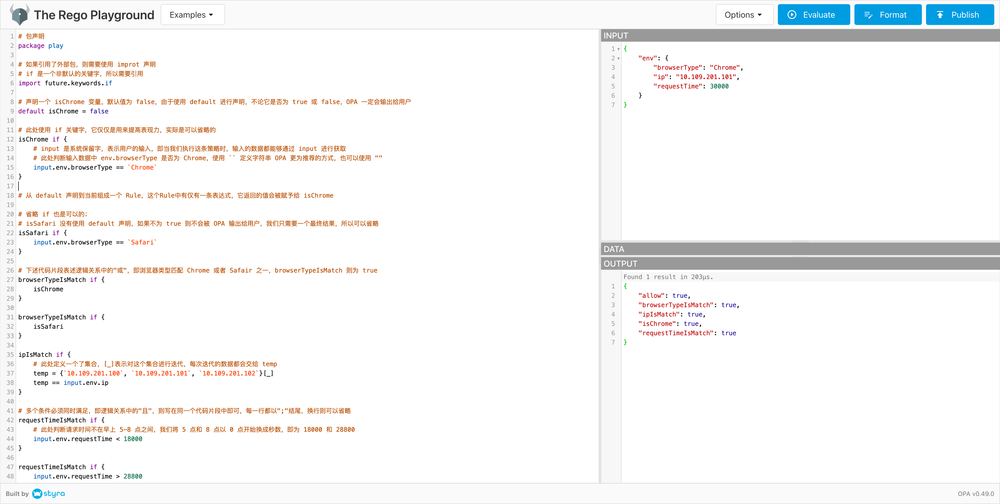
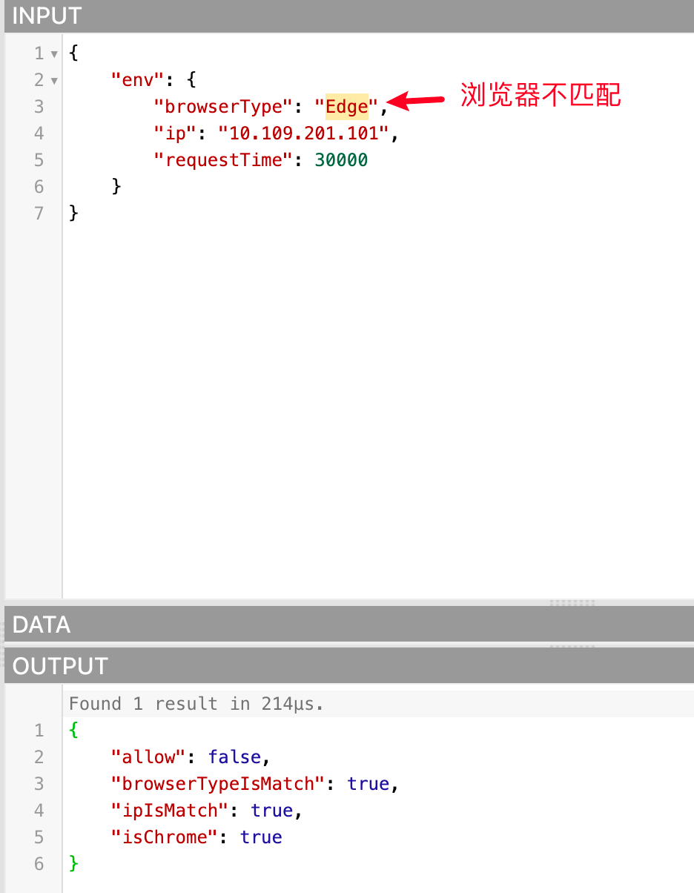
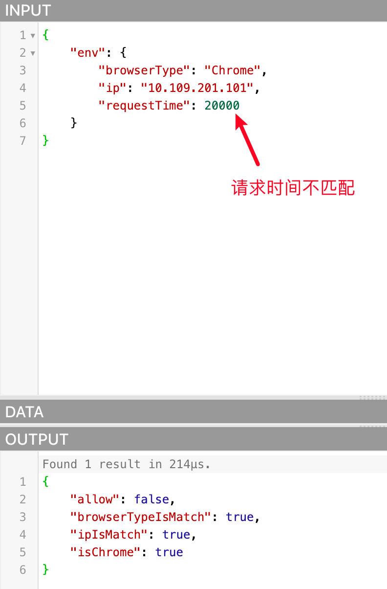

# 数据策略与 OPA

`Policy`：根据形势而确定的原则和方法。比如说：当我们生病了，就要去医院看医生，这就是一条策略，编程语言中的`if`、`switch`关键字就是很好的体现。

`Open Policy Agent` 简称`OPA`是一个使用`Go`语言编写的开源通用策略引擎。我们编写的代码中可能存在大量的策略，它和服务高度耦合，一旦有所改动，需要重新编译或重新部署。OPA 就能帮我们解决这一痛点，它将策略和服务进行解耦（即策略脱钩，Policy Decoupling），这些策略**独立于应用程序而存在**。

官网地址：**<https://www.openpolicyagent.org/>**

## OPA 的使用

OPA 提供了丰富的`RESTful API`，我们需要做出策略决策时候，会查询 OPA 并提供结构化数据（JSON）作为输入。注意：OPA 接受任意结构化数据作为输入



在 OPA 中对于它的输入一般称为`input`，可以为任意类型，输出也一样可以为任意类型，即可以输出布尔值 `true` 或 `false`，也可以输出一个`JSON`字符串对象。

我们的权限管理实现了基于属性的访问控制（Attribute-based access control - *ABAC*），它背后的实现原理是将数据策略中定义的一组组条件**转换**成 OPA 的策略，并在需要的时候让其帮我们做**策略决策**（OPA 还有很多用法）

## 如何定义 OPA 策略

OPA 中策略使用`Rego`语言编写的，Rego 的灵感来自 [Datalog](https://en.wikipedia.org/wiki/Datalog)，它是一种易于理解、已有数十年的历史的查询语言。Rego 扩展了 Datalog 以支持 JSON/YAML 等文档模型，对于它的详细介绍请参考官方文档<https://www.openpolicyagent.org/docs/latest/policy-language/#what-is-rego>

OPA 中的策略在模块（Module）中定义，Module 包含：Package、Import、Rule，除了 Package 是唯一且必须的，另外两个可以 0 或多个。其中 Rule 又是由 Head（定义变量）、Body（定义表达式） 组成。整个 Module 的**抽象语法树（AST）**如下：

```SQL
Module
 |
 +--- Package (Reference)
 |
 +--- Imports
 |     |
 |     +--- Import (Term)
 |
 +--- Rules
       |
       +--- Rule
             |
             +--- Head
             |     |
             |     +--- Name (Variable)
             |     |
             |     +--- Key (Term)
             |     |
             |     +--- Value (Term)
             |
             +--- Body
                   |
                   +--- Expression (Term | Terms | Variable Declaration)
```

Rego 编写的策略通常在**文本文件**中定义，在运行时由 OPA 去解析和编译，所以在数据策略中编写 Rego 条件，会转换成字符串：




### 案例

判断下当前的请求是否满足 IP 属于：`10.109.201.100`、`10.109.201.101`、`10.109.201.102`这三个；请求时间不在早上 5-8 点之间；并且浏览器是 Chrome 或者 Safari。下图是通过表单的方式的配置：



我们根据这个案例，使用 Rego 进行编写，如下：

```Go
# 包声明
package play

# 如果引用了外部包，则需要使用 improt 声明
# if 是一个非默认的关键字，所以需要引用
import future.keywords.if

# 声明一个 isChrome 变量，默认值为 false，由于使用 default 进行声明，不论它是否为 true 或 false，OPA 一定会输出给用户
default isChrome = false

# 此处使用 if 关键字，它仅仅是用来提高表现力，实际是可以省略的
isChrome if {
        # input 是系统保留字，表示用户的输入，即当我们执行这条策略时，输入的数据都能够通过 input 进行获取
        # 此处判断输入数据中 env.browserType 是否为 Chrome，使用 `` 定义字符串 OPA 更为推荐的方式，也可以使用 ""
        input.env.browserType == `Chrome`
}

# 从 default 声明到当前组成一个 Rule，这个Rule中有仅有一条表达式，它返回的值会被赋予给 isChrome

# 省略 if 也是可以的；
# isSafari 没有使用 default 声明，如果不为 true 则不会被 OPA 输出给用户，我们只需要一个最终结果，所以可以省略
isSafari if {
        input.env.browserType == `Safari`
}

# 下述代码片段表述逻辑关系中的"或"，即浏览器类型匹配 Chrome 或者 Safair 之一，browserTypeIsMatch 则为 true
browserTypeIsMatch if {
        isChrome
}

browserTypeIsMatch if {
        isSafari
}

ipIsMatch if {
        # 此处定义一个了集合，[_]表示对这个集合进行迭代，每次迭代的数据都会交给 temp
        temp = {`10.109.201.100`, `10.109.201.101`, `10.109.201.102`}[_]
        temp == input.env.ip
}

# 多个条件必须同时满足，即逻辑关系中的"且"，则写在同一个代码片段中即可，每一行都以";"结尾，换行则可以省略
requestTimeIsMatch if {
        # 此处判断请求时间不在早上 5-8 点之间，我们将 5 点和 8 点以 0 点开始换成秒数，即为 18000 和 28800
        input.env.requestTime < 18000
}{
        input.env.requestTime > 28800
}

# 
# 防止不统一，所以我们约定每个策略都必须使用 default 声明一个名为 allow 的变量，以至于我们都能通过 API 获取到执行的结果
# 因为上面 3 条规则的逻辑关系是"且"，所以在定义一个布尔类型变量，汇总最终的结果
# 因为使用 default 声明，所以 OPA 一定会返回给我们，最后判断整个条件是否满足则观察 allow 的值是否为 true 即可
default allow = false

allow if {
        browserTypeIsMatch
        ipIsMatch
        requestTimeIsMatch
}
```

官方提供了一个 [Playgroud](https://play.openpolicyagent.org)，支持在线执行，整个界面窗口分为如下四块：

- 左侧一整块是`Policy`窗口，在此处使用 Rego 进行编写策略
- 右**上**方是`Input`窗口，规则需要的外部数据在此处定义，可以 `JSON` 或 `YAML` 数据格式
- 右**中**间是`Data`窗口，如果规则需要的数据是来源于持久化数据库，我们可以为策略进行绑定其存储层接口，不过我们这里不需要，所以无需关注
- 右**下**方是`Output`窗口，OPA 进行策略决策后的结果输出区域，在 playground 这种方式中会将全部信息都输出给我们，没有办法指定查询指定的字段值，官方提示的示例中输出为布尔值。

我们将编写好的 Rego 代码在 Playground 中去执行，如下：



因为传入的数据都是符合条件的，所以`allow`为`true`，我们也可以试着传入不匹配的数据，看看 allow 是否为false，如下：





## 数据策略使用 Rego 语言编写条件的注意事项

- `package`无需声明，由于我们开放用户自定义 Rego，防止包名相同冲突，所以由程序自行生成，用户则不需要关注，不声明即可
- 部分鉴权 API 支持传入本次请求相关的环境参数，数据策略配置了条件，程序会将这些参数传递给 OPA，那么在编写的 Rego 条件中，则可以通过 Rego 语言的系统保留字`input`配合**参数所属属性名**进行获取，这些参数名称如下：
  - env：环境属性
    - ip（IP）
    - city（城市）
    - province（省份）
    - country（国家）
    - deviceType（设备类型）
    - systemType（系统类型）
    - browserType（浏览器类型）
    - requestDate（请求时间，格式：yyyy-mm-dd hh:mm:ss）
    - requestTime（请求时间时分秒部分总和的秒数，鉴权时会根据请求参数中的 requestDate 进行计算后额外添加此参数）

### 示例案例

- 获取本次鉴权请求的 IP：**input.env.ip**
- 获取本次鉴权请求的设备类型：**input.env.deviceType**

后期我们可能会放开更多的属性，如：用户池、应用、用户等等，获取方式类似，比如放开 user 属性，获取用户名，则可以通过 input.user.username

- 由于OPA 提供查询策略执行结果的 API 必须传入结果中存在一个变量的变量名，所以我们约定 Rego 编写的条件，**必须使用 default** **关键****字定义一个布尔类型且名 allow 的变量**，我们判断条件是否命中时，会向 OPA 查询该策略执行结果中`allow`变量的值，如果为`true`则表示条件命中，授权成立

## Rego 代码示例

为降低用户学习 Rego 成本，我们根据数据策略目前支持配置的几种条件，提供了一些常用的 Rego 代码片段示例：

- 请求地址信息是在中国湖北省武汉市

```Go
countryIsMatch {
   input.env.country == "中国"
}

provinceIsMatch {
   input.env.province == "湖北"
}

cityIsMatch {
   input.env.city == "武汉"
}

default allow = false

allow {
   countryIsMatch
   provinceIsMatch
   cityIsMatch
}
```

- 请求 IP 属于：10.109.201.100、10.109.201.101、10.109.201.102

```Go
ipIsMatch {
   temp = {`10.109.201.100`, `10.109.201.101`, `10.109.201.102`}[_]
   temp == input.env.ip
}

default allow = false

allow {
   ipIsMatch
}
```

- 请求设备类型是 PC 或者 Mobile

```Go
deviceTypeIsMatch {
   input.env.deviceType == "PC"
}
{
   input.env.deviceType == "Moblie"
}

default allow = false

allow {
   deviceTypeIsMatch
}
```

- 请求请求时间在早上 0-8 点之间（将 8 点以 0 点开始换成秒数，即为 28800）

```Go
requestTimeIsMatch {
   input.env.requestTime >= 0
   input.env.requestTime <= 28800
}

default allow = false

allow {
   requestTimeIsMatch
}
```
