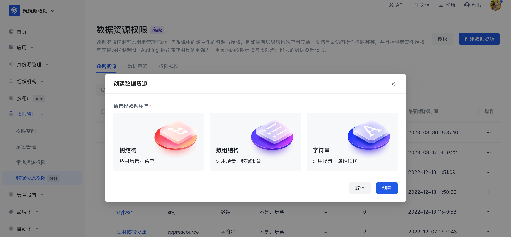
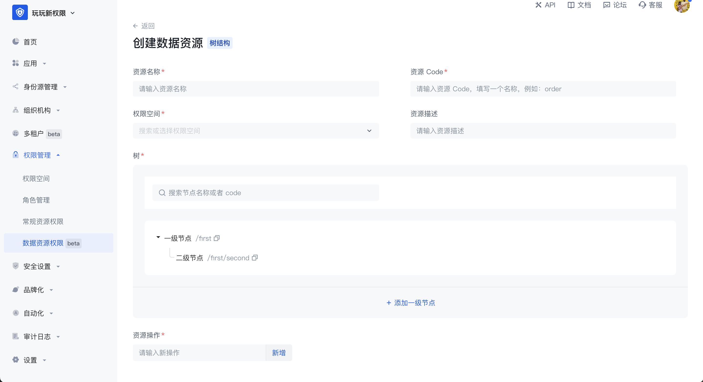
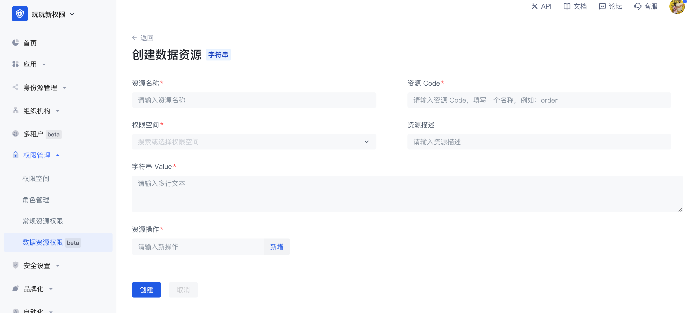
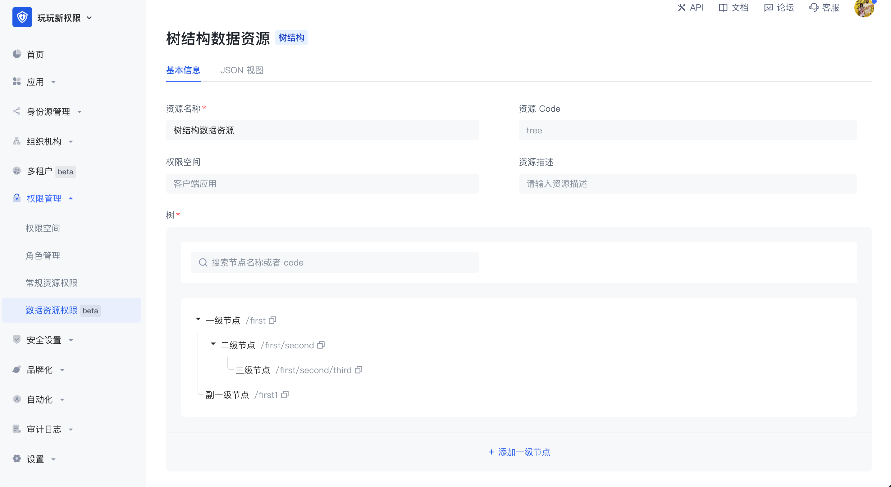

# 数据资源

数据资源是更贴近实际业务数据权限管理场景的资源，在数据资源权限管理中可以实现菜单、文档目录、API、合同等多种类型资源的定义、授权及权限视图查询的完整闭环。

数据资源提供三种资源结构类型，分别是树结构类型、数组结构类型和字符串结构类型，以便于用户便捷创建对应结构的资源，每种类型有其独特的数据结构，每种类型的数据资源有很多的应用场景。进入数据资源权限管理页面时可编辑查看整个用户池内数据资源列表，点击右上角的创建数据资源可以选择数据类型。

- 树结构

树结构数据资源有两种常见的应用场景，分别是树结构的菜单和有目录层级的文档系统。在管理菜单资源的场景下，当超级管理员想将系统菜单设置为权限管理中的资源，想要实现各个菜单管理员能有权限使用不同的菜单资源时，可以将菜单拆为不同的资源并将其授权给不同的主体对象，树结构是有层级的，可自定义每个节点中的值，在树结构中可以创建子节点，也可以创建同层级的节点。

- 数组结构

数组结构的数据资源常见的应用场景是合同条款等数据管理，可以添加多条数组结构的数据资源，可以在一个数组中添加任意个数据，最长 50 个字符。

- 字符串结构

字符串结构的数据资源常见的应用场景是对 API 等资源的管理，一般用于路径指代，在字符串数据资源中可以不受限制的输入多行文本内容，或将 API 路径填入实现对 API 的资源管理。

数据资源区别于常规资源的地方在于：

1. 数据资源提供了三种常见的数据资源类型，能购方便用户更灵活的创建各种类型的资源；
2. 授权方式，数据资源不能直接授权给主体对象，需要打包成策略后授权，常规资源可以直接授权给角色。

数据资源详情：创建好数据资源后，可在资源详情页中查看、编辑资源中的值，创建后资源中的权限空间和资源 code 不可修改。

JSON 视图：支持在资源详情中能通过 JSON 的方式查看资源的数据化的表示。

