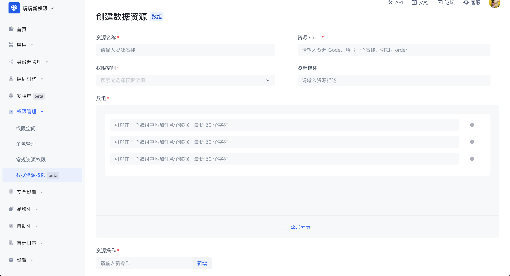
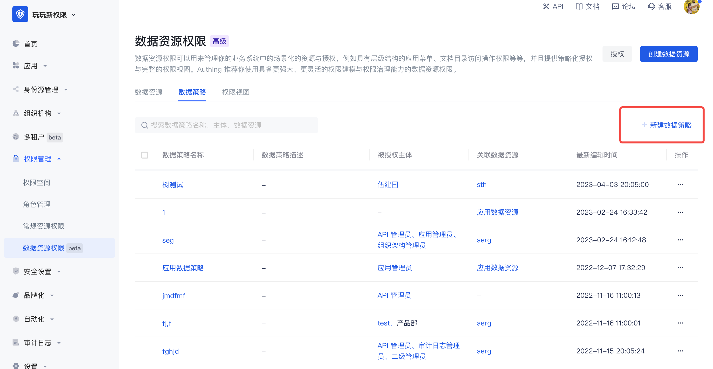
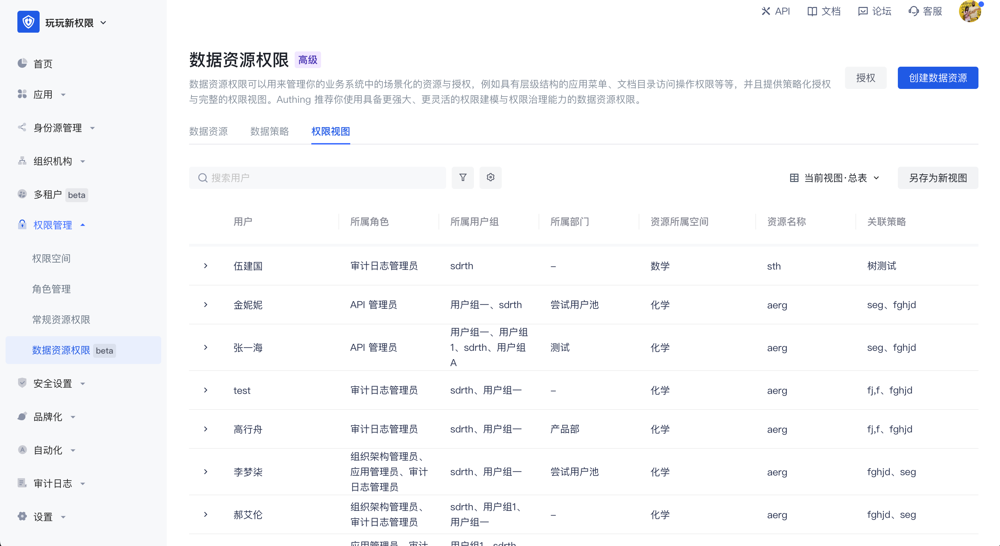

# 数据资源权限

随着企业业务系统越来越复杂，管理和控制对各种资源的访问权限变得越来越困难。为了确保数据安全和遵循相关法规，企业需要一种灵活且强大的权限管理工具，用以管理和监控系统中的资源访问权限。Authing 的数据资源权限旨在解决这一问题，帮助企业轻松管理业务系统中的场景化资源和授权。Authing 推荐你使用具备更强大、更灵活的权限建模与权限治理能力的数据资源权限。

1. 应用场景

数据资源权限主要应用于以下场景：

- 管理具有层级结构的应用菜单，例如企业内部管理系统的侧边栏菜单。
- 管理文档目录访问操作权限，例如企业内部知识库的阅读、编辑和删除权限。
- 对其他资源进行细粒度的权限管理，例如 API 接口等。

2. 解决问题

数据资源权限主要解决以下问题：

- 简化权限管理流程，提高工作效率。
- 确保数据安全，防止数据泄露和滥用。
- 支持合规性审计和报告，降低合规风险。
- 适应企业不断发展和变化的需求，支持灵活的资源管理和授权策略。

3. 功能优势

- 高度灵活的资源定义和管理：Authing 支持对各种类型的资源进行细粒度的定义和管理，使企业能够根据实际需求灵活地配置权限策略。
- 策略化授权：基于策略的授权方式，为角色或用户分配特定的资源访问权限。策略可以包含多个资源和操作，支持灵活的权限组合和管理。
- 完整的权限视图：通过提供直观的权限视图，帮助企业快速了解和管理用户、角色和资源之间的授权关系，提高权限管理的效率。
- 审计与监控：记录用户对资源的访问操作，支持实时监控和定期审计，确保数据安全和合规性。
- 易于集成与扩展：Authing 的数据资源权限功能可以轻松地与现有的企业系统集成，同时支持根据客户需求进行扩展，以满足不断变化的业务需求。

通过引入 Authing 的数据资源权限功能，企业可以实现对业务系统中场景化资源的高效、安全和灵活的管理和授权。这将有助于降低企业的运营成本和风险，同时提高企业对数据资源访问的控制力度，确保数据安全和合规性。

Authing 数据资源权限主要由数据资源管理、数据策略管理和权限视图构成，以下是详细介绍。

## 数据资源管理

数据资源是更贴近实际业务数据权限管理场景的资源，在数据资源权限管理中可以实现菜单、文档目录、API、合同等多种类型资源的定义、授权及权限视图查询的完整闭环。

数据资源提供三种资源结构类型，分别是树结构类型、数组结构类型和字符串结构类型，以便于用户便捷创建对应结构的资源，每种类型有其独特的数据结构，每种类型的数据资源有很多的应用场景。进入数据资源权限管理页面时可编辑查看整个用户池内数据资源列表，点击右上角的创建数据资源可以选择数据类型。

- 树结构

树结构数据资源有两种常见的应用场景，分别是树结构的菜单和有目录层级的文档系统。在管理菜单资源的场景下，当超级管理员想将系统菜单设置为权限管理中的资源，想要实现各个菜单管理员能有权限使用不同的菜单资源时，可以将菜单拆为不同的资源并将其授权给不同的主体对象，树结构是有层级的，可自定义每个节点中的值，在树结构中可以创建子节点，也可以创建同层级的节点。 

- 数组结构

数组结构的数据资源常见的应用场景是合同条款等数据管理，可以添加多条数组结构的数据资源，可以在一个数组中添加任意个数据，最长 50 个字符。

- 字符串结构

字符串结构的数据资源常见的应用场景是对 API 等资源的管理，一般用于路径指代，在字符串数据资源中可以不受限制的输入多行文本内容，或将 API 路径填入实现对 API 的资源管理。

数据资源区别于常规资源的地方在于：

1. 数据资源提供了三种常见的数据资源类型，能购方便用户更灵活的创建各种类型的资源；
2. 授权方式，数据资源不能直接授权给主体对象，需要打包成策略后授权，常规资源可以直接授权给角色。

数据资源详情：创建好数据资源后，可在资源详情页中查看、编辑资源中的值，创建后资源中的权限空间和资源 code 不可修改。

JSON 视图：支持在资源详情中能通过 JSON 的方式查看资源的数据化的表示。

## 数据策略与策略授权

数据策略：通过策略把若干个资源和操作打包在一起，叫做一个策略。

 

在新建数据策略时，一个策略中可以有多个数据权限，每一个数据权限都需要先选择授权作用，然后再选择权限空间中的资源及关联操作，在此基础上还可以添加权限限制条件，最终将资源打包到一起形成一个数据策略。在数据策略中支持跨权限空间选择资源。如果资源是树结构的数据资源，选择粒度细化，也可以选择某个层级的节点。 

策略打包好后，点击权限管理页面右上角的 **授权** 按钮，将其授权给某个主体，可以将一个或多个数据策略同时授权给多个跨不同类型的授权主体。

## 权限视图

权限视图：可为管理员用作权限审计。以用户为维度去计算授权关系，在视图中可以查询到每个用户有哪些权限，策略中对应有哪些资源，以及对应的是哪个权限空间。通过数据策略，资源关联到了用户上，不管这个用户归到哪个用户分组，或属于哪个角色，或属于哪个部门，最终都会以用户的维度来呈现用户最终的权限。

