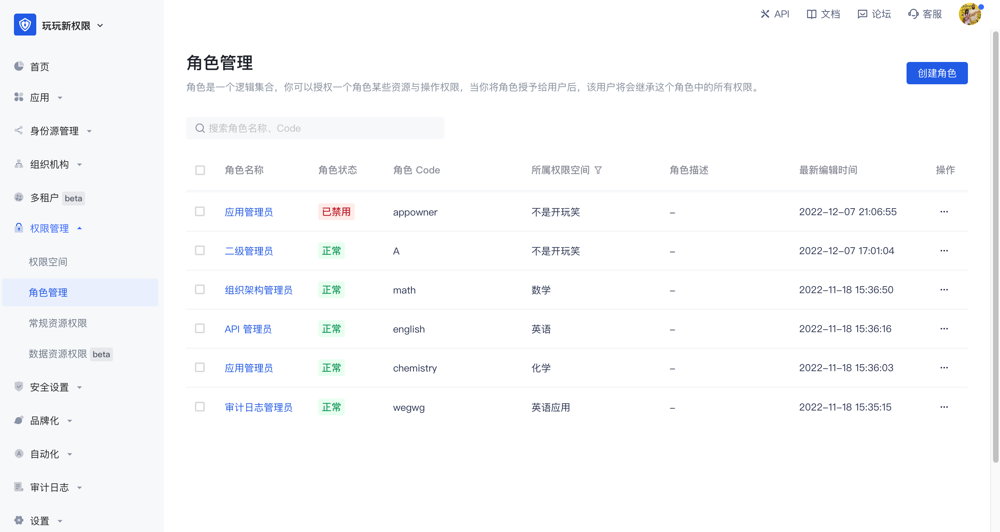

# 角色管理

角色是一个逻辑集合，你可以在每个权限空间下定义角色，并且授权一个角色某些资源与操作权限。当你将角色授予给用户后，该用户将会继承这个角色中的所有权限。

角色管理模块主要用来集中管理用户池内所有权限空间下的角色。

## 创建角色

你可以在列表页面，点击创建权限空间，进入创建页面

| 字段名称         | 说明                                                         |
| ---------------- | ------------------------------------------------------------ |
| 角色名称         | 根据将要授权给该角色的权限场景命名即可，例如“管理员”、“审计员” |
| 角色 Code        | 角色的唯一标识，建议使用语义化的描述，例如“admin”            |
| 权限空间         | 角色归属的权限空间                                           |
| 角色描述         | 选填                                                         |
| 角色自动禁用时间 | 可针对临时性的角色设置自动禁用时间，禁用后角色关联的权限将被收回，可通过启用角色恢复权限 |

## 角色基本信息

在角色详情的基本信息页面，你主要可以

- 管理角色主体
  - 添加角色主体
    - 添加指定用户成为角色主体
    - 添加指定组织成为角色主体
    - 添加主体时支持设置主体自动移除时间
  - 查看角色主体
  - 移除角色主体
- 管理角色的基本信息
  - 查看角色基本信息
    - 角色名称
    - 角色 Code
    - 角色 ID
    - 角色 ARN
    - 角色所属权限空间
    - 角色描述
  - 修改角色名称、角色描述

## 角色权限管理

在角色详情的权限管理页面，你主要可以

- 管理角色关联的常规资源授权
  - 将常规资源授权给当前角色
  - 查看与修改当前角色关联的常规资源授权
  - 移除当前角色关联的常规资源授权授权
- 管理角色关联的数据资源授权
  - 将数据策略授权给当前角色
  - 查看已授权给当前角色的数据策略与详情
  - 移除已授权给当前角色的数据策略

## 角色审计

在角色详情的角色审计页面，你可以查看当前角色的历史变更记录，主要包括

- 创建角色
- 给角色添加主体、移除主体
- 给角色添加授权、移除授权

