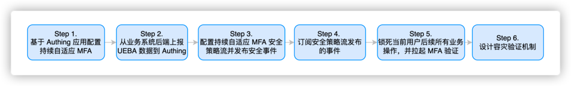

# 进阶 MFA：Continuous Adaptive Multi-Factor Authentication (CAMFA) 指南

> 目标：提高用户体验和安全性、通过智能化降低企业成本
现状：自研系统无 MFA 或者 MFA 功能较弱且急需多场景（例如资源访问、设备新增、信息变更）调用 MFA 
解决方案：接入 Authing 进阶 MFA 组件，快速实现多场景调用


## 什么是持续自适应多因素认证

持续自适应多因素认证（Continuous Adaptive Multi-Factor Authentication，CAMFA）是一种安全身份验证方法，它结合了多个身份验证因素（如密码、生物识别、硬件令牌等），并使用实时风险评估技术对用户进行动态评估，从而提高安全性。

## 如何配置持续自适应多因素认证



### Step 1. 创建 Authing MFA 应用

你需要先在 Authing 创建一个 MFA 应用。进入控制台 (opens new window)> 应用，点击右上角的「添加应用」。


### Step 2. 基于 Authing 应用配置自适应 MFA
进入[控制台](https://console.authing.cn/console) > 应用 >点击应用详情 >点击安全管理，找到多因素认证因子配置界面如下（点击对应开关即可启用认证因子）：


> 自适应 MFA 认证策略底层基于 Authing UEBA，可以针对用户行为和用户画像进行深度梳理分析，从而自动选择与当前行为相匹配的 MFA 策略。
在自适应 MFA 认证策略中，Authing UEBA 引擎会根据用户的行为和画像进行分析和判断，例如用户的登录历史、设备信息、IP 地址、地理位置、活动模式等等，从而确定当前用户的身份和风险级别，并选择与之相匹配的 MFA 策略。

### Step 3. 从业务系统后端上报 UEBA 数据到 Authing 系统

您需要在您的服务端系统中引入 Authing SDK，并使用 MetadataManagementClient 将用户行为数据上报到 Authing 系统，具体操作流程如下：

#### Step 3.1 安装 Authing SDK
```bash
npm install authing-js-sdk
```

#### Step 3.2 初始化 MetadataManagementClient
```javascript
import { MetadataManagementClient } from 'authing-js-sdk'

const appId = 'AUHTING_APP_ID'
const appSecret = 'AUHTING_APP_SECRET'

const authingMetadataManagementClient =  new MetadataManagementClient({appId, appSecret})
```

#### Step 3.3 获取用户行为数据，并将用户行为数据上报到 Authing 系统

```javascript
// 获取用户行为数据信息
const userUEBAData = getUserUEBAFromRequest(req)

// 将用户行为数据上报到 Authing 系统
const UEBAMetadata = authingMetadataManagementClient.authingUEBA.capture(userUEBAData)
```

Authing 提供更多友好方式获取用户行为信息，请参考 「MetadataClient」Authing MFA Quick Start 

###### 为什么要通过业务系统服务端转发用户行为数据


```
数据传到服务器是为了让数据更加安全、避免数据泄露、滥用和随意修改，同时也方便对数据持久化、确保数据不会丢失，同时也方便对数据进行处理、更好的挖掘数据的价值，以及支持数据共享、给其他应用程序或者设备使用。
```

#### Step 4. 配置持续自适应 MFA 安全策略流并发布安全事件


#### Step 5. 订阅安全策略流发布的事件

持续自适应安全策略需要您的客户端对 MFA 事件进行持续监听，当接收到 MFA 事件后，进行实时的响应，具体流程如下所示

##### Step 5.1 在服务端安装 Authing SDK
```bash
$ npm install authing-js-sdk
$ npm install @authing/mfa
```

##### Step 5.2 初始化 AuthenticationClient
```javascript
import { AuthenticationClient } from 'authing-js-sdk'
import { AuthingMFA } from '@authing/mfa'
const appId = 'YOUR_APP_ID'
const authingAuthenticationClient = new AuthenticationClient({appId})
```
##### Step 5.3  订阅 MFA 事件，使用 MFA trigger data 和  AuthingMFA 拉起 MFA 认证流程，进行 MFA 认证
```javascript
// 订阅 MFA 事件，通过 Authing 会自动添加当前用户 MFA 状态 check logic
authingAuthenticationClient
    .MFA
    .subscribe('authing.security.mfa?originalIdentity=originalIdentityexternalid', 
        mfaTriggerData => {
        // 使用 AuthingMFA SDK 拉起 MFA 认证流程
        AuthingMFA(mfaTriggerData).start().then(mfaToken => {
        // mfaToken 为用户 MFA 后生成的 jwt token
        // 可以使用 mfaToken 作为用户登录成功凭据，也可以基于当前 token 进行二次签发
    })
})
```
##### Step 5.4 根据 MFA 认证结果，决定是否认证通过。如果认证通过，记录用户登录状态，跳转到业务系统；如果认证不通过，显示错误提示，返回登录页面

```javascript 
// 使用 AuthingMFA SDK 拉起 MFA 认证流程
AuthingMFA(mfaTriggerData).then(mfaToken => {
    // 可以使用 mfaToken 作为用户登录成功凭据，也可以基于当前 token 进行二次签发
    // 下面示例就是使用 mfaToken 进行二次签发的流程
    const myToken = clientReIssueToken(mfaToken)
    if(myToken) {
         // 1. 记录登录状态
         // 2. 跳转到业务系统
    } else {
        // 界面提示认证失败
    }
})
```
##### 如果您选择使用 Authing mfaToken 作为用户认证 token，可参加如下代码
```javascript
// 使用 AuthingMFA SDK 拉起 MFA 认证流程
AuthingMFA(mfaTriggerData).start().then(mfaToken => {
    // 可以使用 mfaToken 作为用户登录成功凭据，也可以基于当前 token 进行二次签发
    if(myToken) {
         // 1. 使用 mfaToken 记录登录状态
         // 2. 跳转到业务系统
    } else {
        // 界面提示认证失败
    }
})
```

##### Step 6.  锁死当前用户后续所有业务操作，并拉起 MFA 验证

在发生 MFA 风险事件后，需要你改造你的后台系统针对存在 MFA 风险的用户进行限制操作，禁止后续请求

##### 首先以一个简单的 express 后台系统代码进行示例，帮助您来理解如何修改您业务系统的代码

##### Step 6.1  初始化元数据管理端

```javascript
import { MetadataManagementClient } from 'authing-js-sdk'

const appId = 'YOUR_APP_ID'
const authingMetadataManagementClient = new MetadataManagementClient({appId})
```

##### Step 6.2  添加校验用户 MFA 状态的 express 中间件到服务端系统中
```javascript
import express from 'express'
import { MetadataManagementClient } from 'authing-js-sdk'

const appId = 'YOUR_APP_ID'
const authingMetadataManagementClient = new MetadataManagementClient({appId})

const authingUEBA =  authingMetadataManagementClient.authingUEBA
const mfaAuthMiddleware = (req, res, next) => {
    // 获取 token 里面的用户 Id
    const { myUserId } = utils.getUser(req.header.token)
    // 检查用户 MFA 状态，需要传入用户 Id
    const { mfaVerified } = await authingUEBA.checkUserStatus({ originalId: myUserId })
    // 根据 MFA 状态来进行流程扭转
    if(mfaVerified) {
        // 客户进行下一步业务操作
        next()
    } else {
        throw new UnauthorizedClientError()
    }
}

const app = new express()
app.use(mfaAuthMiddleware)
```

#### Step 7 设计容灾验证机制
##### Step 7.1 在刷新页面的场景下，保持 MFA 验证状态的持续存在

用户刷新页面后 Authing 会在安全策略订阅方法中自动查询当前用户 MFA 是否验证成功的状态，如果该状态为验证失败，自动执行当前订阅函数，建议开发者在订阅函数中实现 trigger MFA 方法，以下是具体代码示例：

**Step 7.1.1 在服务端安装 Authing SDK**

```bash
$ npm install authing-js-sdk
$ npm install @authing/mfa
```

**Step 7.1.2 初始化 AuthenticationClient**
```javascript
import { AuthenticationClient } from 'authing-js-sdk'
import { AuthingMFA } from '@authing/mfa'
const appId = 'YOUR_APP_ID'
const authingAuthenticationClient = new AuthenticationClient({appId})
```

**Step 7.1.3  订阅 MFA 事件，使用 MFA trigger data 和  AuthingMFA 拉起 MFA 认证流程，进行 MFA 认证**
```javascript
// 订阅 MFA 事件，通过 Authing 会自动添加当前用户 MFA 状态 check logic
authingAuthenticationClient
    .MFA
    .subscribe('authing.security.mfa?user=xxx', 
        mfaTriggerrData => {
        // 使用 AuthingMFA SDK 拉起 MFA 认证流程
        AuthingMFA(mfaTriggerData).start().then(mfaToken => {
        // mfaToken 为用户 MFA 后生成的 jwt token
        // 可以使用 mfaToken 作为用户登录成功凭据，也可以基于当前 token 进行二次签发
    })
})
```
**Step 7.1.4 根据 MFA 认证结果，决定是否认证通过。如果认证通过，记录用户登录状态，跳转到业务系统；如果认证不通过，显示错误提示，返回系统登录页面**
```javascript
// 使用 AuthingMFA SDK 拉起 MFA 认证流程
AuthingMFA(mfaTriggerData).start().then(mfaToken => {
    // 可以使用 mfaToken 作为用户登录成功凭据，也可以基于当前 token 进行二次签发
    // 下面示例就是使用 mfaToken 进行二次签发的流程
    const myToken = clientReIssueToken(mfaToken)
    if(myToken) {
         // 1. 记录登录状态
         // 2. 跳转到业务系统
    } else {
        // 界面提示认证失败
    }
})
```
**如果您选择使用 Authing mfaToken 作为用户认证 token，可参加如下代码**
```javascript
// 使用 AuthingMFA SDK 拉起 MFA 认证流程
AuthingMFA(mfaTriggerData).start().then(mfaToken => {
    // 可以使用 mfaToken 作为用户登录成功凭据，也可以基于当前 token 进行二次签发
    if(myToken) {
         // 1. 使用 mfaToken 记录登录状态
         // 2. 跳转到业务系统
    } else {
        // 界面提示认证失败
    }
})
```

##### Step 7.2 Authing 自动在 MFA 服务宕机时，实现对当用户放行的容灾机制

在 authingUEBA.checkUserStatus 方法中，Authing 会内置 MFA 服务监控流程，在 MFA 服务返回的结果异常时，总是针对当前用户 MFA 进行放行处理