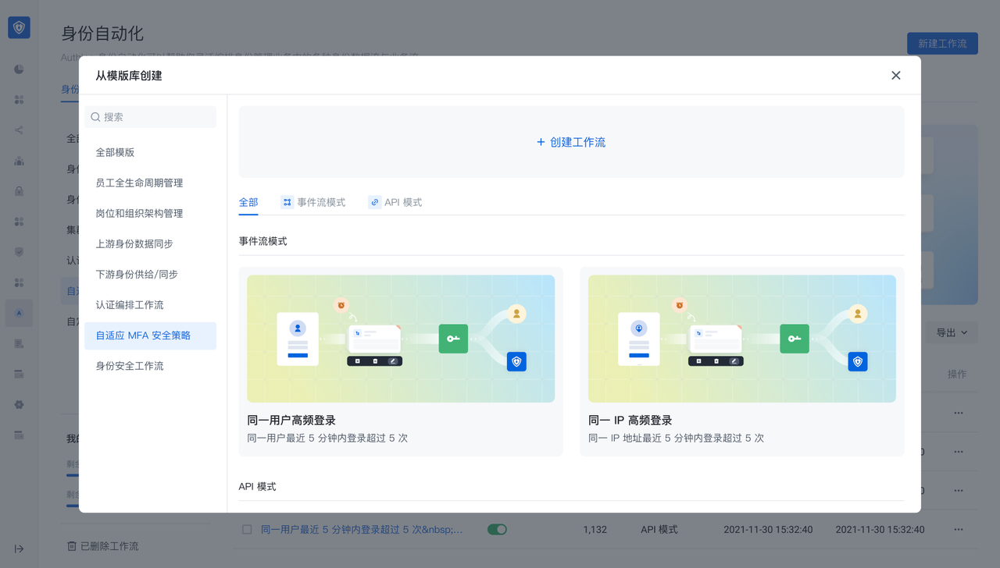
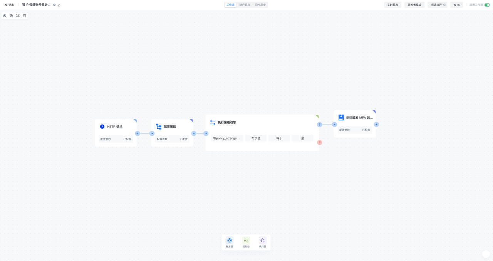
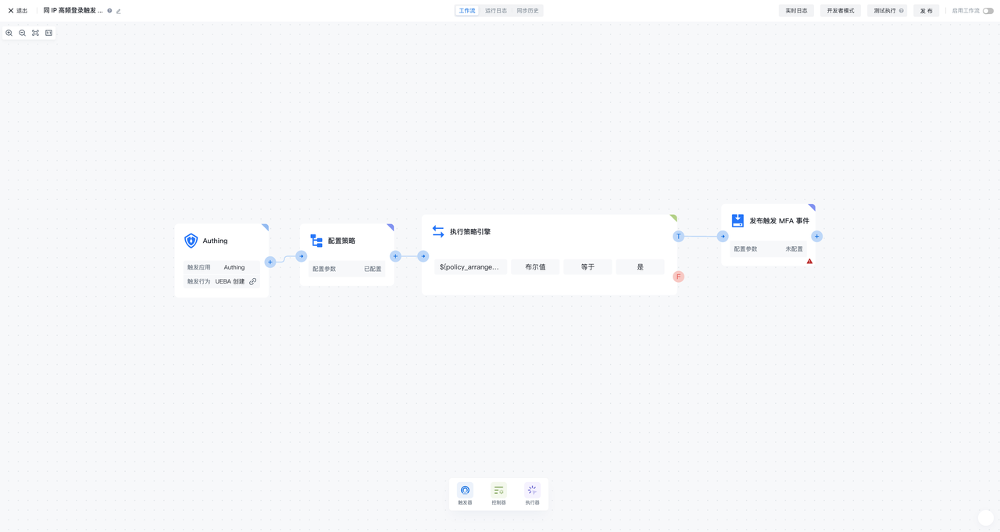
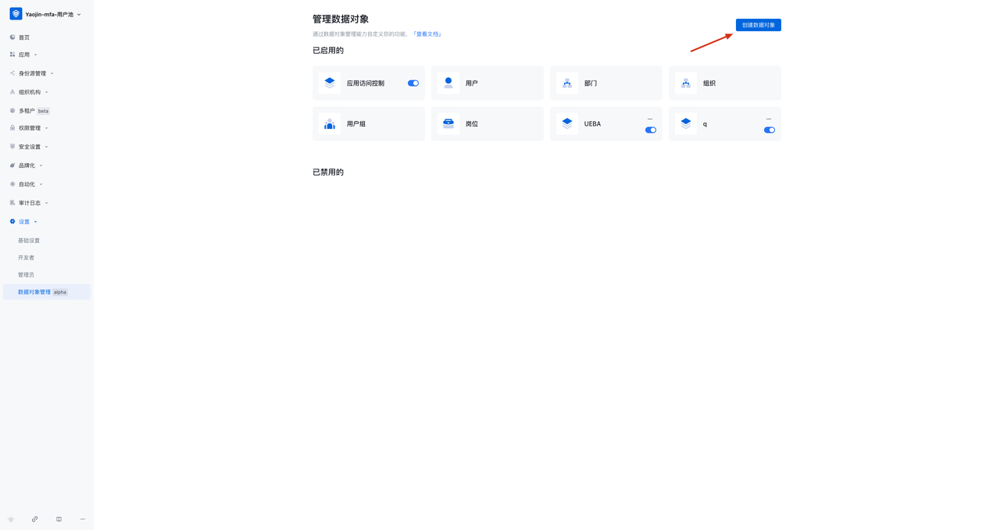
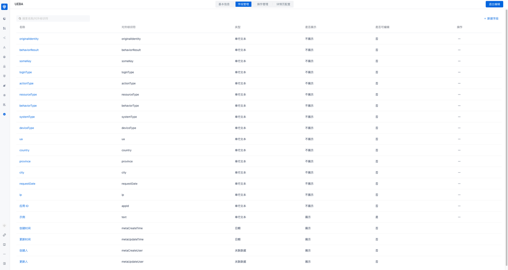
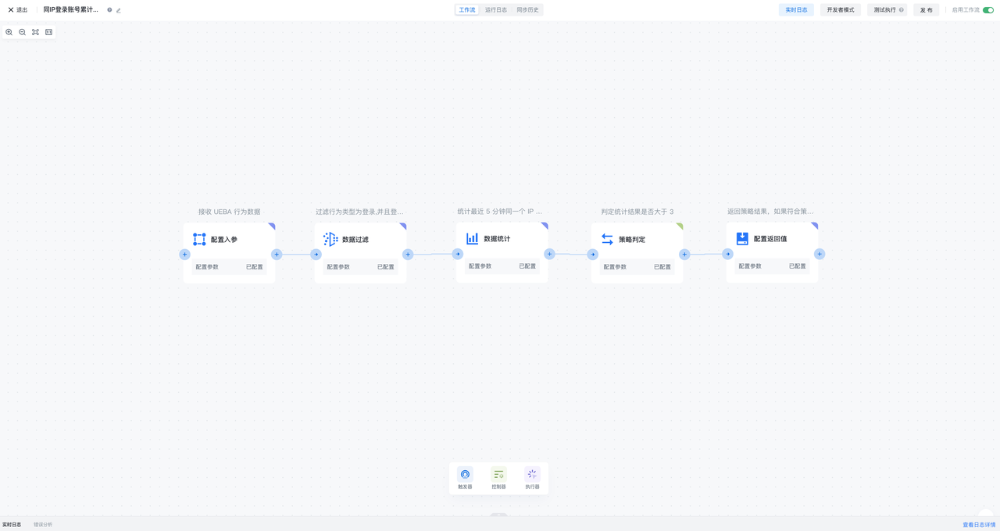

# 自适应 MFA 编排/策略配置说明

## 通过模版创建自适应 MFA 安全编排
 
在身份自动化模块，点击新建工作流，找到“自适应 MFA 安全策略”模块，即可通过模板创建自适应 MFA 安全编排工作流。模版有两种模式：
- API 模式：适用于自适应 MFA 场景
- 事件流模式：使用于持续自适应 MFA 场景

## 通过模板创建后进入 MFA 安全编排-API 模式
 

MFA 安全策略-API 模式，是一个由 HTTP 请求、配置策略、执行策略引擎、返回触发 MFA 数据组成的安全编排流，用于自适应 MFA 场景，能够通过 HTTP 请求触发安全编排工作流，根据配置策略计算用户风险，并根据计算结果返回触发 MFA 数据

### HTTP 请求
HTTP 请求作为 MFA 安全策略流的触发器，每当有新的 HTTP 请求产生时，就会触发该工作流

### 配置策略
在配置策略节点中，你可以引用 Authing 预置的策略编排函数，也可以创建新的自定义策略编排函数，然后引用它。策略编排函数能够接收前序节点 UEBA 变更事件的输入数据，灵活定义算法策略，并输出配置的相应返回值，给到后续节点执行策略引擎使用

### 执行策略引擎
在执行策略引擎节点中，你可以装配配置策略中引用的自适应 MFA 安全策略的返回值，例如策略判定结果，然后配置条件表达式（或条件表达式的组合），实行策略判定的计算

### 返回触发 MFA 数据
当满足执行策略引擎节点的条件（组）时，就会进入返回触发 MFA 数据节点，在返回触发 MFA 数据节点中可以配置选择需要触发何种 MFA 认证方式，以及可以灵活配置自定义返回值

## 通过模板创建后进入 MFA 安全编排-事件流模式
 

MFA 安全策略-事件流模式，是一个由 UEBA 变更事件、配置策略、执行策略引擎、发布 MFA 事件组成的安全编排流，用于持续自适应 MFA 场景，能够持续订阅 UEBA 事件，根据配置策略计算用户风险，并根据计算结果发布特定 MFA 事件

### UEBA 变更事件
UEBA 变更事件作为 MFA 安全策略流的触发器，每当有新的 UEBA 事件产生时，就会触发该工作流

### 配置策略
在配置策略节点中，你可以引用 Authing 预置的策略编排函数，也可以创建新的自定义策略编排函数，然后引用它。策略编排函数能够接收前序节点 UEBA 变更事件的输入数据，灵活定义算法策略，并输出配置的相应返回值，给到后续节点执行策略引擎使用

### 执行策略引擎
在执行策略引擎节点中，你可以装配配置策略中引用的自适应 MFA 安全策略的返回值，例如策略判定结果，然后配置条件表达式（或条件表达式的组合），实行策略判定的计算

### 发布 MFA 事件
当满足执行策略引擎节点的条件（组）时，就会进入发布 MFA 事件节点，在发布 MFA 事件节点中可以配置选择需要触发何种 MFA 认证方式，以及可以灵活配置自定义返回值

### UEBA 数据对象模块配置
在使用 MFA 安全编排-事件流模式时，还需要在设置-数据对象管理中，创建 UEBA 的的数据对象模块
 
具体的用户数据字段列表如下
 

具体字段列表参考：

|名称|对外标识符|解释|生成方式|
|----------|:-------------:|:----------:|:------:|
|appId|应用 ID|
|requestDate|请求日期|
|ip|ip|
|city|请求城市||根据 IP 解析生成|
|province|请求省份||根据 IP 解析生成|
|country|请求国家||根据 IP 解析生成|
|ua|用户代理|
|deviceType|设备类型||根据 UA 解析生成|
|systemType|设备系统||根据 UA 解析生成|
|browserType|浏览器||根据 UA 解析生成|
|originalIdentity|用户唯一标识|用户在业务系统中的唯一标识 ID|业务系统必传|
|behaviorType|行为类型||业务系统选传（推荐）
|behaviorResult|行为结果||业务系统选传（推荐）
|resourcesType|资源类型|用户操作的资源类型|业务系统选传（推荐）
|actionType|操作类型|用户对资源的操作类型|业务系统选传（推荐）
|loginType|认证方式||业务系统选传（推荐）
|someKey|自定义字段|自定义字段|业务系统选传（推荐）

## 配置自适应 MFA 安全策略
 

自适应 MFA 安全策略是一个由配置入参、数据过滤、数据统计、策略判定、配置返回值组成的安全策略流，用于自适应/持续自使用 MFA 场景，能够定义计算输入的参数，过滤数据、统计数据、进行策略判定，最终输出策略计算结果。自适应 MFA 安全策略可以被自适应 MFA 安全编排工作流引用，得到行为数据的策略计算结果，从而实现 MFA 的灵活编排

### 配置入参
配置入参节点可以灵活定义自适应 MFA 安全策略接收的参数与数据类型

### 数据过滤
数据过滤节点可以基于前序输入的数据，配置过滤条件，将符合条件的数据往后传递

### 数据统计
数据统计节点可以接受前序节点的数据后，配置数据统计条件，可以设置统计周期、统计字段和统计类型，并基于统计条件的配置输出统计结果

### 策略判定
策略判定节点可以基于前序节点输入的数据和数据统计的结果，可以配置策略判定条件，并基于策略判定的条件输出策略命中结果

### 配置返回值
配置返回值节点可以装配前序节点的输出结果，包括配置入参的数据字段、数据统计的统计结果、策略判定的策略结果，以及能够自定义任意返回值

## 更多功能了解请参考
- [Authing Adaptive MFA 概述](./intro)
- [基于 Authing Guard 登录组件接入 MFA](./guard)
- [改造已有的 IAM/IDaaS/认证系统接入 Authing 自适应 MFA 能力](./legacy)
- [进阶 MFA：Continuous Adaptive Multi-Factor Authentication (CAMFA) 指南](./camfa)
