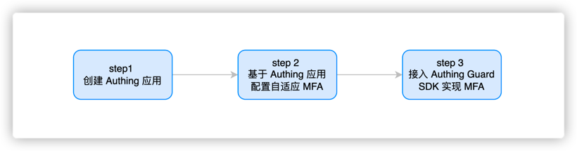
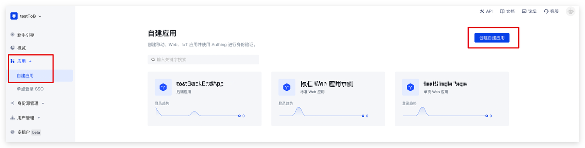
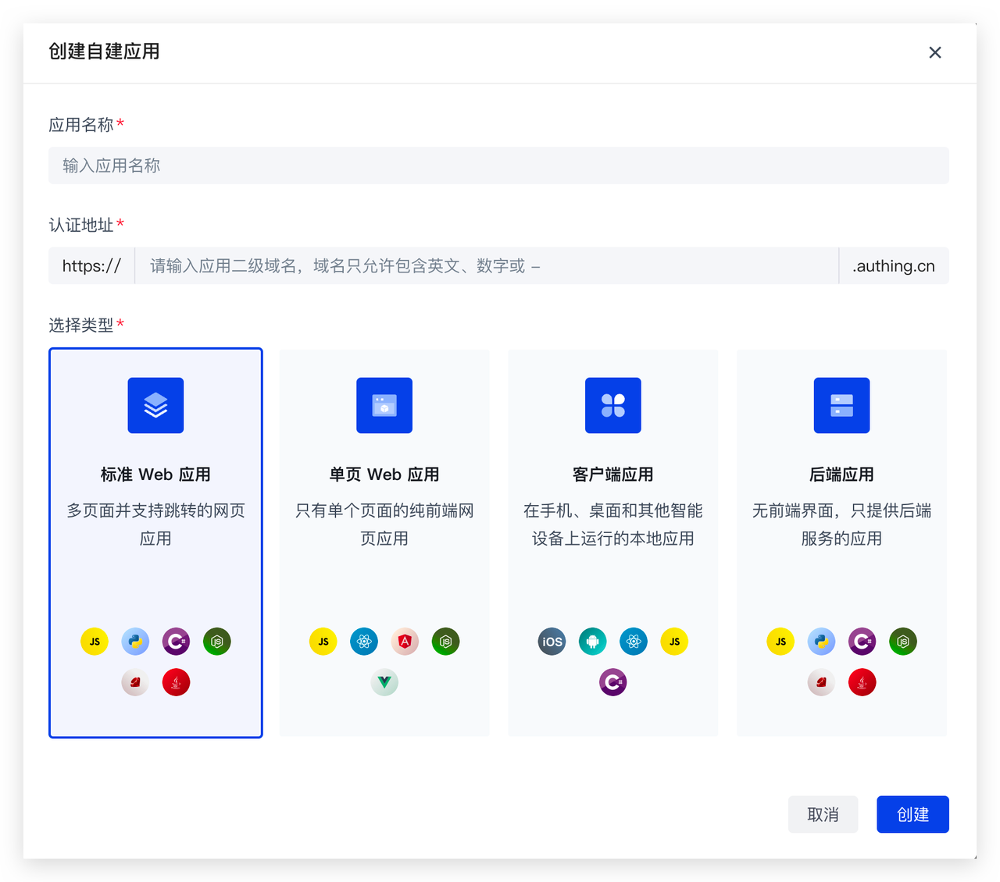
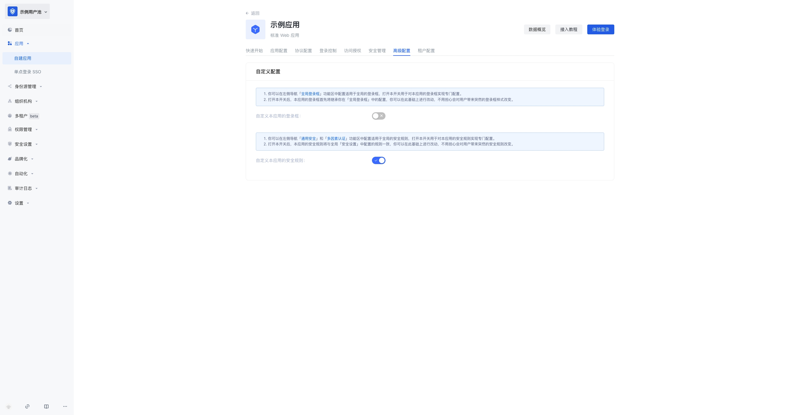
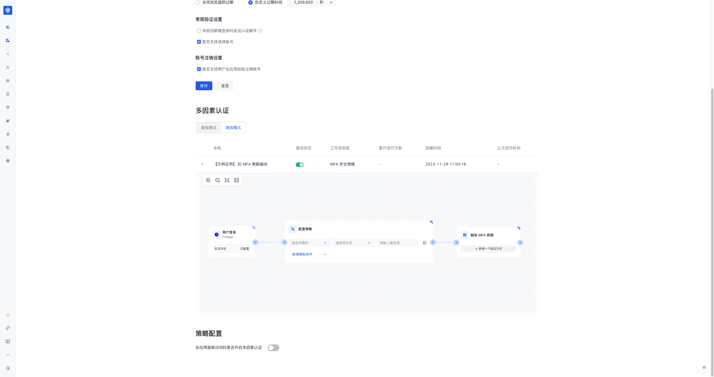
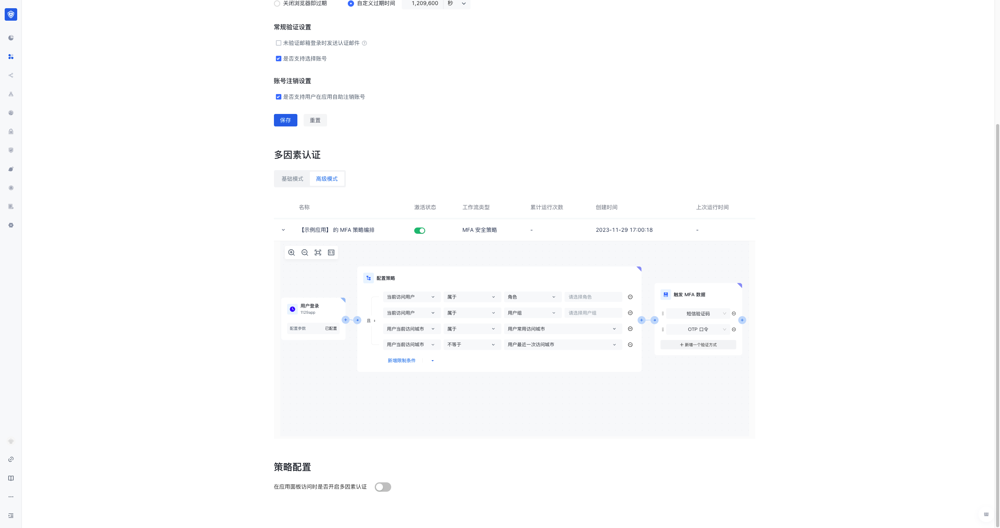
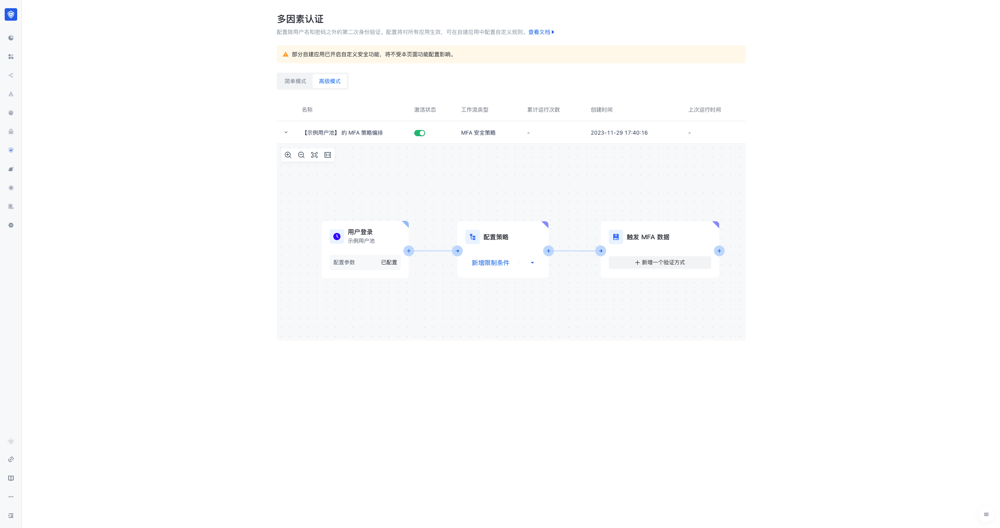

# 基于 Authing Guard 接入 Authing 持续自适应 MFA

我们将默认以下情况是您当前的目标和现状，我们将为您提供最佳的解决方案

>目标：在自研应用或者有代码修改权限的应用中，快速上线 MFA 与安全策略防护能力、提升业务访问安全、提高用户体验、支持多元化业务场景、降低企业管理成本
>
>现状：当前系统 MFA 能力较弱
>
>解决方案：接入 Authing Guard 认证组件，快速接入登录及安全策略能力

## 什么是 Authing Guard？

Authing Guard 是一种由 Authing 提供的安全可靠的身份验证和授权服务，可以帮助企业和开发人员快速构建安全可靠的应用程序和服务，提高用户体验和保护用户的身份和信息安全。
Authing Guard 使用行业最佳实践安全性设计，仅需要几行 JavaScript 代码就可以集成到你开发的项目中。它可以直接从 CDN 或 NPM 加载，也可以从源代码构建。Authing Guard 同时提供 Javascript 原生、React、Vue 和 Angular 的多种集成模式，在你的任何项目中都可以无缝集成并享有高度自定义灵活性。
更加详细的介绍请见 [接入 Authing Guard](https://docs.authing.cn/v2/reference/guard/v2/)。

## 通过 Authing Guard 登录组件接入 MFA 的整体流程



### Step 1. 创建 Authing 应用

你需要先在 Authing 创建一个应用。进入[控制台](https://console.authing.cn/console) > 应用，点击右上角的「创建自建应用」。

认证地址填写一个域名，必须为合法的域名格式，例如 my-awesome-app，作为这个应用在 Authing 的唯一标识。

详细配置可参考：https://docs.authing.cn/v2/guides/app-new/

### Step 2. 基于 Authing 应用配置自适应 MFA

1. 进入[控制台 (opens new window)](https://console.authing.cn/console) >点击应用详情 >点击高级配置，开启**自定义本应用的安全规则。**



2. 在应用详情中点击安全管理，找到多因素认证模块，点击高级模式，可以看到 MFA 安全策略编排的工作流。




3. 你可以在工作流节点中配置触发 MFA 的相关策略以及触发的 MFA 方式。目前支持基于用户的角色、用户组属性，用户的最近一次访问城市、常用访问城市的属性进行策略配置。




4. 除了针对每个应用配置你也可以针对用户池的所有应用配置全局的持续自适应 MFA 安全策略。你可以点击控制台的安全设置 >点击多因素认证，再点击高级模式，即可看到并配置用户池全局的 MFA 安全策略编排的工作流。所有没有开启安全设置的应用都将继承全局的策略配置。




### Step 3. 接入 Authing Guard SDK 实现 MFA

Authing Guard 是一种轻便的认证组件，你可以把它嵌入在你任何的通过浏览器进行用户交互的应用中，一站式处理复杂的用户认证流程。MFA 是 Guard 组件中的模块，在您的项目中接入 Authing Guard 即可使用 MFA 能力。

#### 第一步：安装并初始化 Guard（浏览器加载）

首先，在你的 HTML 文件中使用 script 和 link 标签直接引入文件，并使用全局变量 GuardFactory

```html
<!DOCTYPE html>
<html lang="en">
  <head>
  <meta charset="UTF-8" />
  <meta http-equiv="X-UA-Compatible" content="IE=edge" />
  <meta name="viewport" content="width=device-width, initial-scale=1.0" />
  <title>Authing Guard Demo</title>
<script src="https://cdn.authing.co/packages/guard/5.1.5/guard.min.js"></script>
<link rel="stylesheet" href="https://cdn.authing.co/packages/guard/5.1.5/guard.min.css" />
</head>
<body>
  <div id="authing-guard-container"></div>
  <!-- 引入 Guard -->
</body>
</html>
```

#### 第二步：获取 Guard 实例（CDN）

```tsx
// 代码示例：https://github.com/Authing/Guard/blob/master/examples/guard/normal/embed.html
const guard = new GuardFactory.Guard({
  // 你可以前往 Authing 控制台的本应用详情页查看你的 App ID
  appId: "AUTHING_APP_ID",

  // 如果你使用的是私有化部署的 Authing 服务，需要传入自定义 host，如:
  // host: 'https://my-authing-app.example.com',

  // 默认情况下，会使用你在 Authing 控制台中配置的第一个回调地址为此次认证使用的回调地址。
  // 如果你配置了多个回调地址，也可以手动指定（此地址也需要加入到应用的「登录回调 URL」中）：
  // redirectUri: "YOUR_REDIRECT_URI"
});

console.log("guard instance: ", guard);

```

如需了解更多安装方法请 [Web Guard](https://docs.authing.cn/v2/reference/guard/v2/web.html)


## 更多功能了解请参考

- [Authing Adaptive MFA 概述](./intro)
- [改造已有的 IAM/IDaaS/认证系统接入 Authing 自适应 MFA 能力](./legacy)
- [进阶 MFA：Continuous Adaptive Multi-Factor Authentication (CAMFA) 指南](./camfa)