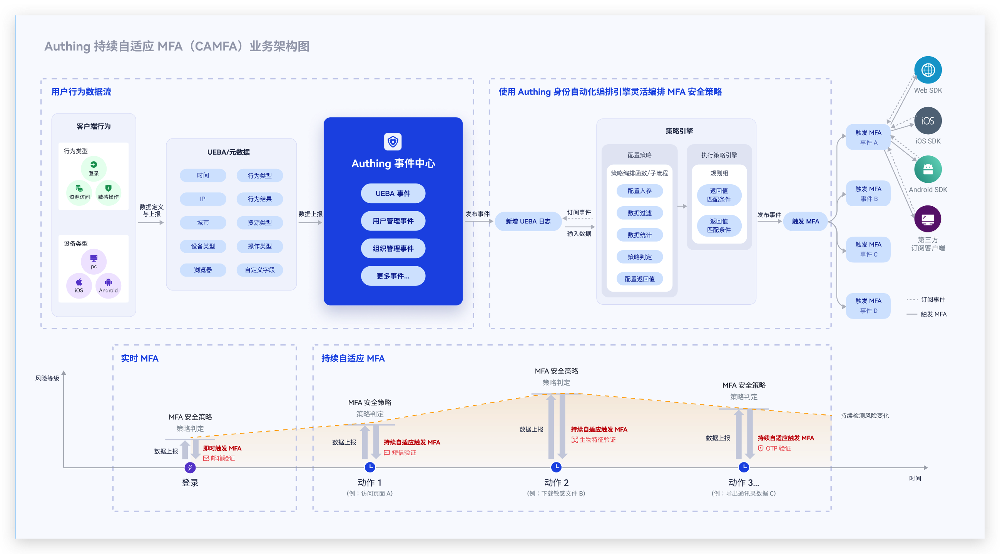
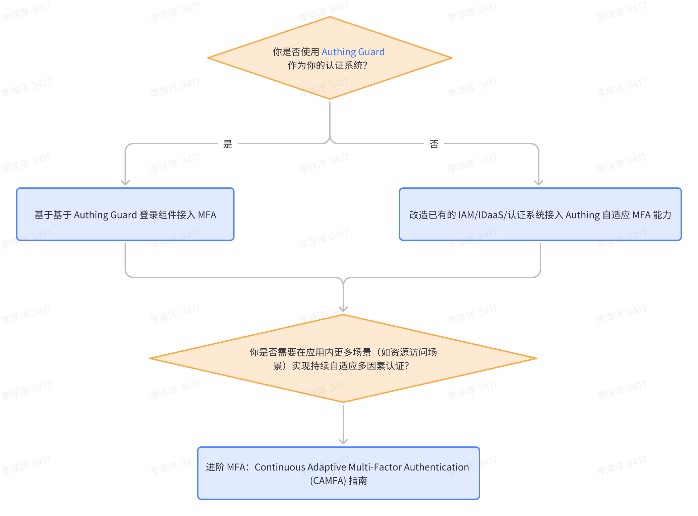

# Authing CAMFA 概述

## 什么是持续自适应 MFA？
持续自适应 MFA（Continuous Adaptive Multi-Factor Authentication，CAMFA） 是一种安全身份验证方法，它结合了多个身份验证因素（如密码、生物识别、硬件令牌等），并在用户的访问生命周期过程中，使用行为风险评估技术对用户的关键行为进行持续地实时动态评估，当触发风险时会通过调用 MFA 认证对用户当前状态进行确认，从而提高账号的安全性，更好地保护业务系统内的数据与资源安全。

## 持续自适应 MFA 的典型应用场景

- 你希望用户在他们经常登录的地理位置（国家/城市）无需触发 MFA，正常完成认证即可。但是当他们的账号在非常用地进行登录时，需要额外完成一次 MFA 才可以登录。
- 你希望企业成员在内网环境访问你的应用时，无需触发 MFA，正常完成认证即可。但是当他们在外网环境访问应用时需要额外完成一次 MFA 才可以登录。
- 你希望企业内用户在登录企业内部的应用时，可以根据组织、角色等不同属性触发不同的 MFA，例如财务部门的成员登录时需要进行手机号短信验证，人事部门的成员登录时需要进行 OTP 验证。
- 你希望用户在访问你的应用时，如果某个 IP 在短时间内连续登录多个应用或者连续登录失败，那么这个 IP 需要做一次 MFA 验证才能继续登录

总之，持续自适应 MFA 适用于你的应用希望能够通过持续监测用户行为，根据用户行为风险有针对性的进行 MFA 验证的相关场景。

## Authing 持续自适应 MFA 的核心特点

Authing 持续自适应 MFA，依托于 Authing 身份自动化的编排能力，基于事件驱动的方式，能够基于用户属性、用户实行行为特征灵活编排安全策略，持续监测用户访问过程中的风险，设置触发多种 MFA。在确保用户体验的同时，有效提升认证与资源访问场景的安全性。

Authing 持续自适应 MFA 具备以下特性：

- **多种接入使用方式**：你可以通过多种方式为你的应用接入 Authing 持续自适应认证的能力。目前支持通过 Authing Guard/Authing 应用网关/Authing MFA 组件的方式为你的应用提供持续自适应 MFA 能力
- **多源行为数据上报**：持续自适应 MFA 可以接入多种场景和多个应用系统的用户行为数据，包括设备特征、网络环境、行为类型等等，如果你是基于 Authing MFA 组件接入还可以完全自定义用户行为数据
- **可视化编排安全策略**：你可以通过工作流可视化地灵活编排不同应用的 MFA 安全策略，策略可以基于多种用户属性、行为特征、风控指标进行编排，支持多个策略分支，不同策略触发不同的 MFA
- **多种 MFA 验证方式**：Authing 持续自适应认证支持多种认证方式，包括手机号短信验证/电子邮箱验证/OTP 验证/人脸识别验证
- **开发者友好**：提供 SDK 与开放接口，助力开发者快速调用相关能力。

## 如何接入 Authing CAMFA？

***目前 Authing CAMFA 功能仅面向内测客户开放，如需获取内测资格可以联系你的商务顾问或者在线联系我们***

## 更多功能了解请参考

- [基于 Authing Guard 登录组件接入 MFA](./guard)
- [改造已有的 IAM/IDaaS/认证系统接入 Authing 自适应 MFA 能力](./legacy)
- [进阶 MFA：Continuous Adaptive Multi-Factor Authentication (CAMFA) 指南](./camfa)