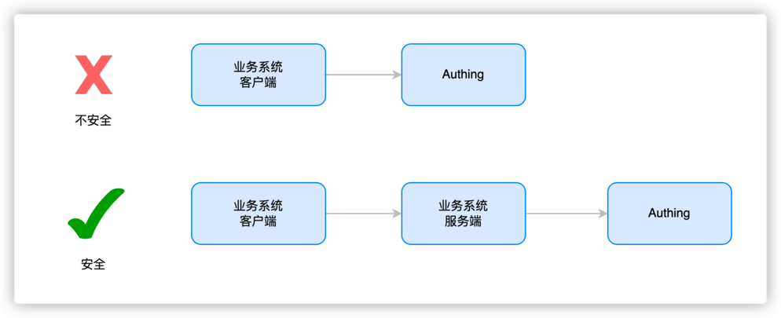

# 改造已有的 IAM/IDaaS/认证系统接入 Authing 自适应 MFA 能力

我们将默认以下情况是您当前的目标和现状，我们将为您提供最佳的解决方案

> 目标：增强现有系统的登录认证安全性、保护企业的敏感数据和应用程序、同时提高用户体验
现状：已有的 IAM/IDaaS/ 认证系统主要是自研或第三方开发，安全能力较弱或 MFA 不具备动态自适应感知能力（例如办公设备切换、办公网络变更能自动唤起 MFA）。它们通常支持多种身份验证方式，例如用户名 / 密码、社交账号登录、手机验证码等。然而，这些系统仍然存在一些问题，例如密码泄露、社交账号被盗等。
解决方案：接入 Authing 安全策略引擎及 MFA 组件，快速提升安全感知能力

## 改造已有的 IAM/IDaaS/认证系统接入 Authing 自适应 MFA 能力的整体流程


### Step 1. 创建 Authing MFA 应用

你需要先在 Authing 创建一个 MFA 应用。进入控制台 (opens new window)> 应用，点击右上角的「添加应用」。


### Step 2. 基于 Authing 应用配置自适应 MFA
进入[控制台](https://console.authing.cn/console) > 应用 >点击应用详情 >点击安全管理，找到多因素认证因子配置界面如下（点击对应开关即可启用认证因子）：


> 自适应 MFA 认证策略底层基于 Authing UEBA，可以针对用户行为和用户画像进行深度梳理分析，从而自动选择与当前行为相匹配的 MFA 策略。
在自适应 MFA 认证策略中，Authing UEBA 引擎会根据用户的行为和画像进行分析和判断，例如用户的登录历史、设备信息、IP 地址、地理位置、活动模式等等，从而确定当前用户的身份和风险级别，并选择与之相匹配的 MFA 策略。

### Step 3. 改造已有的 IAM/IDaaS/认证系统接入 Authing 自适应 MFA 能力

> 假定您的系统具有一个相对简单的登录认证流程，我们会据此为您展示如何一步一步为简单的登录认证流程添加 Authing 自适应 MFA 安全策略认证能力

#### 我们为您推荐的改造已有系统接入 Authing 自适应 MFA 方案

以下是交互时序图


##### 客户端改造方案
- 在代码中安装 Authing MFA SDK,  Authing SDK 并引入 AuthinMFA, MetadataClient
- 使用 MetadataClient 获取当前系统中的用户行为数据，如 IP、浏览器等信息
- 改造原有登录认证接口，传输用户行为数据到系统后台
- 判断当前是否需要 MFA 认证
- 如果需要进行 MFA，使用后端接口返回的 MFA trigger data 和 AuthinMFA 拉起 MFA 认证流程，进行 MFA 认证
- 根据 MFA 认证结果，决定是否认证通过。如果认证通过，记录用户登录状态，跳转到业务系统；如果认证不通过，显示错误提示，返回登录页面
服务端改造方案
- 在代码中安装 Authing SDK，引入 AuthenticationClient、MetadataManagementClient，并进行初始化
- 改造登录接口接收并携带认证状态上报用户行为数据到 Authing 系统
- 用户行为数据上报后，如果用户一次认证通过后，调用 Authing 安全策略引擎计算本次认证是否触发 MFA
- 如果触发 MFA，将本次进行 MFA 的 trigger data 返回给客户端；如果不进行 MFA，则验证通过

##### 服务端改造方案
- 在代码中安装 Authing SDK，引入 AuthenticationClient、MetadataManagementClient，并进行初始化
- 改造登录接口接收并携带认证状态上报用户行为数据到 Authing 系统
- 用户行为数据上报后，如果用户一次认证通过后，调用 Authing 安全策略引擎计算本次认证是否触发 MFA
- 如果触发 MFA，将本次进行 MFA 的 trigger data 返回给客户端；如果不进行 MFA，则验证通过

##### 以一个简单的应用系统登录代码示例，帮助您来理解如何进行对系统的逐步改造
我们假定您登录系统的客户端、服务端代码如下所示，它足够简单易于理解

###### 客户端代码：
``` javascript
// 客户端代码示例

// 获取当前用户的用户名及密码
const username = form.username
const password = form.password

// 携带用户名及密码向服务端发起认证请求
const loginResult = clientLogin(username, password)

// 根据登录结果判断是否进行后续操作
if(loginResult.status) {
    // 1. 记录登录状态
    // 2. 跳转到业务系统
} else {
    // 1. 界面提示认证失败
    // 2. 返回登录界面
}
```

###### 服务端代码：

```javascript
// 服务端代码示例

// 服务端登录认证方法
function login(username, password) {
    
    // 查询当前认证用户
    const user = db.findByUsername(username)
    
    // 判断用户密码是否正确
    if(user.password === md5(password)) {
        return {
            status: true,
            token: jwt(user)
        }
    } else {
        return {
            status: false,
            message: '账号或密码错误'
        }
    }
}
```

### Step 3.1 客户端代码改造示例
#### Step 3.1.1 安装并在代码中引入 Authing MFA SDK（用于拉起 MFA 前端界面）, Authing SDK（用于上报用户行为数据）

```bash
$ npm install authing-js-sdk
$ npm install @authing/mfa
```

```javascript
import { MetadataClient } from 'authing-js-sdk'
import { AuthingMFA } from '@authing/mfa'

const appId = 'AUHTING_APP_ID'
const appSecret = 'AUHTING_APP_SECRET'

const authingMetadataClient = new MetadataClient()
```

#### Step 3.1.2 使用 Metadata Client 获取当前系统中的用户行为数据，如 IP、浏览器等信息
**Metadata Client** 是 Authing 为客户提供的开箱即用的元数据快速生成工具包，帮助客户快速接入 Authing 元数据平台，它内置了 Authing 平台几十种内置元数据类型，关于 **Metadata Client** 的使用方法可以参考：元数据 SDK 使用文档,在本示例中主要用于上报用户行为数据

```javascript
// load 方法采集客户端所在环境信息，以 json 存储，比如 IP、DeviceType(当前请求设备类型)、SystemType(当前操作系统类型)、BrowserType(当前请求浏览器类型) 等
const metadata = authingMetadataClient.authingUEBA.load()
```

#### Step 3.1.3 改造原有登录认证接口，传输用户行为数据到系统后台
```javascript
// 通过 login 接口将用户行为数据传到服务端
const loginResult = clientLogin(username, password, metadata)
```

#### Step 3.1.4 判断当前是否需要 MFA 认证，如果需要进行 MFA，使用后端接口返回的 MFA trigger data 和 Authing MFA SDK 拉起 MFA 认证流程，进行 MFA 认证
```javascript
// 判断服务端返回的登录结果、
if(loginResult.status) {
      // 1. 登录成功记录登录状态
     // 2. 跳转到业务系统
} else if(loginResult.mfaTriggerData){
    // 使用 AuthingMFA SDK 拉起 MFA 认证流程
    AuthingMFA(loginResult.mfaTriggerData).start().then(mfaToken => {
        // mfaToken 为用户 MFA 后生成的 jwt token
        // 可以使用 mfaToken 作为用户登录成功凭据，也可以基于当前 token 进行二次签发
    })
} else {
    // 5. 界面提示认证失败
}
```
#### Step 3.1.5 根据 MFA 认证结果，决定是否认证通过。如果认证通过，记录用户登录状态，跳转到业务系统；如果认证不通过，显示错误提示，返回登录页面
```javascript
// 使用 AuthingMFA SDK 拉起 MFA 认证流程
AuthingMFA(loginResult.mfaTriggerData).start().then(mfaToken => {
    // 可以使用 mfaToken 作为用户登录成功凭据，也可以基于当前 token 进行二次签发
    // 下面示例就是使用 mfaToken 进行二次签发的流程
    const myToken = clientReIssueToken(mfaToken)
    if(myToken) {
         // 1. 记录登录状态
         // 2. 跳转到业务系统
    } else {
        // 界面提示认证失败
    }
})
```

**如果您选择使用 Authing mfaToken 作为用户认证 token，可参加如下代码**
```javascript
// 使用 AuthingMFA SDK 拉起 MFA 认证流程
AuthingMFA(loginResult.mfaTriggerData).start().then(mfaToken => {
    // TODO 验证 token 合法性
    
    // 可以使用 mfaToken 作为用户登录成功凭据，也可以基于当前 token 进行二次签发
    if(myToken) {
         // 1. 使用 mfaToken 记录登录状态
         // 2. 跳转到业务系统
    } else {
        // 界面提示认证失败
    }
}
```
#### 客户端改造后代码整体如下所示
```javascript
import { MetadataClient } from 'authing-js-sdk'
import { AuthingMFA } from '@authing/mfa'

const appId = 'AUHTING_APP_ID'
const appSecret = 'AUHTING_APP_SECRET'

const authingMetadataClient =  new MetadataClient()

// load 方法采集客户端所在环境信息，以 json 存储，比如 IP、DeviceType(当前请求设备类型)、SystemType(当前操作系统类型)、BrowserType(当前请求浏览器类型) 等
const metadata = authingMetadataClient.authingUEBA.load()

// 通过 login 接口将用户行为数据传到服务端
const loginResult = clientLogin(username, password, metadata)

// 判断服务端返回的登录结果、
if(loginResult.status) {
      // 1. 登录成功记录登录状态
     // 2. 跳转到业务系统
} else if(loginResult.mfaTriggerData){
    // 使用 AuthingMFA SDK 拉起 MFA 认证流程
    AuthingMFA(loginResult.mfaTriggerData).start().then(mfaToken => {
        // 可以使用 mfaToken 作为用户登录成功凭据，也可以基于当前 token 进行二次签发
        // 下面示例就是使用 mfaToken 进行二次签发的流程
        
        // TODO SDK verify
        const myToken = clientReIssueToken(mfaToken)
        if(myToken) {
             // 1. 记录登录状态
             // 2. 跳转到业务系统
        } else {
            // 界面提示认证失败
        }
    })
} else {
    // 5. 界面提示认证失败
}
```

### Step 3.2 服务端代码改造示例

#### Step 3.2.1 在代码中安装 Authing SDK，引入 AuthenticationClient、MetadataManagementClient，并进行初始化

```bash
$ npm install authing-js-sdk
```

```javascript
import { MetadataManagementClient, AuthenticationClient } from 'authing-js-sdk'
    
const appId = 'AUHTING_APP_ID'
const appSecret = 'AUHTING_APP_SECRET'

const authingMetadataManagementClient = new MetadataManagementClient({appId, appSecret})
const authingAuthenticationClient = new AuthenticationClient({appId})
```

#### Step 3.2.2 改造登录接口，接收并携带认证状态，上报用户行为数据到 Authing 系统
```javascript
const authingUEBA = authingMetadataManagementClient.authingUEBA

// 用户登录接口
function login(username, password, metadata) {
    // 查询当前认证用户
    const user = db.findByUsername(username)
    const loginStatus = user.password === md5(password)
    
    // 携带认证状态上报用户行为数据到 Authing 系统
    const clientUEBAMetadata = metadata
    const UEBAMetadata = await authingUEBA.capture({
        ...clientUEBAMetadata,
        loginStatus
    })
    
    // 如果认证失败，直接返回错误即可
    if(!loginStatus) {
        return {
            status: false,
            message: '账号或密码错误'
        }
    }
}
```

###### 为什么要通过业务系统服务端转发用户行为数据


```
数据传到服务器是为了让数据更加安全、避免数据泄露、滥用和随意修改，同时也方便对数据持久化、确保数据不会丢失，同时也方便对数据进行处理、更好的挖掘数据的价值，以及支持数据共享、给其他应用程序或者设备使用。
```

#### Step 3.2.3 调用 Authing 安全策略引擎计算本次认证是否触发 MFA
```javascript
// 元数据上传成功后，调用认证侧 MFA 工作流（规定每个应用特定的 MFA 工作策略 Id 和 采集的元数据信息，得到元数据分析结果
const mfaTriggerData = authingAuthenticationClient.triggerWorkflow({
    'workflowId': 'xxx',
    'metadata': clientUEBAMetadata,// 用户所绑定 UEBA 元数据格式的数据
})
```

#### Step 3.2.4 如果触发 MFA，将本次进行 MFA 的 trigger data 返回给客户端；如果不进行 MFA，则验证通过
```javascript
const mfaTriggerData = authingAuthenticationClient.MFA.triggerWorkflow({
        'workflowId': 'xxx',
        'metadata': clientUEBAMetadata,// 用户所绑定 UEBA 元数据格式的数据
    })
    
if(mfaTriggerData) {
    return {
        status: false,
        mfaTriggerData: mfaTriggerData
    }
} else {
    return {
        status: true,
        token: jwt(user)
    }
}
```

#### Step 3.2.5 添加全新接口，校验 MFA token 有效性，根据校验结果重新签发用户 Token

```javascript
// MFA verify 接口
function clientReissueToken(mfaToken) {
    const mfaRes = authingAuthenticationClient.verify(mfaToken)
    // 如果 mfaToken 校验成功
    if(mfaRes.status) {
        // 取出 mfaToken 包含的 Id 信息
        const { originalIdentity } = mfaRes.data
        // 根据 Id 查询所包含的用户，如果用户存在则返回 Token 封装
        const user = db.findByUsername(originalIdentity)
        return {
            status: true,
            token: jwt(user)
        }
    } else {
    // 如果 mfaToken 校验失败，则返回失败信息
        return {
            status: false,
            message: mfaRes.message
        }
    }
}
```

#### 服务端改造后代码整体如下所示
```javascript
import { MetadataManagementClient, AuthenticationClient } from 'authing-js-sdk'

const appId = 'AUHTING_APP_ID'
const appSecret = 'AUHTING_APP_SECRET'

const authingMetadataManagementClient =  new MetadataManagementClient({appId, appSecret})
const authingAuthenticationClient =  new AuthenticationClient({appId})

const authingUEBA =  authingMetadataManagementClient.authingUEBA

// 用户登录接口
function login(username, password, metadata) {
    // 查询当前认证用户
    const user = db.findByUsername(username)
    const loginStatus = user.password === md5(password)
    
    // 携带认证状态上报用户行为数据到 Authing 系统
    const clientUEBAMetadata = metadata
    const UEBAMetadata = await authingUEBA.capture({
        ...clientUEBAMetadata,
        loginStatus
    })
    
    // 如果认证失败，直接返回错误即可
    if(!loginStatus) {
        return {
            status: false,
            message: '账号或密码错误'
        }
    }
    
    // 元数据上传成功后，调用认证侧 MFA 工作流（规定每个应用特定的 MFA 工作策略 Id 和 采集的元数据信息，得到元数据分析结果
    const mfaTriggerData = authingAuthenticationClient.triggerWorkflow({
        'workflowId': 'xxx',
        'metadata': clientUEBAMetadata,// 用户所绑定 UEBA 元数据格式的数据
    })
    
    if(mfaTriggerData) {
        return {
            status: false,
            mfaTriggerData: mfaTriggerData
        }
    } else {
        return {
            status: true,
            token: jwt(user)
        }
    }
}


// MFA verify 接口
function verifyMFA(mfaToken) {
    const mfaRes = authingAuthenticationClient.verify(mfaToken)
    // 如果 mfaToken 校验成功
    if(mfaRes.status) {
        // 取出 mfaToken 包含的 Id 信息
        const { originalIdentity } = mfaRes.data
        // 根据 Id 查询所包含的用户，如果用户存在则返回 Token 封装
        const user = db.findByUsername(originalIdentity)
        return {
            status: true,
            token: jwt(user)
        }
    } else {
    // 如果 mfaToken 校验失败，则返回失败信息
        return {
            status: false,
            message: mfaRes.message
        }
    }
}
```