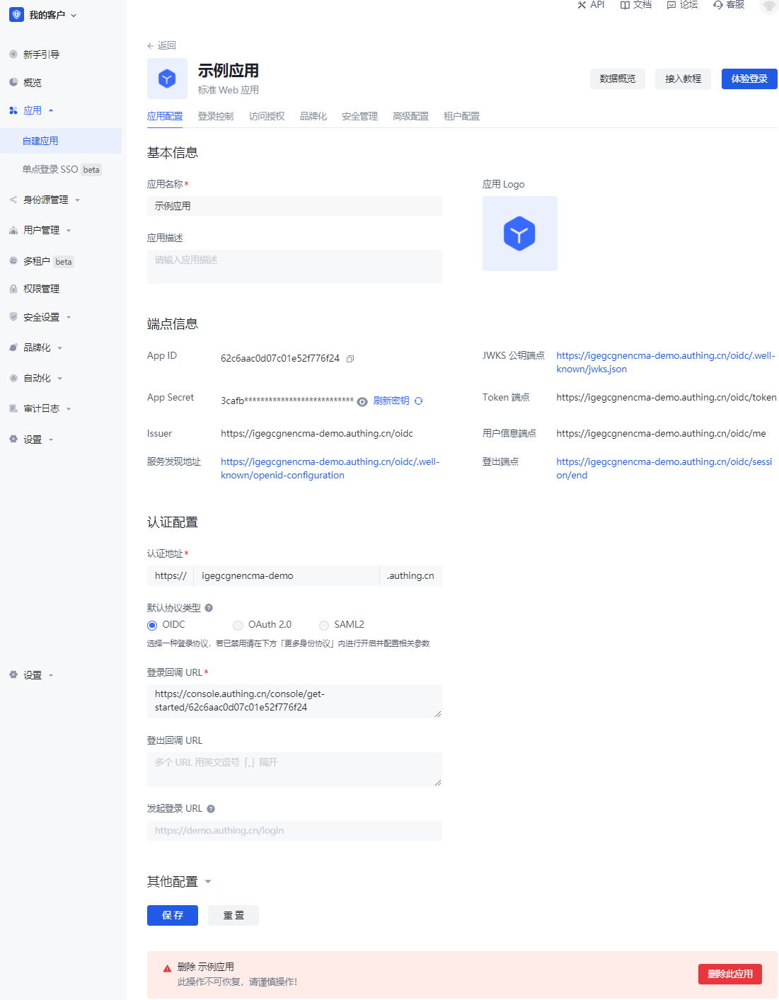
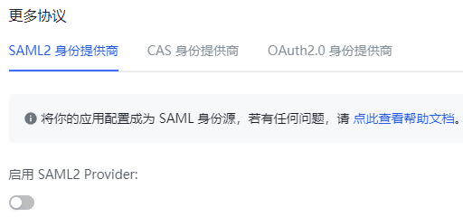

# 应用配置​
​
<LastUpdated/>​
​
路径：**应用->自建应用->应用详情->应用配置**​
​
Authing 作为 SP 时，您可以在 **应用配置** 标签页配置应用 **基本信息**、**端点信息**、**认证配置**。​
​
​
​
| 字段|说明 | 
| :-----| :---- | 
| 
**认证配置->默认协议类型**
 | 联邦认证是一种分布式的身份认证，当用户在 **身份提供商** 登录时，用户可以选择到当前身份提供商信任的联邦身份提供商登录。用户可以通过联邦认证登录一个新的系统，而不必每次在新的系统中注册账号。例如现在许多网站有自己的账密注册登录方式，也有微信扫码直接登录的方式，其中微信就是这个网站的身份联邦，用户不必填写信息注册账号，直接使用微信就可以登录。 Authing 支持通过简单配置，让您的应用成为一个支持标准协议（如 [OIDC](/guides/federation/oidc.md)、[OAuth2.0](/guides/federation/oauth.md)、[SAML](/guides/federation/saml.md)）的联邦认证身份源，实现使用 Authing 的用户目录登录第三方应用。多数应用默认执行 OIDC 登录协议。如需更改采用的标准协议，在同页面下方 **其他配置->更多协议** 模块选择相应的身份供应商，开启相应开关。 |
| **认证配置->登录回调 URL**| 此链接需要填写您的业务回调地址，用户在此应用登录之后，浏览器将会跳转到这个地址，您可以在这里换取用户信息。示例：`https://myawesomeapp.com/login/callback`。| 
| **发起登录 URL**|在 Authing 应用详情点击「体验登录」或在应用面板点击该应用图标时，会跳转到此 URL，默认为 Authing 登录页。 | 

::: hint-info​
**其他配置** 模块适用于 Authing 作为 IDP 时的配置；作为 SP，除了在选择其他身份源时，无需配置此部分内容。​
:::