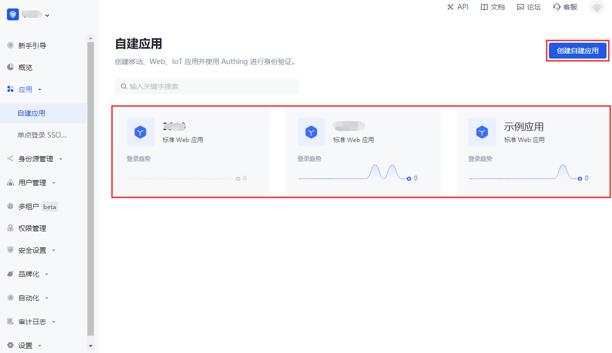

# 创建自建应用

<LastUpdated/>

路径：**应用->自建应用**

您可以在 **自建应用** 页面查看所有自建应用。

要创建新的自建应用，执行以下步骤：

**第一步 点击 创建自建应用 按钮。**

1. 点击页面右上角 **创建自建应用** 按钮。

2. 在弹出窗口填写如下信息：
    - **应用名称**: 应用名
    - **认证地址**: 输入二级域名，必须为合法的域名格式（只允许包含英文、数字和 -，例如 **my-awesome-app**
    - **选择类型**: 应用类型

3. 点击 **创建** 按钮。

**第二步 在 应用配置 标签页配置应用 基本信息、端点信息、认证配置。**

|模块 / 字段|说明|
|----|----|
|**认证配置->默认协议类型**|多数应用默认执行 OIDC 登录协议。如需更改采用的标准协议，在同页面下方 **其他配置->更多协议** 模块选择相应的身份供应商，开启相应开关。|
|**认证配置->登录回调 URL**|此链接需要填写你的业务回调地址，用户在此应用登录之后，浏览器将会跳转到这个地址，您可以在这里换取用户信息。示例：`https://myawesomeapp.com/login/callback`。|
|**其他配置**|适用于 Authing 作为 IDP 时的配置；作为 SP，仅需配置 **基本信息**、**端点信息** 和 **认证配置** 模块。|
|**发起登录 URL**|在 Authing 应用详情点击「体验登录」或在应用面板点击该应用图标时，会跳转到此 URL，默认为 Authing 登录页。|

**第三步 配置登录控制。**

创建好应用之后，你可以点击**体验登录**按钮访问该应用的在线登录表单：

接下来，你可以为此应用[配置登录注册方式](./config-login-methods.md)。
