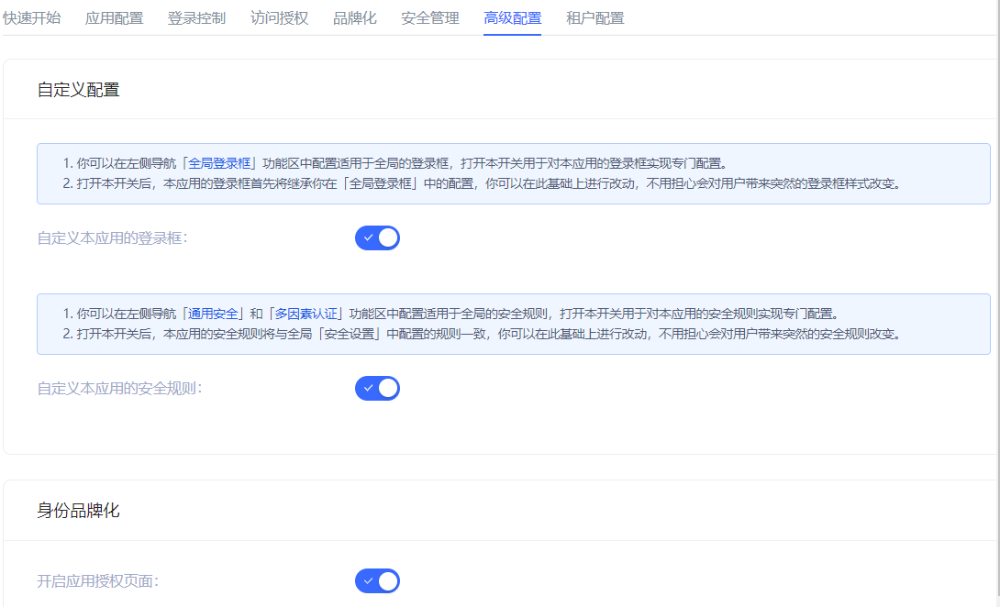
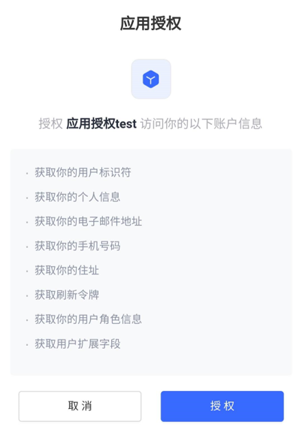

# 高级配置
​
<LastUpdated/>

<<<<<<< HEAD
管理员可以根据业务需要在 **高级配置** 选项卡开启应用登录框开关、应用安全规则开关、应用授权页面开关。

## 自定义配置

::: hint-info​
打开本模块中的开关后，应用的登录框首先将继承左侧导航栏 **品牌化->全局登录框** 中的配置。在此基础上进行改动，不用担心会对用户带来突然的登录框样式改变。
::: ​
=======
路径：**应用->自建应用->应用详情->高级配置**

管理员可以根据业务需要在 **高级配置** 选项卡开启应用登录框开关、应用安全规则开关、应用授权页面开关。

## 自定义配置
​
​

::: hint-info
打开本模块中的开关后，应用的相关配置首先将继承全局配置。在此基础上进行改动，不用担心给用户带来突兀的登录体验。
:::
>>>>>>> ba53c2dd0bf518dbfa90efa3ac5d7ac5dfcd8126

|开关|说明|
|----|----|
|自定义本应用的登录框|默认关闭，开启后在同一页面打开 **品牌化** 选项卡，可以自定义当前应用的登录框。有关详情，请参阅 [品牌化](./customize-guard.md)。|
|自定义本应用的安全规则|默认关闭，开启后在同一页面打开 **安全管理** 选项卡，可以自定义当前应用的登录 / 注册等安全策略。有关详情，请参阅 [安全管理](./security-management.md)。|

## 身份品牌化

<<<<<<< HEAD
当业务软件和身份数据不是被同一方掌握的时，业务软件要通过业务 API 获取用户数据之前，身份提供商有义务告知终端用户其他公司需要获取他们的哪些用户数据（例如手机号、邮箱）以及哪些资源权限，**必须先征得用户的同意**。开启后，用户登陆时，会向用户展示确权页面。

=======
当业务软件和身份数据不是被同一方掌握的时，业务软件要通过业务 API 获取用户数据之前，身份提供商有义务告知终端用户其他公司需要获取他们的哪些用户数据（例如手机号、邮箱）以及哪些资源权限，**必须先征得用户的同意**。开启后，用户登录时，会向用户展示确权页面。

>>>>>>> ba53c2dd0bf518dbfa90efa3ac5d7ac5dfcd8126
