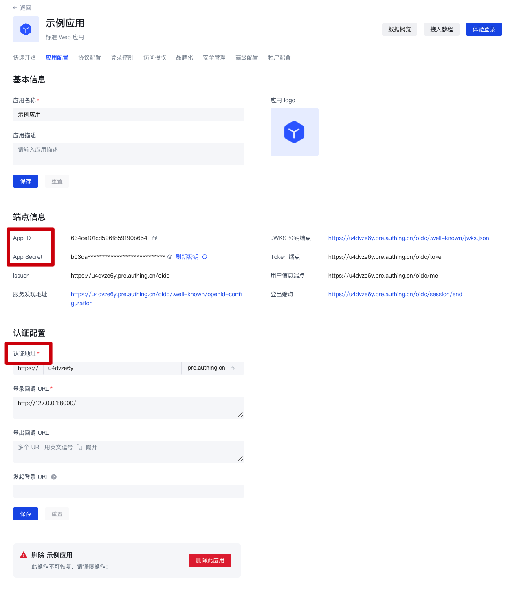

# 应用配置
​
<LastUpdated/>

路径：**应用->自建应用->应用详情->应用配置**

当你想要使用 {{$localeConfig.brandName}} 作为服务提供商（Service Provider, SP），你可以在 **应用配置** 页完成应用 **基本信息** 和 **认证相关** 的配置，同时在将自建应用集成到 {{$localeConfig.brandName}} 时将会需要使用 **端点信息**（例如 **App ID**、**App Secret** 等）以及 **认证配置**（**认证地址**）中的相关信息。

​
​
| 字段|说明 | 
| :-----| :---- | 
| **认证配置->登录回调 URL**| 此链接需要填写你的业务回调地址，用户在此应用登录之后，浏览器将会跳转到这个地址，你可以在这里换取用户信息。示例：`https://myawesomeapp.com/login/callback`。| 
| **发起登录 URL**|在 {{$localeConfig.brandName}} 应用详情点击 **体验登录** 或在应用面板点击该应用图标时，会跳转到此 URL，默认为本应用的登录页。 | 