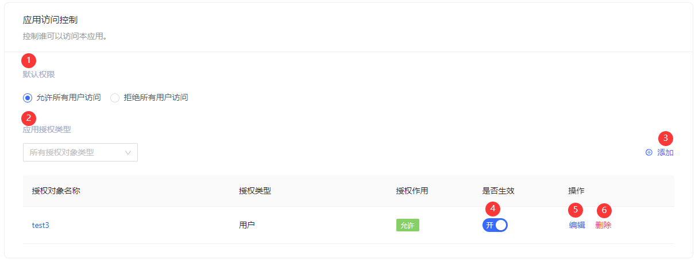
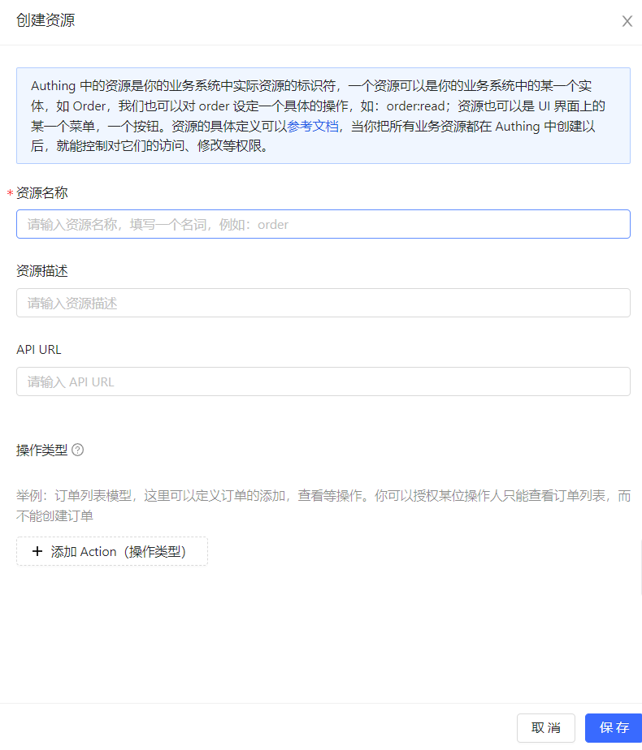
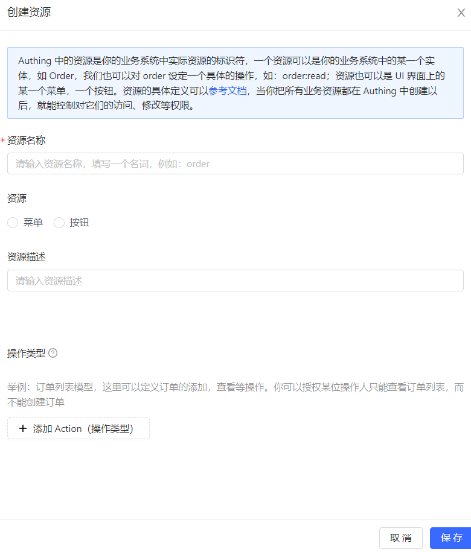
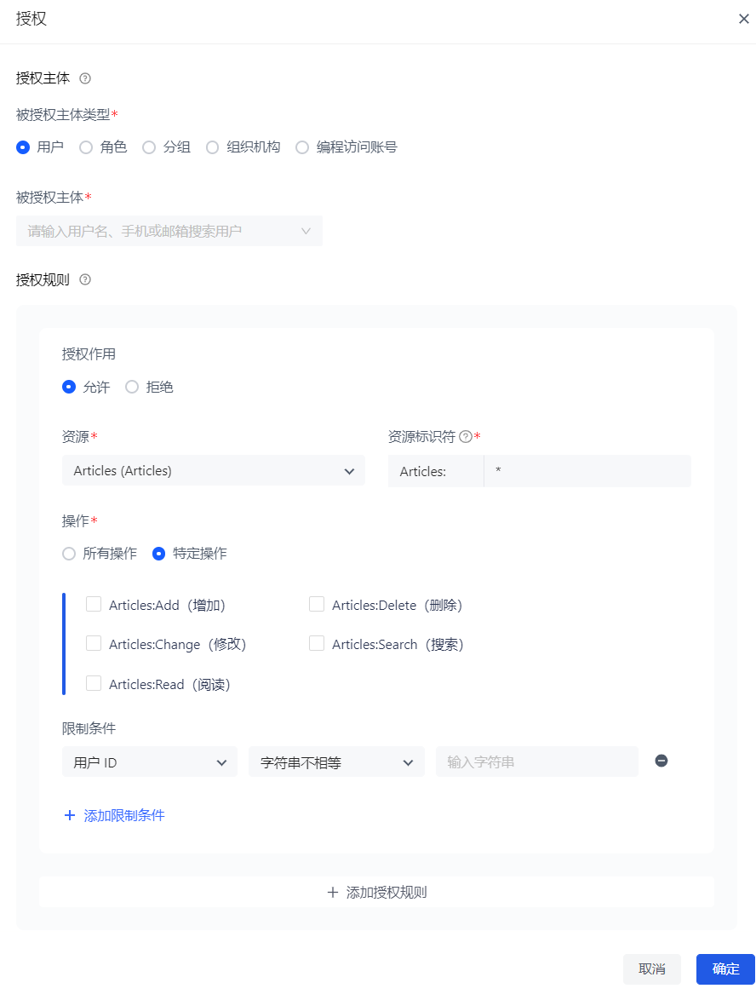
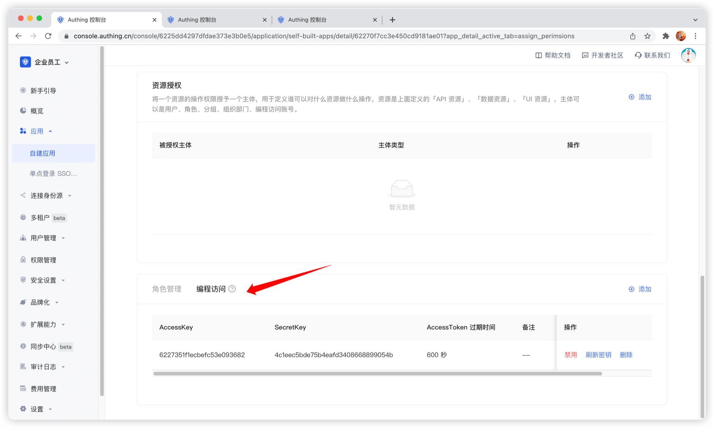

# 访问授权​
​
<LastUpdated/>

路径：**应用->自建应用->应用详情->访问授权**

假如您是一家做社交通讯业务的公司，现有另外一家公司想通过调用您的业务 API 开发一个聊天记录整理导出的工具，并且已经和你的公司签约合作。现在您想要安全地将用户信息授权给这家公司，您期望：

* API 的调用只开放给合作伙伴公司。
* 不同的合作伙伴拥有不同的访问权限，能够访问不同的业务 API。
* 如果将来终止合作，或者发生变化，希望能够收回某些数据的权限或者完全禁用。

作为管理员，您可以在控制台管理和分配资源的权限。在实践权限管理和授权之前，需要先了解几个概念。

- **应用**：管理员能够创建应用，应用就是您在开发的应用项目在 {{$localeConfig.brandName}} 的一个定义。
- **用户**：您可以直接将权限指派给用户，您也可以将您的用户划分成不同的分组、角色、组织机构部门，这样在以后分配权限的时候方便管理。
- **角色**：角色是一组用户的集合，角色中的用户会自动继承该角色被授权的权限。
- **资源**：您可以在 {{$localeConfig.brandName}} 中定义一些资源，例如应用中的资源可能有 API、数据资源、菜单、按钮等。

**访问授权** 从应用维度定义了主体对当前应用的访问权限。管理员可以在 **访问授权** 页面定义被授权主体、角色、资源、授权规则和编程访问。

## 应用访问控制

管理员可以在本模块指定能够访问当前应用的主体。

| 序号 | 字段 / 按钮 | 说明 |
| :-----:| :---- | :---- |
| 1 | 默认权限 | 选项包括：<ul><li>**允许所有用户访问**（默认）</li><li>**拒绝所有用户访问**</li></ul>默认权限的生效优先级低于下方列表的授权优先级。例如：**默认授权** 选择 **拒绝所有用户访问**， 但如果下方授权列表有授权项，则以列表中授权优先。|
| 2 | 应用授权类型 | 可以按照授权类型筛选查看下方授权对象，选项包括：<ul><li>**用户**</li><li>**角色**</li><li>**分组**</li><li>**组织机构**</li><li>**编程访问账号**</li></ul> |
| 3 | 添加 | 打开 **添加授权** 窗口添加授权对象。  授权类型包括：<ul><li>**用户** 数据源与 **用户管理->用户列表** 同步。 可在 **授权对象** 字段输入用户名、手机号或邮箱来搜索用户。</li><li>**角色**：</li>**选择权限分组** 字段的选项和其关联字段 **授权对象** 的数据源与 **权限管理->权限分组** 及相应分组下 **角色管理** 的数据源同步。**选择权限分组** 字段仅支持 **权限管理** 中 **系统权限组**、**默认权限组** 和当前应用所在分组。此处建议选择当前应用所在分组。 <li>**分组**</li>数据源与 **用户管理->用户组管理** 同步。<li>**组织机构** **授权对象** 数据源与 **组织机构->我的客户** 同步。 **子节点继承** 字段指定组织机构中子节点用户是否继承权限。</li></ul>|
| 4 | 是否生效 | 确定是否启用当前授权。新增一条授权后，默认 **开**，即启用该条授权。 | 
| 5 | 编辑 | 编辑当前授权项。 | 
| 6 | 删除 | 删除当前授权项。 | 

## 角色管理

管理员可在此模块指定可以访问当前应用的角色，指定后，该角色下所有指定的主体都具有经授权的权限。

::: hint-info
**角色管理** 模块的数据源与 **权限管理** 中本应用权限分组内 **角色管理** 数据源同步。
::: 

要创建角色，执行以下步骤：

1. 在 **角色管理** 模块点击右上角 **增加** 按钮。
2. 在侧拉框 **创建角色** 窗口输入 **角色 Code**、**角色描述**。
3. 点击 **确定** 按钮。

新增角色会显示在 **角色管理** 列表顶部，同时在 **权限管理** 本应用权限分组下 **角色管理** 列表同步更新。 

管理员可以点击角色所在行 **角色 Code** 列打开角色详情页，编辑角色信息，添加授权用户、组织机构及规则。有关详情，请参阅[角色管理](/guides/access-control/rbac.md)。

要删除某个角色，只需点击该角色所在行 **操作** 列 **删除** 按钮。

::: hint-info
角色删除不可恢复，需谨慎操作。
::: 

## 资源

资源模块对应用内所有资源作了分类：**API 资源**、**数据资源** 和 **UI 资源**。管理员可以在此模块查看、添加、编辑和删除资源。

::: hint-info
API 资源、数据资源、UI 资源在本质上没有区别，类型仅用于管理层面上的区分，创建良好的资源分类能够方便管理员快速聚焦不同的资源。
::: 

要添加资源，执行以下步骤：

1. 在 **访问授权->API / 数据 / UI 资源** 下，点击右上角 **添加** 按钮。

2. 在侧拉框 **创建资源** 窗口输入填写资源信息，定义操作类型。

::: hint-info
* **资源名称**：建议填写语义化的资源名称，便于后续管理。
* **操作类型**：管理员可自定义资源的增删改查等操作权限。可在资源列表点击资源所在行前的 '+' 按钮查看各资源的详细操作权限。
:::

3. 点击 **保存**。

一个资源就创建好了。

::: img-description
API 资源
:::

::: img-description
数据资源
:::

::: img-description
UI 资源
:::

要编辑或删除资源，可在资源列表相应资源所在行点击 **操作** 列 **编辑** / **删除** 按钮。

## 资源授权

现在有了 **资源** 和 **人**，接下来要定义「**谁**」能够对什么「**资源**」做什么「**操作**」。

要对资源进行授权，执行以下步骤：

1. 在 **访问授权->资源授权** 下，点击右上角 **添加** 按钮。 打开 **授权** 窗口。
2. 指定授权主体、授权规则。

::: hint-info
* 授权主体是 **应用访问控制** 模块中授权对象列表的数据源。其中，**编程访问账号** 是添加 **AccessKey** 和 **SecretKey** 对时自动生成的 **AccessKey** 值。
* 授权规则为：配置某个「条件」下，允许或拒绝某个「主体」对某个「资源」的特定或所有操作。
    * **特定操作** 包括 **API 资源 / 数据资源 / UI 资源** 中为资源定义的操作类型。 只能为单个资源指定特定操作，不可以对所有资源指定 **特定操作**。
    * **限制条件** 是对授权规则添加限制条件。
    * 如果希望将多个资源授权给用户，可以点击底部 **+添加授权规则** 按钮继续添加规则。
::: 

管理员也可以在资源授权列表点击相应授权所在行的 **查看详情** 及 **取消授权** 按钮查看授权详情及取消授权。

## 编程访问账号

编程访问账号是应用下的一对 **AccessKey**、**SecretKey**。管理员可以创建 **AccessKey** 和 **SecretKey**，并授予这组 Key 相应的权限，用于交给外包商等第三方厂商进行调用。调用方使用编程访问账号结合 OIDC 授权码 code 获取用户的 AccessToken 与 IdToken，或者使用编程访问账号进行 OIDC ClientCredentials 模式代表调用方本身请求授权，从而调用您的资源接口。

要创建编程访问账号，执行以下步骤：

1. 在 **访问授权->编程访问** 下，点击右上角 **添加** 按钮。 打开 **添加编程访问账号** 侧拉框。

2. 指定 **AccessToken 过期时间（秒）**。

3. 点击 **确定** 按钮。

编程访问账号列表会在顶部新增一条记录。

管理员可以在编程访问账号列表 **禁用**、**刷新密钥** 和 **删除** 所在行账号。

::: hint-info
点击 **刷新密钥**，只会更新 **SecretKey**。
::: 