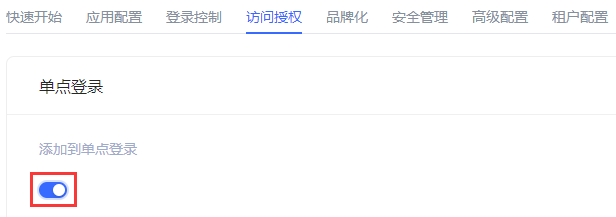

# 访问授权​
​
<LastUpdated/>

路径：**应用->自建应用->应用详情->访问授权**

**访问授权** 从应用维度定义了主体对当前应用的访问权限。管理员可以在 **访问授权** 页面将当前应用集成到单点登录（SSO），并为主体定义授权规则。

## 单点登录

管理员可以在此模块将当前自建应用添加到应用面板。

为此，管理员只需在 **单点登录** 模块下开启 **添加到单点登录** 开关即可。

## 应用访问控制

管理员可以在本模块指定能够访问当前应用的主体。

| 序号 | 字段 / 按钮 | 说明 |
| :-----:| :---- | :---- |
| 1 | 默认权限 | 选项包括：<ul><li>**允许所有用户访问**（默认）</li><li>**拒绝所有用户访问**</li></ul>默认权限的生效优先级低于下方列表的授权优先级。例如：**默认授权** 选择 **拒绝所有用户访问**， 但如果下方授权列表有授权项，则以列表中授权优先。|
| 2 | 应用授权类型 | 可以按照授权类型筛选查看下方授权对象，选项包括：<ul><li>**用户**</li><li>**角色**</li><li>**分组**</li><li>**组织机构**</li></ul> |
| 3 | 添加 | 打开 **添加授权** 窗口添加授权对象。  授权类型包括：<ul><li>**用户** 数据源与 **用户管理->用户列表** 同步。 可在 **授权对象** 字段输入用户名、手机号或邮箱来搜索用户。</li><li>**角色**：</li>**选择权限分组** 字段的选项和其关联字段 **授权对象** 的数据源与 **权限管理->权限分组** 及相应分组下 **角色管理** 的数据源同步。**选择权限分组** 字段仅支持 **权限管理** 中 **系统权限组**、**默认权限组** 和当前应用所在分组。此处建议选择当前应用所在分组。 <li>**分组**</li>数据源与 **用户管理->用户组管理** 同步。<li>**组织机构** **授权对象** 数据源与 **组织机构->我的客户** 同步。 **子节点继承** 字段指定组织机构中子节点用户是否继承权限。</li></ul>|
| 4 | 是否生效 | 确定是否启用当前授权。新增一条授权后，默认 **开**，即启用该条授权。 | 
| 5 | 编辑 | 编辑当前授权项。 | 
| 6 | 删除 | 删除当前授权项。 | 